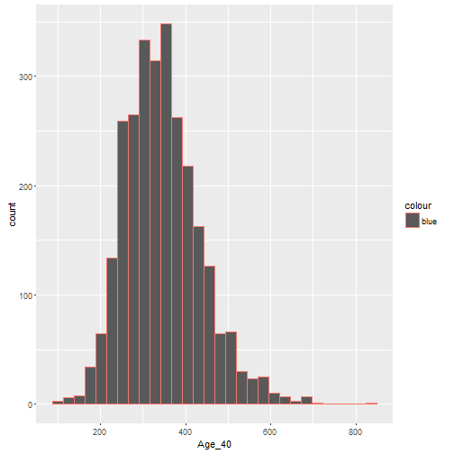

===
ACA Project Slides (Affordable Care Act in Florida By County)

Author: Patrick Garrabrant, CLU, HCP

Date: 9/18/2016


========================================================

Much has been said about the Affordable Care Act.
With this app you can compare prices year over year

- By County
- By Metal Level
- By Age Bracket

This is a GREAT place to look at trending and observe medical inflation
as it pertains to Individual Health Insurance

========================================================
The CMS Public Use File publishes the rates of each plan offered by
health insurance companies and labels them by County

You will see a Table you can sort to your needs.
- 


```r
Florida<- read.csv("mydata/20141516v3.csv")
data.frame(Florida)
```

```
     Year          Carrier        Metal Type       County Age_21 Age_27
1    2014             BCBS       Bronze  EPO      ALACHUA 205.08 214.92
2    2014             BCBS       Bronze  HMO      ALACHUA 196.00 205.41
3    2014             BCBS Catastrophic  EPO      ALACHUA 167.44 175.47
4    2014             BCBS         Gold  EPO      ALACHUA 261.00 273.53
5    2014             BCBS         Gold  HMO      ALACHUA 245.64 257.43
6    2014             BCBS     Platinum  EPO      ALACHUA 289.66 303.57
7    2014             BCBS     Platinum  HMO      ALACHUA 269.97 282.93
8    2014             BCBS       Silver  EPO      ALACHUA 237.28 248.67
9    2014             BCBS       Silver  HMO      ALACHUA 224.50 235.27
10   2014             BCBS       Bronze  EPO        BAKER 214.29 224.58
11   2014             BCBS       Bronze  HMO        BAKER 223.10 233.81
12   2014             BCBS Catastrophic  EPO        BAKER 189.64 198.75
13   2014             BCBS         Gold  EPO        BAKER 272.73 285.82
14   2014             BCBS         Gold  HMO        BAKER 279.60 293.02
15   2014             BCBS     Platinum  EPO        BAKER 302.68 317.21
16   2014             BCBS     Platinum  HMO        BAKER 307.29 322.04
17   2014             BCBS       Silver  EPO        BAKER 247.95 259.85
18   2014             BCBS       Silver  HMO        BAKER 255.53 267.80
19   2014             BCBS       Bronze  EPO          BAY 200.62 210.24
20   2014             BCBS Catastrophic  EPO          BAY 185.97 194.90
21   2014             BCBS         Gold  EPO          BAY 255.33 267.58
22   2014             BCBS     Platinum  EPO          BAY 283.37 296.97
23   2014             BCBS       Silver  EPO          BAY 232.12 243.26
24   2014             BCBS       Bronze  EPO     BRADFORD 186.63 195.58
25   2014             BCBS       Bronze  HMO     BRADFORD 178.16 186.71
26   2014             BCBS Catastrophic  EPO     BRADFORD 152.37 159.69
27   2014             BCBS         Gold  EPO     BRADFORD 237.52 248.92
28   2014             BCBS         Gold  HMO     BRADFORD 223.28 234.00
29   2014             BCBS     Platinum  EPO     BRADFORD 263.60 276.25
30   2014             BCBS     Platinum  HMO     BRADFORD 245.40 257.18
31   2014             BCBS       Silver  EPO     BRADFORD 215.94 226.30
32   2014             BCBS       Silver  HMO     BRADFORD 204.07 213.86
33   2014            Aetna       Bronze  PPO      BREVARD 199.00 208.33
34   2014            Aetna Catastrophic  PPO      BREVARD 141.00 148.00
35   2014            Aetna         Gold  PPO      BREVARD 284.00 297.00
36   2014            Aetna       Silver  PPO      BREVARD 246.50 258.00
37   2014             BCBS       Bronze  EPO      BREVARD 213.05 223.27
38   2014             BCBS       Bronze  HMO      BREVARD 211.81 221.97
39   2014             BCBS Catastrophic  EPO      BREVARD 189.26 198.34
40   2014             BCBS         Gold  EPO      BREVARD 271.15 284.16
41   2014             BCBS         Gold  HMO      BREVARD 265.45 278.19
42   2014             BCBS     Platinum  EPO      BREVARD 300.92 315.37
43   2014             BCBS     Platinum  HMO      BREVARD 291.74 305.74
44   2014             BCBS       Silver  EPO      BREVARD 246.50 258.34
45   2014             BCBS       Silver  HMO      BREVARD 242.60 254.25
46   2014            Cigna       Bronze  PPO      BREVARD 224.55 235.33
47   2014            Cigna         Gold  PPO      BREVARD 302.84 317.38
48   2014            Cigna       Silver  PPO      BREVARD 263.08 275.71
49   2014         Coventry       Bronze  HMO      BREVARD 143.80 150.70
50   2014         Coventry Catastrophic  HMO      BREVARD  93.14  97.61
51   2014         Coventry         Gold  HMO      BREVARD 204.65 214.47
52   2014         Coventry       Silver  HMO      BREVARD 188.70 197.76
53   2014      HealthFirst       Bronze  PPO      BREVARD 185.43 194.33
54   2014      HealthFirst Catastrophic  PPO      BREVARD 184.76 193.63
55   2014      HealthFirst         Gold  PPO      BREVARD 296.05 310.26
56   2014      HealthFirst       Silver  PPO      BREVARD 226.38 237.25
57   2014            Aetna       Bronze  PPO      BROWARD 203.00 212.67
58   2014            Aetna Catastrophic  PPO      BROWARD 144.00 151.00
59   2014            Aetna         Gold  PPO      BROWARD 289.00 303.00
60   2014            Aetna       Silver  PPO      BROWARD 251.00 263.50
61   2014         Ambetter       Bronze  HMO      BROWARD 230.59 241.65
62   2014         Ambetter         Gold  HMO      BROWARD 329.42 345.22
63   2014         Ambetter       Silver  HMO      BROWARD 274.89 288.08
64   2014             BCBS       Bronze  EPO      BROWARD 252.62 264.74
65   2014             BCBS       Bronze  HMO      BROWARD 249.52 261.49
66   2014             BCBS Catastrophic  EPO      BROWARD 217.65 228.09
67   2014             BCBS         Gold  EPO      BROWARD 321.51 336.94
68   2014             BCBS         Gold  HMO      BROWARD 312.71 327.72
69   2014             BCBS     Platinum  EPO      BROWARD 356.82 373.94
70   2014             BCBS     Platinum  HMO      BROWARD 343.68 360.18
71   2014             BCBS       Silver  EPO      BROWARD 292.29 306.32
72   2014             BCBS       Silver  HMO      BROWARD 285.79 299.51
73   2014            Cigna       Bronze  PPO      BROWARD 222.90 233.60
74   2014            Cigna         Gold  PPO      BROWARD 300.61 315.04
75   2014            Cigna       Silver  PPO      BROWARD 261.14 273.67
76   2014         Coventry       Bronze  HMO      BROWARD 126.41 132.47
77   2014         Coventry Catastrophic  HMO      BROWARD  81.88  85.81
78   2014         Coventry         Gold  HMO      BROWARD 179.90 188.53
79   2014         Coventry       Silver  HMO      BROWARD 165.88 173.84
80   2014           Humana       Bronze  HMO      BROWARD 174.38 182.74
81   2014           Humana Catastrophic  HMO      BROWARD 129.51 135.72
82   2014           Humana         Gold  HMO      BROWARD 219.51 230.04
83   2014           Humana     Platinum  HMO      BROWARD 247.49 259.36
84   2014           Humana       Silver  HMO      BROWARD 190.34 199.47
85   2014           Molina       Bronze  HMO      BROWARD 213.94 224.21
86   2014           Molina         Gold  HMO      BROWARD 272.68 285.77
87   2014           Molina       Silver  HMO      BROWARD 241.51 253.11
88   2014             BCBS       Bronze  EPO      CALHOUN 208.39 218.39
89   2014             BCBS Catastrophic  EPO      CALHOUN 170.14 178.31
90   2014             BCBS         Gold  EPO      CALHOUN 265.22 277.94
91   2014             BCBS     Platinum  EPO      CALHOUN 294.34 308.47
92   2014             BCBS       Silver  EPO      CALHOUN 241.11 252.69
93   2014            Aetna       Bronze  PPO    CHARLOTTE 193.67 203.00
94   2014            Aetna Catastrophic  PPO    CHARLOTTE 137.00 143.00
95   2014            Aetna         Gold  PPO    CHARLOTTE 276.00 289.00
96   2014            Aetna       Silver  PPO    CHARLOTTE 239.50 251.00
97   2014             BCBS       Bronze  EPO    CHARLOTTE 201.72 211.41
98   2014             BCBS       Bronze  HMO    CHARLOTTE 196.90 206.36
99   2014             BCBS Catastrophic  EPO    CHARLOTTE 171.68 179.92
100  2014             BCBS         Gold  EPO    CHARLOTTE 256.74 269.06
101  2014             BCBS         Gold  HMO    CHARLOTTE 246.77 258.62
102  2014             BCBS     Platinum  EPO    CHARLOTTE 284.93 298.61
103  2014             BCBS     Platinum  HMO    CHARLOTTE 271.21 284.23
104  2014             BCBS       Silver  EPO    CHARLOTTE 233.41 244.61
105  2014             BCBS       Silver  HMO    CHARLOTTE 225.53 236.36
106  2014           Humana       Bronze  HMO    CHARLOTTE 173.77 182.11
107  2014           Humana Catastrophic  HMO    CHARLOTTE 129.06 135.25
108  2014           Humana         Gold  HMO    CHARLOTTE 218.75 229.24
109  2014           Humana     Platinum  HMO    CHARLOTTE 246.63 258.45
110  2014           Humana       Silver  HMO    CHARLOTTE 189.68 198.77
111  2014             BCBS       Bronze  EPO       CITRUS 188.10 197.13
112  2014             BCBS       Bronze  HMO       CITRUS 179.29 187.90
113  2014             BCBS Catastrophic  EPO       CITRUS 152.18 159.47
114  2014             BCBS         Gold  EPO       CITRUS 239.40 250.89
115  2014             BCBS         Gold  HMO       CITRUS 224.70 235.48
116  2014             BCBS     Platinum  EPO       CITRUS 265.68 278.44
117  2014             BCBS     Platinum  HMO       CITRUS 246.95 258.81
118  2014             BCBS       Silver  EPO       CITRUS 217.64 228.09
119  2014             BCBS       Silver  HMO       CITRUS 205.36 215.21
120  2014            Aetna       Bronze  PPO         CLAY 222.33 233.00
121  2014            Aetna Catastrophic  PPO         CLAY 158.00 165.00
122  2014            Aetna         Gold  PPO         CLAY 317.00 333.00
123  2014            Aetna       Silver  PPO         CLAY 275.50 288.50
124  2014             BCBS       Bronze  EPO         CLAY 211.63 221.79
125  2014             BCBS       Bronze  HMO         CLAY 214.29 224.58
126  2014             BCBS Catastrophic  EPO         CLAY 190.42 199.56
127  2014             BCBS         Gold  EPO         CLAY 269.34 282.27
128  2014             BCBS         Gold  HMO         CLAY 268.56 281.45
129  2014             BCBS     Platinum  EPO         CLAY 298.92 313.27
130  2014             BCBS     Platinum  HMO         CLAY 295.16 309.33
131  2014             BCBS       Silver  EPO         CLAY 244.86 256.62
132  2014             BCBS       Silver  HMO         CLAY 245.45 257.23
133  2014             BCBS       Bronze  EPO      COLLIER 207.12 217.06
134  2014             BCBS       Bronze  HMO      COLLIER 193.97 203.28
135  2014             BCBS Catastrophic  EPO      COLLIER 175.74 184.17
136  2014             BCBS         Gold  EPO      COLLIER 263.60 276.26
137  2014             BCBS         Gold  HMO      COLLIER 243.09 254.76
138  2014             BCBS     Platinum  EPO      COLLIER 292.55 306.60
139  2014             BCBS     Platinum  HMO      COLLIER 267.17 279.99
140  2014             BCBS       Silver  EPO      COLLIER 239.65 251.15
141  2014             BCBS       Silver  HMO      COLLIER 222.17 232.83
142  2014             BCBS       Bronze  EPO     COLUMBIA 216.19 226.57
143  2014             BCBS       Bronze  HMO     COLUMBIA 202.33 212.03
144  2014             BCBS Catastrophic  EPO     COLUMBIA 176.51 184.98
145  2014             BCBS         Gold  EPO     COLUMBIA 275.15 288.36
146  2014             BCBS         Gold  HMO     COLUMBIA 253.56 265.74
147  2014             BCBS     Platinum  EPO     COLUMBIA 305.36 320.02
148  2014             BCBS     Platinum  HMO     COLUMBIA 278.68 292.05
149  2014             BCBS       Silver  EPO     COLUMBIA 250.14 262.15
150  2014             BCBS       Silver  HMO     COLUMBIA 231.74 242.86
151  2014             BCBS       Bronze  EPO      DE SOTO 214.77 225.08
152  2014             BCBS       Bronze  HMO      DE SOTO 205.26 215.11
153  2014             BCBS Catastrophic  EPO      DE SOTO 175.35 183.77
154  2014             BCBS         Gold  EPO      DE SOTO 273.34 286.46
155  2014             BCBS         Gold  HMO      DE SOTO 257.24 269.59
156  2014             BCBS     Platinum  EPO      DE SOTO 303.36 317.92
157  2014             BCBS     Platinum  HMO      DE SOTO 282.72 296.29
158  2014             BCBS       Silver  EPO      DE SOTO 248.51 260.43
159  2014             BCBS       Silver  HMO      DE SOTO 235.10 246.39
160  2014             BCBS       Bronze  EPO        DIXIE 210.75 220.87
161  2014             BCBS       Bronze  HMO        DIXIE 197.81 207.30
162  2014             BCBS Catastrophic  EPO        DIXIE 172.07 180.33
163  2014             BCBS         Gold  EPO        DIXIE 268.22 281.10
164  2014             BCBS         Gold  HMO        DIXIE 247.90 259.80
165  2014             BCBS     Platinum  EPO        DIXIE 297.68 311.97
166  2014             BCBS     Platinum  HMO        DIXIE 272.46 285.53
167  2014             BCBS       Silver  EPO        DIXIE 243.85 255.56
168  2014             BCBS       Silver  HMO        DIXIE 226.57 237.44
169  2014            Aetna       Bronze  PPO        DUVAL 222.33 233.00
170  2014            Aetna Catastrophic  PPO        DUVAL 158.00 165.00
171  2014            Aetna         Gold  PPO        DUVAL 317.00 333.00
172  2014            Aetna       Silver  PPO        DUVAL 275.50 288.50
173  2014             BCBS       Bronze  EPO        DUVAL 212.07 222.25
174  2014             BCBS       Bronze  HMO        DUVAL 212.03 222.21
175  2014             BCBS Catastrophic  EPO        DUVAL 190.22 199.35
176  2014             BCBS         Gold  EPO        DUVAL 269.90 282.86
177  2014             BCBS         Gold  HMO        DUVAL 265.73 278.49
178  2014             BCBS     Platinum  EPO        DUVAL 299.54 313.92
179  2014             BCBS     Platinum  HMO        DUVAL 292.04 306.06
180  2014             BCBS       Silver  EPO        DUVAL 245.37 257.15
181  2014             BCBS       Silver  HMO        DUVAL 242.86 254.52
182  2014         Coventry       Bronze  HMO        DUVAL 135.42 141.92
183  2014         Coventry Catastrophic  HMO        DUVAL  87.72  91.93
184  2014         Coventry         Gold  HMO        DUVAL 192.73 201.98
185  2014         Coventry       Silver  HMO        DUVAL 177.71 186.24
186  2014            Aetna       Bronze  PPO     ESCAMBIA 169.00 177.33
187  2014            Aetna Catastrophic  PPO     ESCAMBIA 120.00 126.00
188  2014            Aetna         Gold  PPO     ESCAMBIA 241.00 253.00
189  2014            Aetna       Silver  PPO     ESCAMBIA 209.50 219.50
190  2014             BCBS       Bronze  EPO     ESCAMBIA 211.63 221.79
191  2014             BCBS       Bronze  HMO     ESCAMBIA 208.19 218.19
192  2014             BCBS Catastrophic  EPO     ESCAMBIA 183.46 192.27
193  2014             BCBS         Gold  EPO     ESCAMBIA 269.34 282.27
194  2014             BCBS         Gold  HMO     ESCAMBIA 260.92 273.45
195  2014             BCBS     Platinum  EPO     ESCAMBIA 298.92 313.27
196  2014             BCBS     Platinum  HMO     ESCAMBIA 286.76 300.53
197  2014             BCBS       Silver  EPO     ESCAMBIA 244.86 256.62
198  2014             BCBS       Silver  HMO     ESCAMBIA 238.46 249.91
199  2014         Coventry       Bronze  HMO     ESCAMBIA 161.50 169.26
200  2014         Coventry Catastrophic  HMO     ESCAMBIA 104.61 109.63
201  2014         Coventry         Gold  HMO     ESCAMBIA 229.86 240.89
202  2014         Coventry       Silver  HMO     ESCAMBIA 211.94 222.12
203  2014             BCBS       Bronze  EPO      FLAGLER 240.08 251.61
204  2014             BCBS       Bronze  HMO      FLAGLER 209.32 219.37
205  2014             BCBS Catastrophic  EPO      FLAGLER 196.02 205.43
206  2014             BCBS         Gold  EPO      FLAGLER 305.56 320.22
207  2014             BCBS         Gold  HMO      FLAGLER 262.34 274.93
208  2014             BCBS     Platinum  EPO      FLAGLER 339.11 355.39
209  2014             BCBS     Platinum  HMO      FLAGLER 288.32 302.16
210  2014             BCBS       Silver  EPO      FLAGLER 277.79 291.12
211  2014             BCBS       Silver  HMO      FLAGLER 239.76 251.27
212  2014            Cigna       Bronze  PPO      FLAGLER 213.18 223.41
213  2014            Cigna         Gold  PPO      FLAGLER 287.51 301.31
214  2014            Cigna       Silver  PPO      FLAGLER 249.75 261.74
215  2014    FloridaHealth       Bronze  HMO      FLAGLER 179.22 187.82
216  2014    FloridaHealth       Bronze  POS      FLAGLER 197.83 207.33
217  2014    FloridaHealth Catastrophic  HMO      FLAGLER 174.52 182.90
218  2014    FloridaHealth Catastrophic  POS      FLAGLER 201.34 211.00
219  2014    FloridaHealth         Gold  HMO      FLAGLER 267.69 280.54
220  2014    FloridaHealth         Gold  POS      FLAGLER 314.13 329.21
221  2014    FloridaHealth     Platinum  HMO      FLAGLER 321.34 336.76
222  2014    FloridaHealth     Platinum  POS      FLAGLER 353.73 370.71
223  2014    FloridaHealth       Silver  HMO      FLAGLER 230.45 241.51
224  2014    FloridaHealth       Silver  POS      FLAGLER 260.45 272.95
225  2014             BCBS       Bronze  EPO     FRANKLIN 210.04 220.12
226  2014             BCBS Catastrophic  EPO     FRANKLIN 171.49 179.72
227  2014             BCBS         Gold  EPO     FRANKLIN 267.32 280.15
228  2014             BCBS     Platinum  EPO     FRANKLIN 296.68 310.92
229  2014             BCBS       Silver  EPO     FRANKLIN 243.03 254.69
230  2014             BCBS       Bronze  EPO      GADSDEN 237.48 248.88
231  2014             BCBS Catastrophic  EPO      GADSDEN 193.89 203.20
232  2014             BCBS         Gold  EPO      GADSDEN 302.25 316.75
233  2014             BCBS     Platinum  EPO      GADSDEN 335.43 351.54
234  2014             BCBS       Silver  EPO      GADSDEN 274.78 287.96
235  2014             BCBS       Bronze  EPO    GILCHRIST 205.08 214.92
236  2014             BCBS       Bronze  HMO    GILCHRIST 197.13 206.59
237  2014             BCBS Catastrophic  EPO    GILCHRIST 167.44 175.47
238  2014             BCBS         Gold  EPO    GILCHRIST 261.00 273.53
239  2014             BCBS         Gold  HMO    GILCHRIST 247.06 258.91
240  2014             BCBS     Platinum  EPO    GILCHRIST 289.66 303.57
241  2014             BCBS     Platinum  HMO    GILCHRIST 271.52 284.56
242  2014             BCBS       Silver  EPO    GILCHRIST 237.28 248.67
243  2014             BCBS       Silver  HMO    GILCHRIST 225.79 236.63
244  2014             BCBS       Bronze  EPO       GLADES 220.69 231.28
245  2014             BCBS Catastrophic  EPO       GLADES 180.18 188.83
246  2014             BCBS         Gold  EPO       GLADES 280.87 294.35
247  2014             BCBS     Platinum  EPO       GLADES 311.71 326.68
248  2014             BCBS       Silver  EPO       GLADES 255.35 267.60
249  2014             BCBS       Bronze  EPO         GULF 188.81 197.87
250  2014             BCBS Catastrophic  EPO         GULF 170.72 178.91
251  2014             BCBS         Gold  EPO         GULF 240.30 251.83
252  2014             BCBS     Platinum  EPO         GULF 266.69 279.49
253  2014             BCBS       Silver  EPO         GULF 218.46 228.94
254  2014             BCBS       Bronze  EPO     HAMILTON 202.47 212.19
255  2014             BCBS Catastrophic  EPO     HAMILTON 165.31 173.25
256  2014             BCBS         Gold  EPO     HAMILTON 257.69 270.06
257  2014             BCBS     Platinum  EPO     HAMILTON 285.99 299.71
258  2014             BCBS       Silver  EPO     HAMILTON 234.27 245.52
259  2014             BCBS       Bronze  EPO       HARDEE 238.43 249.87
260  2014             BCBS Catastrophic  EPO       HARDEE 194.67 204.01
261  2014             BCBS         Gold  EPO       HARDEE 303.45 318.01
262  2014             BCBS     Platinum  EPO       HARDEE 336.77 352.94
263  2014             BCBS       Silver  EPO       HARDEE 275.87 289.11
264  2014             BCBS       Bronze  EPO       HENDRY 223.29 234.01
265  2014             BCBS       Bronze  HMO       HENDRY 207.52 217.48
266  2014             BCBS Catastrophic  EPO       HENDRY 182.31 191.06
267  2014             BCBS         Gold  EPO       HENDRY 284.18 297.82
268  2014             BCBS         Gold  HMO       HENDRY 260.08 272.55
269  2014             BCBS     Platinum  EPO       HENDRY 315.39 330.53
270  2014             BCBS     Platinum  HMO       HENDRY 285.83 299.55
271  2014             BCBS       Silver  EPO       HENDRY 258.36 270.76
272  2014             BCBS       Silver  HMO       HENDRY 237.69 249.10
273  2014             BCBS       Bronze  EPO     HERNANDO 199.49 209.07
274  2014             BCBS       Bronze  HMO     HERNANDO 196.00 205.41
275  2014             BCBS Catastrophic  EPO     HERNANDO 178.83 187.41
276  2014             BCBS         Gold  EPO     HERNANDO 253.89 266.08
277  2014             BCBS         Gold  HMO     HERNANDO 245.64 257.43
278  2014             BCBS     Platinum  EPO     HERNANDO 281.77 295.30
279  2014             BCBS     Platinum  HMO     HERNANDO 269.97 282.93
280  2014             BCBS       Silver  EPO     HERNANDO 230.82 241.90
281  2014             BCBS       Silver  HMO     HERNANDO 224.50 235.27
282  2014            Cigna       Bronze  PPO     HERNANDO 226.41 237.28
283  2014            Cigna         Gold  PPO     HERNANDO 305.35 320.01
284  2014            Cigna       Silver  PPO     HERNANDO 265.26 277.99
285  2014         Coventry       Bronze  HMO     HERNANDO 230.58 241.65
286  2014         Coventry Catastrophic  HMO     HERNANDO 149.36 156.53
287  2014         Coventry         Gold  HMO     HERNANDO 328.17 343.92
288  2014         Coventry       Silver  HMO     HERNANDO 302.58 317.12
289  2014             BCBS       Bronze  EPO    HIGHLANDS 214.72 225.03
290  2014             BCBS Catastrophic  EPO    HIGHLANDS 189.06 198.14
291  2014             BCBS         Gold  EPO    HIGHLANDS 273.28 286.40
292  2014             BCBS     Platinum  EPO    HIGHLANDS 303.29 317.85
293  2014             BCBS       Silver  EPO    HIGHLANDS 248.44 260.37
294  2014            Aetna       Bronze  PPO HILLSBOROUGH 203.67 213.33
295  2014            Aetna Catastrophic  PPO HILLSBOROUGH 144.00 151.00
296  2014            Aetna         Gold  PPO HILLSBOROUGH 290.00 304.00
297  2014            Aetna       Silver  PPO HILLSBOROUGH 252.00 264.00
298  2014             BCBS       Bronze  EPO HILLSBOROUGH 205.25 215.10
299  2014             BCBS       Bronze  HMO HILLSBOROUGH 208.65 218.66
300  2014             BCBS Catastrophic  EPO HILLSBOROUGH 187.13 196.12
301  2014             BCBS         Gold  EPO HILLSBOROUGH 261.22 273.76
302  2014             BCBS         Gold  HMO HILLSBOROUGH 261.49 274.04
303  2014             BCBS     Platinum  EPO HILLSBOROUGH 289.91 303.82
304  2014             BCBS     Platinum  HMO HILLSBOROUGH 287.38 301.18
305  2014             BCBS       Silver  EPO HILLSBOROUGH 237.48 248.88
306  2014             BCBS       Silver  HMO HILLSBOROUGH 238.98 250.45
307  2014            Cigna       Bronze  PPO HILLSBOROUGH 226.41 237.28
308  2014            Cigna         Gold  PPO HILLSBOROUGH 305.35 320.01
309  2014            Cigna       Silver  PPO HILLSBOROUGH 265.26 277.99
310  2014         Coventry       Bronze  HMO HILLSBOROUGH 195.64 205.03
311  2014         Coventry Catastrophic  HMO HILLSBOROUGH 126.72 132.81
312  2014         Coventry         Gold  HMO HILLSBOROUGH 278.44 291.81
313  2014         Coventry       Silver  HMO HILLSBOROUGH 256.74 269.06
314  2014           Humana       Bronze  HMO HILLSBOROUGH 165.55 173.49
315  2014           Humana Catastrophic  HMO HILLSBOROUGH 122.96 128.85
316  2014           Humana         Gold  HMO HILLSBOROUGH 208.40 218.40
317  2014           Humana     Platinum  HMO HILLSBOROUGH 234.96 246.23
318  2014           Humana       Silver  HMO HILLSBOROUGH 180.70 189.37
319  2014             BCBS       Bronze  EPO       HOLMES 197.51 206.99
320  2014             BCBS Catastrophic  EPO       HOLMES 161.26 169.00
321  2014             BCBS         Gold  EPO       HOLMES 251.36 263.43
322  2014             BCBS     Platinum  EPO       HOLMES 278.97 292.36
323  2014             BCBS       Silver  EPO       HOLMES 228.52 239.49
324  2014             BCBS       Bronze  EPO INDIAN RIVER 200.53 210.15
325  2014             BCBS Catastrophic  EPO INDIAN RIVER 176.32 184.78
326  2014             BCBS         Gold  EPO INDIAN RIVER 255.22 267.47
327  2014             BCBS     Platinum  EPO INDIAN RIVER 283.24 296.84
328  2014             BCBS       Silver  EPO INDIAN RIVER 232.02 243.16
329  2014            Cigna       Bronze  PPO INDIAN RIVER 224.55 235.33
330  2014            Cigna         Gold  PPO INDIAN RIVER 302.84 317.38
331  2014            Cigna       Silver  PPO INDIAN RIVER 263.08 275.71
332  2014      HealthFirst       Bronze  PPO INDIAN RIVER 185.43 194.33
333  2014      HealthFirst Catastrophic  PPO INDIAN RIVER 184.76 193.63
334  2014      HealthFirst         Gold  PPO INDIAN RIVER 296.05 310.26
335  2014      HealthFirst       Silver  PPO INDIAN RIVER 226.38 237.25
336  2014             BCBS       Bronze  EPO      JACKSON 198.93 208.48
337  2014             BCBS Catastrophic  EPO      JACKSON 162.41 170.21
338  2014             BCBS         Gold  EPO      JACKSON 253.17 265.32
339  2014             BCBS     Platinum  EPO      JACKSON 280.98 294.46
340  2014             BCBS       Silver  EPO      JACKSON 230.17 241.21
341  2014             BCBS       Bronze  EPO    JEFFERSON 234.88 246.16
342  2014             BCBS Catastrophic  EPO    JEFFERSON 191.77 200.97
343  2014             BCBS         Gold  EPO    JEFFERSON 298.93 313.28
344  2014             BCBS     Platinum  EPO    JEFFERSON 331.76 347.69
345  2014             BCBS       Silver  EPO    JEFFERSON 271.77 284.81
346  2014             BCBS       Bronze  EPO    LAFAYETTE 219.74 230.29
347  2014             BCBS Catastrophic  EPO    LAFAYETTE 179.41 188.02
348  2014             BCBS         Gold  EPO    LAFAYETTE 279.66 293.09
349  2014             BCBS     Platinum  EPO    LAFAYETTE 310.38 325.27
350  2014             BCBS       Silver  EPO    LAFAYETTE 254.25 266.45
351  2014            Aetna       Bronze  PPO         LAKE 217.00 227.33
352  2014            Aetna Catastrophic  PPO         LAKE 153.00 161.00
353  2014            Aetna         Gold  PPO         LAKE 309.00 324.00
354  2014            Aetna       Silver  PPO         LAKE 268.50 281.00
355  2014             BCBS       Bronze  EPO         LAKE 198.71 208.24
356  2014             BCBS       Bronze  HMO         LAKE 203.23 212.98
357  2014             BCBS Catastrophic  EPO         LAKE 178.83 187.41
358  2014             BCBS         Gold  EPO         LAKE 252.90 265.03
359  2014             BCBS         Gold  HMO         LAKE 254.69 266.92
360  2014             BCBS     Platinum  EPO         LAKE 280.67 294.14
361  2014             BCBS     Platinum  HMO         LAKE 279.92 293.36
362  2014             BCBS       Silver  EPO         LAKE 229.91 240.95
363  2014             BCBS       Silver  HMO         LAKE 232.77 243.95
364  2014            Cigna       Bronze  PPO         LAKE 249.57 261.55
365  2014            Cigna         Gold  PPO         LAKE 336.59 352.74
366  2014            Cigna       Silver  PPO         LAKE 292.39 306.42
367  2014           Humana       Bronze  HMO         LAKE 180.63 189.29
368  2014           Humana Catastrophic  HMO         LAKE 134.15 140.59
369  2014           Humana         Gold  HMO         LAKE 227.38 238.28
370  2014           Humana     Platinum  HMO         LAKE 256.35 268.64
371  2014           Humana       Silver  HMO         LAKE 197.16 206.61
372  2014             BCBS       Bronze  EPO          LEE 242.45 254.08
373  2014             BCBS       Bronze  HMO          LEE 218.58 229.07
374  2014             BCBS Catastrophic  EPO          LEE 197.95 207.45
375  2014             BCBS         Gold  EPO          LEE 308.57 323.38
376  2014             BCBS         Gold  HMO          LEE 273.93 287.09
377  2014             BCBS     Platinum  EPO          LEE 342.45 358.89
378  2014             BCBS     Platinum  HMO          LEE 301.07 315.52
379  2014             BCBS       Silver  EPO          LEE 280.52 293.99
380  2014             BCBS       Silver  HMO          LEE 250.36 262.38
381  2014            Cigna       Bronze  PPO          LEE 223.11 233.82
382  2014            Cigna         Gold  PPO          LEE 300.89 315.33
383  2014            Cigna       Silver  PPO          LEE 261.38 273.93
384  2014             BCBS       Bronze  EPO         LEON 212.41 222.60
385  2014             BCBS Catastrophic  EPO         LEON 173.42 181.75
386  2014             BCBS         Gold  EPO         LEON 270.33 283.31
387  2014             BCBS     Platinum  EPO         LEON 300.02 314.42
388  2014             BCBS       Silver  EPO         LEON 245.77 257.56
389  2014             BCBS       Bronze  EPO         LEVY 205.08 214.92
390  2014             BCBS       Bronze  HMO         LEVY 193.52 202.80
391  2014             BCBS Catastrophic  EPO         LEVY 167.44 175.47
392  2014             BCBS         Gold  EPO         LEVY 261.00 273.53
393  2014             BCBS         Gold  HMO         LEVY 242.53 254.17
394  2014             BCBS     Platinum  EPO         LEVY 289.66 303.57
395  2014             BCBS     Platinum  HMO         LEVY 266.55 279.34
396  2014             BCBS       Silver  EPO         LEVY 237.28 248.67
397  2014             BCBS       Silver  HMO         LEVY 221.65 232.29
398  2014             BCBS       Bronze  EPO      LIBERTY 225.18 235.99
399  2014             BCBS Catastrophic  EPO      LIBERTY 183.85 192.68
400  2014             BCBS         Gold  EPO      LIBERTY 286.59 300.34
401  2014             BCBS     Platinum  EPO      LIBERTY 318.06 333.33
402  2014             BCBS       Silver  EPO      LIBERTY 260.55 273.05
403  2014             BCBS       Bronze  EPO      MADISON 209.81 219.88
404  2014             BCBS Catastrophic  EPO      MADISON 171.30 179.52
405  2014             BCBS         Gold  EPO      MADISON 267.02 279.84
406  2014             BCBS     Platinum  EPO      MADISON 296.34 310.57
407  2014             BCBS       Silver  EPO      MADISON 242.75 254.41
408  2014            Aetna       Bronze  PPO      MANATEE 193.67 203.00
409  2014            Aetna Catastrophic  PPO      MANATEE 137.00 143.00
410  2014            Aetna         Gold  PPO      MANATEE 276.00 289.00
411  2014            Aetna       Silver  PPO      MANATEE 239.50 251.00
412  2014             BCBS       Bronze  EPO      MANATEE 216.19 226.57
413  2014             BCBS       Bronze  HMO      MANATEE 202.10 211.80
414  2014             BCBS Catastrophic  EPO      MANATEE 176.51 184.98
415  2014             BCBS         Gold  EPO      MANATEE 275.15 288.36
416  2014             BCBS         Gold  HMO      MANATEE 253.28 265.44
417  2014             BCBS     Platinum  EPO      MANATEE 305.36 320.02
418  2014             BCBS     Platinum  HMO      MANATEE 278.36 291.73
419  2014             BCBS       Silver  EPO      MANATEE 250.14 262.15
420  2014             BCBS       Silver  HMO      MANATEE 231.48 242.59
421  2014            Cigna       Bronze  PPO      MANATEE 223.93 234.68
422  2014            Cigna         Gold  PPO      MANATEE 302.01 316.50
423  2014            Cigna       Silver  PPO      MANATEE 262.35 274.94
424  2014            Aetna       Bronze  PPO       MARION 225.00 236.00
425  2014            Aetna Catastrophic  PPO       MARION 159.00 167.00
426  2014            Aetna         Gold  PPO       MARION 321.00 336.00
427  2014            Aetna       Silver  PPO       MARION 278.00 291.50
428  2014             BCBS       Bronze  EPO       MARION 192.78 202.03
429  2014             BCBS       Bronze  HMO       MARION 195.78 205.17
430  2014             BCBS Catastrophic  EPO       MARION 168.79 176.89
431  2014             BCBS         Gold  EPO       MARION 245.35 257.13
432  2014             BCBS         Gold  HMO       MARION 245.36 257.13
433  2014             BCBS     Platinum  EPO       MARION 272.30 285.36
434  2014             BCBS     Platinum  HMO       MARION 269.65 282.60
435  2014             BCBS       Silver  EPO       MARION 223.06 233.76
436  2014             BCBS       Silver  HMO       MARION 224.24 235.00
437  2014             BCBS       Bronze  EPO       MARTIN 210.84 220.96
438  2014             BCBS       Bronze  HMO       MARTIN 214.29 224.58
439  2014             BCBS Catastrophic  EPO       MARTIN 183.46 192.27
440  2014             BCBS         Gold  EPO       MARTIN 268.34 281.22
441  2014             BCBS         Gold  HMO       MARTIN 268.56 281.45
442  2014             BCBS     Platinum  EPO       MARTIN 297.81 312.11
443  2014             BCBS     Platinum  HMO       MARTIN 295.16 309.33
444  2014             BCBS       Silver  EPO       MARTIN 243.96 255.67
445  2014             BCBS       Silver  HMO       MARTIN 245.45 257.23
446  2014            Cigna       Bronze  PPO       MARTIN 236.96 248.33
447  2014            Cigna         Gold  PPO       MARTIN 319.58 334.92
448  2014            Cigna       Silver  PPO       MARTIN 277.61 290.94
449  2014            Aetna       Bronze  PPO   Miami-Dade 209.67 219.67
450  2014            Aetna Catastrophic  PPO   Miami-Dade 148.00 155.00
451  2014            Aetna         Gold  PPO   Miami-Dade 299.00 313.00
452  2014            Aetna       Silver  PPO   Miami-Dade 259.00 271.50
453  2014         Ambetter       Bronze  HMO   Miami-Dade 239.01 250.47
454  2014         Ambetter         Gold  HMO   Miami-Dade 341.45 357.83
455  2014         Ambetter       Silver  HMO   Miami-Dade 284.93 298.59
456  2014             BCBS       Bronze  EPO   Miami-Dade 256.52 268.84
457  2014             BCBS       Bronze  HMO   Miami-Dade 268.26 281.14
458  2014             BCBS Catastrophic  EPO   Miami-Dade 224.21 234.97
459  2014             BCBS         Gold  EPO   Miami-Dade 326.48 342.16
460  2014             BCBS         Gold  HMO   Miami-Dade 336.20 352.34
461  2014             BCBS     Platinum  EPO   Miami-Dade 362.34 379.73
462  2014             BCBS     Platinum  HMO   Miami-Dade 369.50 387.23
463  2014             BCBS       Silver  EPO   Miami-Dade 296.81 311.06
464  2014             BCBS       Silver  HMO   Miami-Dade 307.26 322.01
465  2014            Cigna       Bronze  PPO   Miami-Dade 242.54 254.18
466  2014            Cigna         Gold  PPO   Miami-Dade 327.11 342.81
467  2014            Cigna       Silver  PPO   Miami-Dade 284.15 297.79
468  2014         Coventry       Bronze  HMO   Miami-Dade 160.54 168.24
469  2014         Coventry Catastrophic  HMO   Miami-Dade 103.99 108.98
470  2014         Coventry         Gold  HMO   Miami-Dade 228.48 239.45
471  2014         Coventry       Silver  HMO   Miami-Dade 210.68 220.79
472  2014           Humana       Bronze  HMO   Miami-Dade 196.29 205.71
473  2014           Humana Catastrophic  HMO   Miami-Dade 145.79 152.78
474  2014           Humana         Gold  HMO   Miami-Dade 247.10 258.95
475  2014           Humana     Platinum  HMO   Miami-Dade 278.58 291.95
476  2014           Humana       Silver  HMO   Miami-Dade 214.25 224.53
477  2014           Molina       Bronze  HMO   Miami-Dade 213.94 224.21
478  2014           Molina         Gold  HMO   Miami-Dade 272.68 285.77
479  2014           Molina       Silver  HMO   Miami-Dade 241.51 253.11
480  2014 PreferredMedical       Bronze  HMO   Miami-Dade 182.16 190.90
481  2014 PreferredMedical         Gold  HMO   Miami-Dade 287.99 301.82
482  2014 PreferredMedical       Silver  HMO   Miami-Dade 216.79 227.20
483  2014             BCBS       Bronze  EPO       MONROE 300.16 314.57
484  2014             BCBS Catastrophic  EPO       MONROE 245.07 256.83
485  2014             BCBS         Gold  EPO       MONROE 382.02 400.36
486  2014             BCBS     Platinum  EPO       MONROE 423.97 444.32
487  2014             BCBS       Silver  EPO       MONROE 347.30 363.97
488  2014            Cigna       Bronze  PPO       MONROE 242.54 254.18
489  2014            Cigna         Gold  PPO       MONROE 327.11 342.81
490  2014            Cigna       Silver  PPO       MONROE 284.15 297.79
491  2014             BCBS       Bronze  EPO       NASSAU 246.47 258.30
492  2014             BCBS       Bronze  HMO       NASSAU 226.03 236.88
493  2014             BCBS Catastrophic  EPO       NASSAU 201.23 210.89
494  2014             BCBS         Gold  EPO       NASSAU 313.68 328.74
495  2014             BCBS         Gold  HMO       NASSAU 283.27 296.87
496  2014             BCBS     Platinum  EPO       NASSAU 348.13 364.84
497  2014             BCBS     Platinum  HMO       NASSAU 311.33 326.28
498  2014             BCBS       Silver  EPO       NASSAU 285.18 298.86
499  2014             BCBS       Silver  HMO       NASSAU 258.90 271.32
500  2014             BCBS       Bronze  EPO     OKALOOSA 198.46 207.99
501  2014             BCBS       Bronze  HMO     OKALOOSA 213.16 223.40
502  2014             BCBS Catastrophic  EPO     OKALOOSA 181.73 190.45
503  2014             BCBS         Gold  EPO     OKALOOSA 252.58 264.71
504  2014             BCBS         Gold  HMO     OKALOOSA 267.15 279.97
505  2014             BCBS     Platinum  EPO     OKALOOSA 280.32 293.78
506  2014             BCBS     Platinum  HMO     OKALOOSA 293.61 307.69
507  2014             BCBS       Silver  EPO     OKALOOSA 229.63 240.65
508  2014             BCBS       Silver  HMO     OKALOOSA 244.15 255.87
509  2014             BCBS       Bronze  EPO   OKEECHOBEE 240.08 251.61
510  2014             BCBS       Bronze  HMO   OKEECHOBEE 231.90 243.04
511  2014             BCBS Catastrophic  EPO   OKEECHOBEE 196.02 205.43
512  2014             BCBS         Gold  EPO   OKEECHOBEE 305.56 320.22
513  2014             BCBS         Gold  HMO   OKEECHOBEE 290.64 304.59
514  2014             BCBS     Platinum  EPO   OKEECHOBEE 339.11 355.39
515  2014             BCBS     Platinum  HMO   OKEECHOBEE 319.42 334.76
516  2014             BCBS       Silver  EPO   OKEECHOBEE 277.79 291.12
517  2014             BCBS       Silver  HMO   OKEECHOBEE 265.62 278.37
518  2014            Aetna       Bronze  PPO       ORANGE 217.00 227.33
519  2014            Aetna Catastrophic  PPO       ORANGE 153.00 161.00
520  2014            Aetna         Gold  PPO       ORANGE 309.00 324.00
521  2014            Aetna       Silver  PPO       ORANGE 268.50 281.00
522  2014             BCBS       Bronze  EPO       ORANGE 224.46 235.23
523  2014             BCBS       Bronze  HMO       ORANGE 226.48 237.36
524  2014             BCBS Catastrophic  EPO       ORANGE 199.11 208.66
525  2014             BCBS         Gold  EPO       ORANGE 285.67 299.38
526  2014             BCBS         Gold  HMO       ORANGE 283.84 297.47
527  2014             BCBS     Platinum  EPO       ORANGE 317.04 332.26
528  2014             BCBS     Platinum  HMO       ORANGE 311.96 326.93
529  2014             BCBS       Silver  EPO       ORANGE 259.71 272.17
530  2014             BCBS       Silver  HMO       ORANGE 259.42 271.86
531  2014            Cigna       Bronze  PPO       ORANGE 206.77 216.70
532  2014            Cigna         Gold  PPO       ORANGE 278.86 292.24
533  2014            Cigna       Silver  PPO       ORANGE 242.25 253.87
534  2014           Humana       Bronze  HMO       ORANGE 180.63 189.29
535  2014           Humana Catastrophic  HMO       ORANGE 134.15 140.59
536  2014           Humana         Gold  HMO       ORANGE 227.38 238.28
537  2014           Humana     Platinum  HMO       ORANGE 256.35 268.64
538  2014           Humana       Silver  HMO       ORANGE 197.16 206.61
539  2014            Aetna       Bronze  PPO      OSCEOLA 217.00 227.33
540  2014            Aetna Catastrophic  PPO      OSCEOLA 153.00 161.00
541  2014            Aetna         Gold  PPO      OSCEOLA 309.00 324.00
542  2014            Aetna       Silver  PPO      OSCEOLA 268.50 281.00
543  2014             BCBS       Bronze  EPO      OSCEOLA 227.48 238.39
544  2014             BCBS       Bronze  HMO      OSCEOLA 227.16 238.07
545  2014             BCBS Catastrophic  EPO      OSCEOLA 198.91 208.46
546  2014             BCBS         Gold  EPO      OSCEOLA 289.51 303.41
547  2014             BCBS         Gold  HMO      OSCEOLA 284.69 298.36
548  2014             BCBS     Platinum  EPO      OSCEOLA 321.31 336.73
549  2014             BCBS     Platinum  HMO      OSCEOLA 312.89 327.91
550  2014             BCBS       Silver  EPO      OSCEOLA 263.20 275.83
551  2014             BCBS       Silver  HMO      OSCEOLA 260.19 272.68
552  2014            Cigna       Bronze  PPO      OSCEOLA 206.77 216.70
553  2014            Cigna         Gold  PPO      OSCEOLA 278.86 292.24
554  2014            Cigna       Silver  PPO      OSCEOLA 242.25 253.87
555  2014           Humana       Bronze  HMO      OSCEOLA 180.63 189.29
556  2014           Humana Catastrophic  HMO      OSCEOLA 134.15 140.59
557  2014           Humana         Gold  HMO      OSCEOLA 227.38 238.28
558  2014           Humana     Platinum  HMO      OSCEOLA 256.35 268.64
559  2014           Humana       Silver  HMO      OSCEOLA 197.16 206.61
560  2014            Aetna       Bronze  PPO   PALM BEACH 203.00 212.67
561  2014            Aetna Catastrophic  PPO   PALM BEACH 144.00 151.00
562  2014            Aetna         Gold  PPO   PALM BEACH 289.00 303.00
563  2014            Aetna       Silver  PPO   PALM BEACH 251.00 263.50
564  2014         Ambetter       Bronze  HMO   PALM BEACH 237.78 249.18
565  2014         Ambetter         Gold  HMO   PALM BEACH 339.69 355.99
566  2014         Ambetter       Silver  HMO   PALM BEACH 283.46 297.05
567  2014             BCBS       Bronze  EPO   PALM BEACH 238.65 250.11
568  2014             BCBS       Bronze  HMO   PALM BEACH 238.91 250.37
569  2014             BCBS Catastrophic  EPO   PALM BEACH 205.09 214.94
570  2014             BCBS         Gold  EPO   PALM BEACH 303.74 318.32
571  2014             BCBS         Gold  HMO   PALM BEACH 299.41 313.78
572  2014             BCBS     Platinum  EPO   PALM BEACH 337.09 353.27
573  2014             BCBS     Platinum  HMO   PALM BEACH 329.06 344.86
574  2014             BCBS       Silver  EPO   PALM BEACH 276.14 289.39
575  2014             BCBS       Silver  HMO   PALM BEACH 273.64 286.77
576  2014            Cigna       Bronze  PPO   PALM BEACH 212.77 222.98
577  2014            Cigna         Gold  PPO   PALM BEACH 286.95 300.72
578  2014            Cigna       Silver  PPO   PALM BEACH 249.27 261.24
579  2014         Coventry       Bronze  HMO   PALM BEACH 160.06 167.74
580  2014         Coventry Catastrophic  HMO   PALM BEACH 103.67 108.65
581  2014         Coventry         Gold  HMO   PALM BEACH 227.79 238.73
582  2014         Coventry       Silver  HMO   PALM BEACH 210.04 220.12
583  2014           Humana       Bronze  HMO   PALM BEACH 145.99 152.99
584  2014           Humana Catastrophic  HMO   PALM BEACH 108.43 113.63
585  2014           Humana         Gold  HMO   PALM BEACH 183.78 192.60
586  2014           Humana     Platinum  HMO   PALM BEACH 207.20 217.14
587  2014           Humana       Silver  HMO   PALM BEACH 159.35 167.00
588  2014           Molina       Bronze  HMO   PALM BEACH 235.37 246.66
589  2014           Molina         Gold  HMO   PALM BEACH 299.99 314.39
590  2014           Molina       Silver  HMO   PALM BEACH 265.70 278.45
591  2014            Aetna       Bronze  PPO        PASCO 203.67 213.33
592  2014            Aetna Catastrophic  PPO        PASCO 144.00 151.00
593  2014            Aetna         Gold  PPO        PASCO 290.00 304.00
594  2014            Aetna       Silver  PPO        PASCO 252.00 264.00
595  2014             BCBS       Bronze  EPO        PASCO 211.23 221.37
596  2014             BCBS       Bronze  HMO        PASCO 214.29 224.58
597  2014             BCBS Catastrophic  EPO        PASCO 191.96 201.18
598  2014             BCBS         Gold  EPO        PASCO 268.83 281.74
599  2014             BCBS         Gold  HMO        PASCO 268.56 281.45
600  2014             BCBS     Platinum  EPO        PASCO 298.36 312.68
601  2014             BCBS     Platinum  HMO        PASCO 295.16 309.33
602  2014             BCBS       Silver  EPO        PASCO 244.40 256.13
603  2014             BCBS       Silver  HMO        PASCO 245.45 257.23
604  2014            Cigna       Bronze  PPO        PASCO 226.41 237.28
605  2014            Cigna         Gold  PPO        PASCO 305.35 320.01
606  2014            Cigna       Silver  PPO        PASCO 265.26 277.99
607  2014         Coventry       Bronze  HMO        PASCO 195.81 205.21
608  2014         Coventry Catastrophic  HMO        PASCO 126.83 132.91
609  2014         Coventry         Gold  HMO        PASCO 278.67 292.05
610  2014         Coventry       Silver  HMO        PASCO 256.95 269.29
611  2014           Humana       Bronze  HMO        PASCO 165.55 173.49
612  2014           Humana Catastrophic  HMO        PASCO 122.96 128.85
613  2014           Humana         Gold  HMO        PASCO 208.40 218.40
614  2014           Humana     Platinum  HMO        PASCO 234.96 246.23
615  2014           Humana       Silver  HMO        PASCO 180.70 189.37
616  2014            Aetna       Bronze  PPO     PINELLAS 203.67 213.33
617  2014            Aetna Catastrophic  PPO     PINELLAS 144.00 151.00
618  2014            Aetna         Gold  PPO     PINELLAS 290.00 304.00
619  2014            Aetna       Silver  PPO     PINELLAS 252.00 264.00
620  2014             BCBS       Bronze  EPO     PINELLAS 213.14 223.37
621  2014             BCBS       Bronze  HMO     PINELLAS 217.68 228.13
622  2014             BCBS Catastrophic  EPO     PINELLAS 192.15 201.38
623  2014             BCBS         Gold  EPO     PINELLAS 271.27 284.29
624  2014             BCBS         Gold  HMO     PINELLAS 272.80 285.90
625  2014             BCBS     Platinum  EPO     PINELLAS 301.05 315.51
626  2014             BCBS     Platinum  HMO     PINELLAS 299.83 314.22
627  2014             BCBS       Silver  EPO     PINELLAS 246.61 258.45
628  2014             BCBS       Silver  HMO     PINELLAS 249.33 261.29
629  2014            Cigna       Bronze  PPO     PINELLAS 226.41 237.28
630  2014            Cigna         Gold  PPO     PINELLAS 305.35 320.01
631  2014            Cigna       Silver  PPO     PINELLAS 265.26 277.99
632  2014         Coventry       Bronze  HMO     PINELLAS 174.55 182.93
633  2014         Coventry Catastrophic  HMO     PINELLAS 113.06 118.49
634  2014         Coventry         Gold  HMO     PINELLAS 248.42 260.33
635  2014         Coventry       Silver  HMO     PINELLAS 229.06 240.05
636  2014           Humana       Bronze  HMO     PINELLAS 165.55 173.49
637  2014           Humana Catastrophic  HMO     PINELLAS 122.96 128.85
638  2014           Humana         Gold  HMO     PINELLAS 208.40 218.40
639  2014           Humana     Platinum  HMO     PINELLAS 234.96 246.23
640  2014           Humana       Silver  HMO     PINELLAS 180.70 189.37
641  2014             BCBS       Bronze  EPO         POLK 244.60 256.34
642  2014             BCBS       Bronze  HMO         POLK 252.90 265.04
643  2014             BCBS Catastrophic  EPO         POLK 219.19 229.71
644  2014             BCBS         Gold  EPO         POLK 311.31 326.25
645  2014             BCBS         Gold  HMO         POLK 316.96 332.17
646  2014             BCBS     Platinum  EPO         POLK 345.49 362.08
647  2014             BCBS     Platinum  HMO         POLK 348.35 365.07
648  2014             BCBS       Silver  EPO         POLK 283.01 296.60
649  2014             BCBS       Silver  HMO         POLK 289.67 303.58
650  2014            Cigna       Bronze  PPO         POLK 235.92 247.25
651  2014            Cigna         Gold  PPO         POLK 318.18 333.45
652  2014            Cigna       Silver  PPO         POLK 276.40 289.67
653  2014         Coventry       Bronze  HMO         POLK 203.21 212.96
654  2014         Coventry Catastrophic  HMO         POLK 131.63 137.94
655  2014         Coventry         Gold  HMO         POLK 289.20 303.08
656  2014         Coventry       Silver  HMO         POLK 266.67 279.47
657  2014           Humana       Bronze  HMO         POLK 190.42 199.56
658  2014           Humana Catastrophic  HMO         POLK 141.43 148.21
659  2014           Humana         Gold  HMO         POLK 239.71 251.21
660  2014           Humana     Platinum  HMO         POLK 270.26 283.22
661  2014           Humana       Silver  HMO         POLK 207.85 217.82
662  2014             BCBS       Bronze  EPO       PUTNAM 234.17 245.41
663  2014             BCBS Catastrophic  EPO       PUTNAM 191.19 200.37
664  2014             BCBS         Gold  EPO       PUTNAM 298.03 312.33
665  2014             BCBS     Platinum  EPO       PUTNAM 330.76 346.64
666  2014             BCBS       Silver  EPO       PUTNAM 270.95 283.95
667  2014             BCBS       Bronze  EPO   SANTA ROSA 213.77 224.04
668  2014             BCBS       Bronze  HMO   SANTA ROSA 208.87 218.90
669  2014             BCBS Catastrophic  EPO   SANTA ROSA 184.04 192.88
670  2014             BCBS         Gold  EPO   SANTA ROSA 272.08 285.14
671  2014             BCBS         Gold  HMO   SANTA ROSA 261.77 274.34
672  2014             BCBS     Platinum  EPO   SANTA ROSA 301.95 316.45
673  2014             BCBS     Platinum  HMO   SANTA ROSA 287.69 301.51
674  2014             BCBS       Silver  EPO   SANTA ROSA 247.35 259.22
675  2014             BCBS       Silver  HMO   SANTA ROSA 239.24 250.73
676  2014         Coventry       Bronze  HMO   SANTA ROSA 161.50 169.26
677  2014         Coventry Catastrophic  HMO   SANTA ROSA 104.61 109.63
678  2014         Coventry         Gold  HMO   SANTA ROSA 229.86 240.89
679  2014         Coventry       Silver  HMO   SANTA ROSA 211.94 222.12
680  2014            Aetna       Bronze  PPO     SARASOTA 193.67 203.00
681  2014            Aetna Catastrophic  PPO     SARASOTA 137.00 143.00
682  2014            Aetna         Gold  PPO     SARASOTA 276.00 289.00
683  2014            Aetna       Silver  PPO     SARASOTA 239.50 251.00
684  2014             BCBS       Bronze  EPO     SARASOTA 203.27 213.03
685  2014             BCBS       Bronze  HMO     SARASOTA 195.32 204.70
686  2014             BCBS Catastrophic  EPO     SARASOTA 171.10 179.32
687  2014             BCBS         Gold  EPO     SARASOTA 258.71 271.13
688  2014             BCBS         Gold  HMO     SARASOTA 244.79 256.54
689  2014             BCBS     Platinum  EPO     SARASOTA 287.12 300.90
690  2014             BCBS     Platinum  HMO     SARASOTA 269.03 281.95
691  2014             BCBS       Silver  EPO     SARASOTA 235.20 246.49
692  2014             BCBS       Silver  HMO     SARASOTA 223.72 234.46
693  2014            Cigna       Bronze  PPO     SARASOTA 223.93 234.68
694  2014            Cigna         Gold  PPO     SARASOTA 302.01 316.50
695  2014            Cigna       Silver  PPO     SARASOTA 262.35 274.94
696  2014            Aetna       Bronze  PPO     SEMINOLE 217.00 227.33
697  2014            Aetna Catastrophic  PPO     SEMINOLE 153.00 161.00
698  2014            Aetna         Gold  PPO     SEMINOLE 309.00 324.00
699  2014            Aetna       Silver  PPO     SEMINOLE 268.50 281.00
700  2014             BCBS       Bronze  EPO     SEMINOLE 234.99 246.27
701  2014             BCBS       Bronze  HMO     SEMINOLE 234.16 245.40
702  2014             BCBS Catastrophic  EPO     SEMINOLE 206.06 215.95
703  2014             BCBS         Gold  EPO     SEMINOLE 299.07 313.43
704  2014             BCBS         Gold  HMO     SEMINOLE 293.47 307.55
705  2014             BCBS     Platinum  EPO     SEMINOLE 331.91 347.85
706  2014             BCBS     Platinum  HMO     SEMINOLE 322.53 338.01
707  2014             BCBS       Silver  EPO     SEMINOLE 271.89 284.94
708  2014             BCBS       Silver  HMO     SEMINOLE 268.21 281.08
709  2014            Cigna       Bronze  PPO     SEMINOLE 206.77 216.70
710  2014            Cigna         Gold  PPO     SEMINOLE 278.86 292.24
711  2014            Cigna       Silver  PPO     SEMINOLE 242.25 253.87
712  2014    FloridaHealth       Bronze  HMO     SEMINOLE 179.22 187.82
713  2014    FloridaHealth       Bronze  POS     SEMINOLE 197.83 207.33
714  2014    FloridaHealth Catastrophic  HMO     SEMINOLE 174.52 182.90
715  2014    FloridaHealth Catastrophic  POS     SEMINOLE 201.34 211.00
716  2014    FloridaHealth         Gold  HMO     SEMINOLE 267.69 280.54
717  2014    FloridaHealth         Gold  POS     SEMINOLE 314.13 329.21
718  2014    FloridaHealth     Platinum  HMO     SEMINOLE 321.34 336.76
719  2014    FloridaHealth     Platinum  POS     SEMINOLE 353.73 370.71
720  2014    FloridaHealth       Silver  HMO     SEMINOLE 230.45 241.51
721  2014    FloridaHealth       Silver  POS     SEMINOLE 260.45 272.95
722  2014           Humana       Bronze  HMO     SEMINOLE 180.63 189.29
723  2014           Humana Catastrophic  HMO     SEMINOLE 134.15 140.59
724  2014           Humana         Gold  HMO     SEMINOLE 227.38 238.28
725  2014           Humana     Platinum  HMO     SEMINOLE 256.35 268.64
726  2014           Humana       Silver  HMO     SEMINOLE 197.16 206.61
727  2014            Aetna       Bronze  PPO    ST. JOHNS 222.33 233.00
728  2014            Aetna Catastrophic  PPO    ST. JOHNS 158.00 165.00
729  2014            Aetna         Gold  PPO    ST. JOHNS 317.00 333.00
730  2014            Aetna       Silver  PPO    ST. JOHNS 275.50 288.50
731  2014             BCBS       Bronze  EPO    ST. JOHNS 227.46 238.38
732  2014             BCBS       Bronze  HMO    ST. JOHNS 225.58 236.41
733  2014             BCBS Catastrophic  EPO    ST. JOHNS 205.48 215.34
734  2014             BCBS         Gold  EPO    ST. JOHNS 289.49 303.39
735  2014             BCBS         Gold  HMO    ST. JOHNS 282.71 296.28
736  2014             BCBS     Platinum  EPO    ST. JOHNS 321.29 336.71
737  2014             BCBS     Platinum  HMO    ST. JOHNS 310.71 325.63
738  2014             BCBS       Silver  EPO    ST. JOHNS 263.18 275.82
739  2014             BCBS       Silver  HMO    ST. JOHNS 258.38 270.78
740  2014             BCBS       Bronze  EPO    ST. LUCIE 219.98 230.54
741  2014             BCBS       Bronze  HMO    ST. LUCIE 215.65 226.00
742  2014             BCBS Catastrophic  EPO    ST. LUCIE 179.60 188.22
743  2014             BCBS         Gold  EPO    ST. LUCIE 279.97 293.40
744  2014             BCBS         Gold  HMO    ST. LUCIE 270.26 283.23
745  2014             BCBS     Platinum  EPO    ST. LUCIE 310.71 325.63
746  2014             BCBS     Platinum  HMO    ST. LUCIE 297.03 311.28
747  2014             BCBS       Silver  EPO    ST. LUCIE 254.52 266.74
748  2014             BCBS       Silver  HMO    ST. LUCIE 247.00 258.85
749  2014            Cigna       Bronze  PPO    ST. LUCIE 236.96 248.33
750  2014            Cigna         Gold  PPO    ST. LUCIE 319.58 334.92
751  2014            Cigna       Silver  PPO    ST. LUCIE 277.61 290.94
752  2014             BCBS       Bronze  EPO       SUMTER 189.55 198.65
753  2014             BCBS       Bronze  HMO       SUMTER 195.10 204.46
754  2014             BCBS Catastrophic  EPO       SUMTER 169.37 177.50
755  2014             BCBS         Gold  EPO       SUMTER 241.24 252.82
756  2014             BCBS         Gold  HMO       SUMTER 244.51 256.24
757  2014             BCBS     Platinum  EPO       SUMTER 267.73 280.58
758  2014             BCBS     Platinum  HMO       SUMTER 268.72 281.62
759  2014             BCBS       Silver  EPO       SUMTER 219.32 229.84
760  2014             BCBS       Silver  HMO       SUMTER 223.46 234.19
761  2014            Cigna       Bronze  PPO       SUMTER 249.57 261.55
762  2014            Cigna         Gold  PPO       SUMTER 336.59 352.74
763  2014            Cigna       Silver  PPO       SUMTER 292.39 306.42
764  2014             BCBS       Bronze  EPO     SUWANNEE 213.35 223.60
765  2014             BCBS       Bronze  HMO     SUWANNEE 199.84 209.43
766  2014             BCBS Catastrophic  EPO     SUWANNEE 174.19 182.56
767  2014             BCBS         Gold  EPO     SUWANNEE 271.53 284.57
768  2014             BCBS         Gold  HMO     SUWANNEE 250.45 262.47
769  2014             BCBS     Platinum  EPO     SUWANNEE 301.36 315.82
770  2014             BCBS     Platinum  HMO     SUWANNEE 275.25 288.47
771  2014             BCBS       Silver  EPO     SUWANNEE 246.86 258.71
772  2014             BCBS       Silver  HMO     SUWANNEE 228.89 239.88
773  2014             BCBS       Bronze  EPO       TAYLOR 208.86 218.88
774  2014             BCBS Catastrophic  EPO       TAYLOR 170.53 178.71
775  2014             BCBS         Gold  EPO       TAYLOR 265.82 278.57
776  2014             BCBS     Platinum  EPO       TAYLOR 295.01 309.17
777  2014             BCBS       Silver  EPO       TAYLOR 241.66 253.26
778  2014             BCBS       Bronze  EPO        UNION 210.75 220.87
779  2014             BCBS Catastrophic  EPO        UNION 172.07 180.33
780  2014             BCBS         Gold  EPO        UNION 268.22 281.10
781  2014             BCBS     Platinum  EPO        UNION 297.68 311.97
782  2014             BCBS       Silver  EPO        UNION 243.85 255.56
783  2014             BCBS       Bronze  EPO      VOLUSIA 217.61 228.06
784  2014             BCBS       Bronze  HMO      VOLUSIA 207.52 217.48
785  2014             BCBS Catastrophic  EPO      VOLUSIA 177.67 186.20
786  2014             BCBS         Gold  EPO      VOLUSIA 276.95 290.25
787  2014             BCBS         Gold  HMO      VOLUSIA 260.08 272.55
788  2014             BCBS     Platinum  EPO      VOLUSIA 307.37 322.12
789  2014             BCBS     Platinum  HMO      VOLUSIA 285.83 299.55
790  2014             BCBS       Silver  EPO      VOLUSIA 251.79 263.87
791  2014             BCBS       Silver  HMO      VOLUSIA 237.69 249.10
792  2014            Cigna       Bronze  PPO      VOLUSIA 213.18 223.41
793  2014            Cigna         Gold  PPO      VOLUSIA 287.51 301.31
794  2014            Cigna       Silver  PPO      VOLUSIA 249.75 261.74
795  2014         Coventry       Bronze  HMO      VOLUSIA 136.07 142.60
796  2014         Coventry Catastrophic  HMO      VOLUSIA  88.13  92.36
797  2014         Coventry         Gold  HMO      VOLUSIA 193.65 202.94
798  2014         Coventry       Silver  HMO      VOLUSIA 178.56 187.13
799  2014    FloridaHealth       Bronze  HMO      VOLUSIA 176.14 184.60
800  2014    FloridaHealth       Bronze  POS      VOLUSIA 197.83 207.33
801  2014    FloridaHealth Catastrophic  HMO      VOLUSIA 170.16 178.33
802  2014    FloridaHealth Catastrophic  POS      VOLUSIA 201.34 211.00
803  2014    FloridaHealth         Gold  HMO      VOLUSIA 267.69 280.54
804  2014    FloridaHealth         Gold  POS      VOLUSIA 314.13 329.21
805  2014    FloridaHealth     Platinum  HMO      VOLUSIA 321.34 336.76
806  2014    FloridaHealth     Platinum  POS      VOLUSIA 353.73 370.71
807  2014    FloridaHealth       Silver  HMO      VOLUSIA 226.49 237.37
808  2014    FloridaHealth       Silver  POS      VOLUSIA 260.45 272.95
809  2014             BCBS       Bronze  EPO      WAKULLA 232.04 243.18
810  2014             BCBS Catastrophic  EPO      WAKULLA 189.45 198.54
811  2014             BCBS         Gold  EPO      WAKULLA 295.32 309.49
812  2014             BCBS     Platinum  EPO      WAKULLA 327.75 343.48
813  2014             BCBS       Silver  EPO      WAKULLA 268.48 281.37
814  2014             BCBS       Bronze  EPO       WALTON 207.43 217.39
815  2014             BCBS       Bronze  HMO       WALTON 209.32 219.37
816  2014             BCBS Catastrophic  EPO       WALTON 181.92 190.65
817  2014             BCBS         Gold  EPO       WALTON 264.00 276.67
818  2014             BCBS         Gold  HMO       WALTON 262.34 274.93
819  2014             BCBS     Platinum  EPO       WALTON 292.99 307.06
820  2014             BCBS     Platinum  HMO       WALTON 288.32 302.16
821  2014             BCBS       Silver  EPO       WALTON 240.01 251.53
822  2014             BCBS       Silver  HMO       WALTON 239.76 251.27
823  2014             BCBS       Bronze  EPO   WASHINGTON 210.04 220.12
824  2014             BCBS Catastrophic  EPO   WASHINGTON 171.49 179.72
825  2014             BCBS         Gold  EPO   WASHINGTON 267.32 280.15
826  2014             BCBS     Platinum  EPO   WASHINGTON 296.68 310.92
827  2014             BCBS       Silver  EPO   WASHINGTON 243.03 254.69
828  2015             BCBS       Bronze  EPO      ALACHUA 244.80 256.55
829  2015             BCBS       Bronze  HMO      ALACHUA 235.31 246.60
830  2015             BCBS         Gold  EPO      ALACHUA 331.80 347.72
831  2015             BCBS         Gold  HMO      ALACHUA 310.22 325.11
832  2015             BCBS     Platinum  EPO      ALACHUA 349.96 366.76
833  2015             BCBS     Platinum  HMO      ALACHUA 320.80 336.20
834  2015             BCBS       Silver  EPO      ALACHUA 284.24 297.89
835  2015             BCBS       Silver  HMO      ALACHUA 269.18 282.10
836  2015              UHC       Bronze  HMO      ALACHUA 204.54 214.36
837  2015              UHC Catastrophic  HMO      ALACHUA 190.47 199.61
838  2015              UHC         Gold  HMO      ALACHUA 276.29 289.55
839  2015              UHC     Platinum  HMO      ALACHUA 308.71 323.53
840  2015              UHC       Silver  HMO      ALACHUA 248.04 259.94
841  2015             BCBS       Bronze  EPO        BAKER 246.24 258.06
842  2015             BCBS       Bronze  HMO        BAKER 257.04 269.37
843  2015             BCBS         Gold  EPO        BAKER 333.75 349.77
844  2015             BCBS         Gold  HMO        BAKER 338.87 355.14
845  2015             BCBS     Platinum  EPO        BAKER 352.02 368.91
846  2015             BCBS     Platinum  HMO        BAKER 350.43 367.25
847  2015             BCBS       Silver  EPO        BAKER 285.92 299.64
848  2015             BCBS       Silver  HMO        BAKER 294.03 308.15
849  2015              UHC       Bronze  HMO        BAKER 205.37 215.23
850  2015              UHC Catastrophic  HMO        BAKER 191.25 200.43
851  2015              UHC         Gold  HMO        BAKER 277.42 290.74
852  2015              UHC     Platinum  HMO        BAKER 309.97 324.85
853  2015              UHC       Silver  HMO        BAKER 249.06 261.01
854  2015             BCBS       Bronze  EPO          BAY 217.50 227.95
855  2015             BCBS       Bronze  HMO          BAY 247.65 259.53
856  2015             BCBS         Gold  EPO          BAY 294.80 308.95
857  2015             BCBS         Gold  HMO          BAY 326.49 342.16
858  2015             BCBS     Platinum  EPO          BAY 310.94 325.86
859  2015             BCBS     Platinum  HMO          BAY 337.63 353.83
860  2015             BCBS       Silver  EPO          BAY 252.55 264.67
861  2015             BCBS       Silver  HMO          BAY 283.29 296.89
862  2015              UHC       Bronze  HMO          BAY 184.04 192.87
863  2015              UHC Catastrophic  HMO          BAY 171.39 179.62
864  2015              UHC         Gold  HMO          BAY 248.61 260.54
865  2015              UHC     Platinum  HMO          BAY 277.78 291.11
866  2015              UHC       Silver  HMO          BAY 223.19 233.91
867  2015             BCBS       Bronze  EPO     BRADFORD 229.74 240.76
868  2015             BCBS       Bronze  HMO     BRADFORD 218.14 228.61
869  2015             BCBS         Gold  EPO     BRADFORD 311.38 326.32
870  2015             BCBS         Gold  HMO     BRADFORD 287.58 301.39
871  2015             BCBS     Platinum  EPO     BRADFORD 328.42 344.19
872  2015             BCBS     Platinum  HMO     BRADFORD 297.39 311.67
873  2015             BCBS       Silver  EPO     BRADFORD 266.75 279.56
874  2015             BCBS       Silver  HMO     BRADFORD 249.53 261.51
875  2015              UHC       Bronze  HMO     BRADFORD 195.90 205.30
876  2015              UHC Catastrophic  HMO     BRADFORD 182.42 191.18
877  2015              UHC         Gold  HMO     BRADFORD 264.61 277.31
878  2015              UHC     Platinum  HMO     BRADFORD 295.66 309.85
879  2015              UHC       Silver  HMO     BRADFORD 237.56 248.97
880  2015             BCBS       Bronze  EPO      BREVARD 243.71 255.41
881  2015             BCBS       Bronze  HMO      BREVARD 249.53 261.50
882  2015             BCBS         Gold  EPO      BREVARD 330.31 346.17
883  2015             BCBS         Gold  HMO      BREVARD 328.97 344.76
884  2015             BCBS     Platinum  EPO      BREVARD 348.39 365.12
885  2015             BCBS     Platinum  HMO      BREVARD 340.19 356.51
886  2015             BCBS       Silver  EPO      BREVARD 282.98 296.56
887  2015             BCBS       Silver  HMO      BREVARD 285.44 299.14
888  2015            Cigna       Bronze  PPO      BREVARD 257.17 269.50
889  2015            Cigna         Gold  PPO      BREVARD 357.04 374.16
890  2015            Cigna       Silver  PPO      BREVARD 309.34 324.17
891  2015    FloridaHealth       Bronze  HMO      BREVARD 219.78 230.32
892  2015    FloridaHealth       Bronze  POS      BREVARD 233.14 244.33
893  2015    FloridaHealth Catastrophic  HMO      BREVARD 198.14 207.65
894  2015    FloridaHealth Catastrophic  POS      BREVARD 214.62 224.93
895  2015    FloridaHealth         Gold  HMO      BREVARD 320.41 335.79
896  2015    FloridaHealth         Gold  POS      BREVARD 362.93 380.35
897  2015    FloridaHealth     Platinum  HMO      BREVARD 371.15 388.96
898  2015    FloridaHealth     Platinum  POS      BREVARD 408.82 428.44
899  2015    FloridaHealth       Silver  HMO      BREVARD 277.60 290.93
900  2015    FloridaHealth       Silver  POS      BREVARD 308.22 323.01
901  2015      HealthFirst       Bronze  HMO      BREVARD 208.78 218.80
902  2015      HealthFirst       Bronze  POS      BREVARD 221.41 232.04
903  2015      HealthFirst       Bronze  PPO      BREVARD 235.39 246.69
904  2015      HealthFirst Catastrophic  HMO      BREVARD 187.37 196.36
905  2015      HealthFirst Catastrophic  POS      BREVARD 198.22 207.73
906  2015      HealthFirst Catastrophic  PPO      BREVARD 208.34 218.34
907  2015      HealthFirst         Gold  HMO      BREVARD 308.93 323.76
908  2015      HealthFirst         Gold  POS      BREVARD 330.01 345.85
909  2015      HealthFirst         Gold  PPO      BREVARD 349.17 365.93
910  2015      HealthFirst     Platinum  HMO      BREVARD 368.70 386.40
911  2015      HealthFirst     Platinum  POS      BREVARD 395.29 414.27
912  2015      HealthFirst       Silver  HMO      BREVARD 254.08 266.28
913  2015      HealthFirst       Silver  POS      BREVARD 269.70 282.65
914  2015      HealthFirst       Silver  PPO      BREVARD 281.40 294.91
915  2015              UHC       Bronze  HMO      BREVARD 202.96 212.70
916  2015              UHC Catastrophic  HMO      BREVARD 189.00 198.07
917  2015              UHC         Gold  HMO      BREVARD 274.16 287.32
918  2015              UHC     Platinum  HMO      BREVARD 306.32 321.02
919  2015              UHC       Silver  HMO      BREVARD 246.12 257.93
920  2015         Ambetter       Bronze  HMO      BROWARD 195.67 205.05
921  2015         Ambetter         Gold  HMO      BROWARD 297.30 311.56
922  2015         Ambetter       Silver  HMO      BROWARD 246.50 258.32
923  2015             BCBS       Bronze  EPO      BROWARD 299.49 313.87
924  2015             BCBS       Bronze  HMO      BROWARD 287.63 301.43
925  2015             BCBS         Gold  EPO      BROWARD 405.93 425.41
926  2015             BCBS         Gold  HMO      BROWARD 379.20 397.40
927  2015             BCBS     Platinum  EPO      BROWARD 428.14 448.69
928  2015             BCBS     Platinum  HMO      BROWARD 392.13 410.95
929  2015             BCBS       Silver  EPO      BROWARD 347.75 364.44
930  2015             BCBS       Silver  HMO      BROWARD 329.02 344.82
931  2015            Cigna       Bronze  PPO      BROWARD 252.69 264.81
932  2015            Cigna         Gold  PPO      BROWARD 350.82 367.64
933  2015            Cigna       Silver  PPO      BROWARD 303.95 318.53
934  2015         Coventry       Bronze  HMO      BROWARD 148.48 155.61
935  2015         Coventry         Gold  HMO      BROWARD 208.29 218.29
936  2015         Coventry       Silver  HMO      BROWARD 188.83 197.89
937  2015           Humana       Bronze  HMO      BROWARD 191.67 200.86
938  2015           Humana Catastrophic  HMO      BROWARD 149.47 156.64
939  2015           Humana         Gold  HMO      BROWARD 244.61 256.35
940  2015           Humana     Platinum  HMO      BROWARD 283.93 297.56
941  2015           Humana       Silver  HMO      BROWARD 212.78 222.99
942  2015           Molina       Bronze  HMO      BROWARD 191.46 200.65
943  2015           Molina         Gold  HMO      BROWARD 259.30 271.75
944  2015           Molina       Silver  HMO      BROWARD 224.81 235.60
945  2015              UHC       Bronze  HMO      BROWARD 206.86 216.79
946  2015              UHC Catastrophic  HMO      BROWARD 192.63 201.88
947  2015              UHC         Gold  HMO      BROWARD 279.43 292.84
948  2015              UHC     Platinum  HMO      BROWARD 312.21 327.20
949  2015              UHC       Silver  HMO      BROWARD 250.86 262.90
950  2015             BCBS       Bronze  EPO      CALHOUN 246.06 257.87
951  2015             BCBS         Gold  EPO      CALHOUN 333.50 349.51
952  2015             BCBS     Platinum  EPO      CALHOUN 351.75 368.64
953  2015             BCBS       Silver  EPO      CALHOUN 285.70 299.42
954  2015              UHC       Bronze  HMO      CALHOUN 196.28 205.70
955  2015              UHC Catastrophic  HMO      CALHOUN 182.78 191.55
956  2015              UHC         Gold  HMO      CALHOUN 265.14 277.86
957  2015              UHC     Platinum  HMO      CALHOUN 296.24 310.46
958  2015              UHC       Silver  HMO      CALHOUN 238.03 249.45
959  2015             BCBS       Bronze  EPO    CHARLOTTE 242.02 253.63
960  2015             BCBS       Bronze  HMO    CHARLOTTE 226.72 237.60
961  2015             BCBS         Gold  EPO    CHARLOTTE 328.02 343.77
962  2015             BCBS         Gold  HMO    CHARLOTTE 298.90 313.25
963  2015             BCBS     Platinum  EPO    CHARLOTTE 345.98 362.58
964  2015             BCBS     Platinum  HMO    CHARLOTTE 309.09 323.93
965  2015             BCBS       Silver  EPO    CHARLOTTE 281.01 294.50
966  2015             BCBS       Silver  HMO    CHARLOTTE 259.35 271.80
967  2015           Humana       Bronze  HMO    CHARLOTTE 207.27 217.22
968  2015           Humana Catastrophic  HMO    CHARLOTTE 161.64 169.40
969  2015           Humana         Gold  HMO    CHARLOTTE 264.55 277.25
970  2015           Humana     Platinum  HMO    CHARLOTTE 307.07 321.81
971  2015           Humana       Silver  HMO    CHARLOTTE 230.13 241.18
972  2015              UHC       Bronze  HMO    CHARLOTTE 210.71 220.83
973  2015              UHC Catastrophic  HMO    CHARLOTTE 196.22 205.64
974  2015              UHC         Gold  HMO    CHARLOTTE 284.63 298.29
975  2015              UHC     Platinum  HMO    CHARLOTTE 318.03 333.30
976  2015              UHC       Silver  HMO    CHARLOTTE 255.53 267.80
977  2015             BCBS       Bronze  EPO       CITRUS 237.79 249.21
978  2015             BCBS       Bronze  HMO       CITRUS 206.60 216.52
979  2015             BCBS         Gold  EPO       CITRUS 322.30 337.76
980  2015             BCBS         Gold  HMO       CITRUS 272.37 285.45
981  2015             BCBS     Platinum  EPO       CITRUS 339.94 356.25
982  2015             BCBS     Platinum  HMO       CITRUS 281.66 295.18
983  2015             BCBS       Silver  EPO       CITRUS 276.10 289.36
984  2015             BCBS       Silver  HMO       CITRUS 236.34 247.68
985  2015              UHC       Bronze  HMO       CITRUS 199.08 208.63
986  2015              UHC Catastrophic  HMO       CITRUS 185.39 194.29
987  2015              UHC         Gold  HMO       CITRUS 268.92 281.82
988  2015              UHC     Platinum  HMO       CITRUS 300.47 314.89
989  2015              UHC       Silver  HMO       CITRUS 241.42 253.01
990  2015             BCBS       Bronze  EPO         CLAY 238.36 249.80
991  2015             BCBS       Bronze  HMO         CLAY 248.72 260.66
992  2015             BCBS         Gold  EPO         CLAY 323.06 338.57
993  2015             BCBS         Gold  HMO         CLAY 327.91 343.65
994  2015             BCBS     Platinum  EPO         CLAY 340.74 357.10
995  2015             BCBS     Platinum  HMO         CLAY 339.09 355.37
996  2015             BCBS       Silver  EPO         CLAY 276.76 290.04
997  2015             BCBS       Silver  HMO         CLAY 284.52 298.18
998  2015              UHC       Bronze  HMO         CLAY 206.40 216.31
999  2015              UHC Catastrophic  HMO         CLAY 192.21 201.44
1000 2015              UHC         Gold  HMO         CLAY 278.81 292.19
1001 2015              UHC     Platinum  HMO         CLAY 311.53 326.48
1002 2015              UHC       Silver  HMO         CLAY 250.31 262.32
1003 2015             BCBS       Bronze  EPO      COLLIER 249.63 261.61
1004 2015             BCBS       Bronze  HMO      COLLIER 234.23 245.47
1005 2015             BCBS         Gold  EPO      COLLIER 338.34 354.58
1006 2015             BCBS         Gold  HMO      COLLIER 308.81 323.63
1007 2015             BCBS     Platinum  EPO      COLLIER 356.85 373.98
1008 2015             BCBS     Platinum  HMO      COLLIER 319.34 334.67
1009 2015             BCBS       Silver  EPO      COLLIER 289.84 303.76
1010 2015             BCBS       Silver  HMO      COLLIER 267.95 280.81
1011 2015              UHC       Bronze  HMO      COLLIER 218.49 228.98
1012 2015              UHC Catastrophic  HMO      COLLIER 203.47 213.24
1013 2015              UHC         Gold  HMO      COLLIER 295.14 309.31
1014 2015              UHC     Platinum  HMO      COLLIER 329.77 345.60
1015 2015              UHC       Silver  HMO      COLLIER 264.97 277.68
1016 2015             BCBS       Bronze  EPO     COLUMBIA 253.90 266.09
1017 2015             BCBS       Bronze  HMO     COLUMBIA 246.58 258.41
1018 2015             BCBS         Gold  EPO     COLUMBIA 344.13 360.65
1019 2015             BCBS         Gold  HMO     COLUMBIA 325.08 340.68
1020 2015             BCBS     Platinum  EPO     COLUMBIA 362.97 380.39
1021 2015             BCBS     Platinum  HMO     COLUMBIA 336.17 352.30
1022 2015             BCBS       Silver  EPO     COLUMBIA 294.81 308.96
1023 2015             BCBS       Silver  HMO     COLUMBIA 282.07 295.60
1024 2015              UHC       Bronze  HMO     COLUMBIA 198.77 208.31
1025 2015              UHC Catastrophic  HMO     COLUMBIA 185.10 193.98
1026 2015              UHC         Gold  HMO     COLUMBIA 268.49 281.38
1027 2015              UHC     Platinum  HMO     COLUMBIA 300.00 314.40
1028 2015              UHC       Silver  HMO     COLUMBIA 241.05 252.62
1029 2015             BCBS       Bronze  EPO      DE SOTO 261.75 274.31
1030 2015             BCBS       Bronze  HMO      DE SOTO 244.16 255.88
1031 2015             BCBS         Gold  EPO      DE SOTO 354.77 371.80
1032 2015             BCBS         Gold  HMO      DE SOTO 321.89 337.35
1033 2015             BCBS     Platinum  EPO      DE SOTO 374.19 392.15
1034 2015             BCBS     Platinum  HMO      DE SOTO 332.87 348.85
1035 2015             BCBS       Silver  EPO      DE SOTO 303.92 318.51
1036 2015             BCBS       Silver  HMO      DE SOTO 279.30 292.71
1037 2015              UHC       Bronze  HMO      DE SOTO 210.93 221.05
1038 2015              UHC Catastrophic  HMO      DE SOTO 196.42 205.85
1039 2015              UHC         Gold  HMO      DE SOTO 284.92 298.60
1040 2015              UHC     Platinum  HMO      DE SOTO 318.36 333.64
1041 2015              UHC       Silver  HMO      DE SOTO 255.79 268.07
1042 2015             BCBS       Bronze  EPO        DIXIE 259.24 271.68
1043 2015             BCBS       Bronze  HMO        DIXIE 242.02 253.63
1044 2015             BCBS         Gold  EPO        DIXIE 351.36 368.23
1045 2015             BCBS         Gold  HMO        DIXIE 319.06 334.38
1046 2015             BCBS     Platinum  EPO        DIXIE 370.60 388.39
1047 2015             BCBS     Platinum  HMO        DIXIE 329.94 345.78
1048 2015             BCBS       Silver  EPO        DIXIE 301.01 315.46
1049 2015             BCBS       Silver  HMO        DIXIE 276.85 290.13
1050 2015              UHC       Bronze  HMO        DIXIE 226.92 237.81
1051 2015              UHC Catastrophic  HMO        DIXIE 211.31 221.45
1052 2015              UHC         Gold  HMO        DIXIE 306.53 321.24
1053 2015              UHC     Platinum  HMO        DIXIE 342.49 358.93
1054 2015              UHC       Silver  HMO        DIXIE 275.18 288.39
1055 2015             BCBS       Bronze  EPO        DUVAL 239.76 251.27
1056 2015             BCBS       Bronze  HMO        DUVAL 251.94 264.03
1057 2015             BCBS         Gold  EPO        DUVAL 324.97 340.57
1058 2015             BCBS         Gold  HMO        DUVAL 332.15 348.10
1059 2015             BCBS     Platinum  EPO        DUVAL 342.75 359.21
1060 2015             BCBS     Platinum  HMO        DUVAL 343.48 359.96
1061 2015             BCBS       Silver  EPO        DUVAL 278.40 291.76
1062 2015             BCBS       Silver  HMO        DUVAL 288.20 302.04
1063 2015         Coventry       Bronze  HMO        DUVAL 166.90 174.91
1064 2015         Coventry         Gold  HMO        DUVAL 234.12 245.36
1065 2015         Coventry       Silver  HMO        DUVAL 212.24 222.42
1066 2015              UHC       Bronze  HMO        DUVAL 187.90 196.92
1067 2015              UHC Catastrophic  HMO        DUVAL 174.98 183.38
1068 2015              UHC         Gold  HMO        DUVAL 253.82 266.00
1069 2015              UHC     Platinum  HMO        DUVAL 283.60 297.21
1070 2015              UHC       Silver  HMO        DUVAL 227.86 238.80
1071 2015             BCBS       Bronze  EPO     ESCAMBIA 248.78 260.72
1072 2015             BCBS       Bronze  HMO     ESCAMBIA 251.94 264.03
1073 2015             BCBS         Gold  EPO     ESCAMBIA 337.19 353.37
1074 2015             BCBS         Gold  HMO     ESCAMBIA 332.15 348.10
1075 2015             BCBS     Platinum  EPO     ESCAMBIA 355.65 372.71
1076 2015             BCBS     Platinum  HMO     ESCAMBIA 343.48 359.96
1077 2015             BCBS       Silver  EPO     ESCAMBIA 288.86 302.73
1078 2015             BCBS       Silver  HMO     ESCAMBIA 288.20 302.04
1079 2015         Coventry       Bronze  HMO     ESCAMBIA 169.87 178.02
1080 2015         Coventry         Gold  HMO     ESCAMBIA 238.29 249.73
1081 2015         Coventry       Silver  HMO     ESCAMBIA 216.02 226.38
1082 2015              UHC       Bronze  HMO     ESCAMBIA 210.28 220.38
1083 2015              UHC Catastrophic  HMO     ESCAMBIA 195.82 205.22
1084 2015              UHC         Gold  HMO     ESCAMBIA 284.05 297.69
1085 2015              UHC     Platinum  HMO     ESCAMBIA 317.38 332.61
1086 2015              UHC       Silver  HMO     ESCAMBIA 255.01 267.25
1087 2015             BCBS       Bronze  EPO      FLAGLER 293.76 307.86
1088 2015             BCBS       Bronze  HMO      FLAGLER 256.24 268.53
1089 2015             BCBS         Gold  EPO      FLAGLER 398.16 417.27
1090 2015             BCBS         Gold  HMO      FLAGLER 337.81 354.03
1091 2015             BCBS     Platinum  EPO      FLAGLER 419.95 440.11
1092 2015             BCBS     Platinum  HMO      FLAGLER 349.33 366.10
1093 2015             BCBS       Silver  EPO      FLAGLER 341.09 357.47
1094 2015             BCBS       Silver  HMO      FLAGLER 293.11 307.18
1095 2015            Cigna       Bronze  PPO      FLAGLER 251.21 263.25
1096 2015            Cigna         Gold  PPO      FLAGLER 348.76 365.48
1097 2015            Cigna       Silver  PPO      FLAGLER 302.17 316.66
1098 2015    FloridaHealth       Bronze  HMO      FLAGLER 219.78 230.32
1099 2015    FloridaHealth       Bronze  POS      FLAGLER 233.14 244.33
1100 2015    FloridaHealth Catastrophic  HMO      FLAGLER 198.14 207.65
1101 2015    FloridaHealth Catastrophic  POS      FLAGLER 214.62 224.93
1102 2015    FloridaHealth         Gold  HMO      FLAGLER 320.41 335.79
1103 2015    FloridaHealth         Gold  POS      FLAGLER 362.93 380.35
1104 2015    FloridaHealth     Platinum  HMO      FLAGLER 371.15 388.96
1105 2015    FloridaHealth     Platinum  POS      FLAGLER 408.82 428.44
1106 2015    FloridaHealth       Silver  HMO      FLAGLER 277.60 290.93
1107 2015    FloridaHealth       Silver  POS      FLAGLER 308.22 323.01
1108 2015              UHC       Bronze  HMO      FLAGLER 220.36 230.93
1109 2015              UHC Catastrophic  HMO      FLAGLER 205.20 215.05
1110 2015              UHC         Gold  HMO      FLAGLER 297.66 311.95
1111 2015              UHC     Platinum  HMO      FLAGLER 332.59 348.55
1112 2015              UHC       Silver  HMO      FLAGLER 267.23 280.06
1113 2015             BCBS       Bronze  EPO     FRANKLIN 247.00 258.86
1114 2015             BCBS         Gold  EPO     FRANKLIN 334.77 350.84
1115 2015             BCBS     Platinum  EPO     FRANKLIN 353.10 370.05
1116 2015             BCBS       Silver  EPO     FRANKLIN 286.80 300.56
1117 2015              UHC       Bronze  HMO     FRANKLIN 226.92 237.81
1118 2015              UHC Catastrophic  HMO     FRANKLIN 211.31 221.45
1119 2015              UHC         Gold  HMO     FRANKLIN 306.53 321.24
1120 2015              UHC     Platinum  HMO     FRANKLIN 342.49 358.93
1121 2015              UHC       Silver  HMO     FRANKLIN 275.18 288.39
1122 2015             BCBS       Bronze  EPO      GADSDEN 287.49 301.29
1123 2015             BCBS         Gold  EPO      GADSDEN 389.65 408.35
1124 2015             BCBS     Platinum  EPO      GADSDEN 410.98 430.71
1125 2015             BCBS       Silver  EPO      GADSDEN 333.80 349.83
1126 2015              UHC       Bronze  HMO      GADSDEN 210.76 220.88
1127 2015              UHC Catastrophic  HMO      GADSDEN 196.27 205.69
1128 2015              UHC         Gold  HMO      GADSDEN 284.70 298.36
1129 2015              UHC     Platinum  HMO      GADSDEN 318.10 333.37
1130 2015              UHC       Silver  HMO      GADSDEN 255.59 267.86
1131 2015             BCBS       Bronze  EPO    GILCHRIST 252.34 264.44
1132 2015             BCBS       Bronze  HMO    GILCHRIST 241.21 252.78
1133 2015             BCBS         Gold  EPO    GILCHRIST 342.01 358.42
1134 2015             BCBS         Gold  HMO    GILCHRIST 318.00 333.27
1135 2015             BCBS     Platinum  EPO    GILCHRIST 360.73 378.04
1136 2015             BCBS     Platinum  HMO    GILCHRIST 328.85 344.63
1137 2015             BCBS       Silver  EPO    GILCHRIST 292.99 307.06
1138 2015             BCBS       Silver  HMO    GILCHRIST 275.93 289.17
1139 2015              UHC       Bronze  HMO    GILCHRIST 233.26 244.46
1140 2015              UHC Catastrophic  HMO    GILCHRIST 217.22 227.65
1141 2015              UHC         Gold  HMO    GILCHRIST 315.09 330.22
1142 2015              UHC     Platinum  HMO    GILCHRIST 352.07 368.97
1143 2015              UHC       Silver  HMO    GILCHRIST 282.88 296.46
1144 2015             BCBS       Bronze  EPO       GLADES 265.83 278.59
1145 2015             BCBS         Gold  EPO       GLADES 360.30 377.59
1146 2015             BCBS     Platinum  EPO       GLADES 380.02 398.26
1147 2015             BCBS       Silver  EPO       GLADES 308.66 323.48
1148 2015              UHC       Bronze  HMO       GLADES 221.72 232.36
1149 2015              UHC Catastrophic  HMO       GLADES 206.48 216.39
1150 2015              UHC         Gold  HMO       GLADES 299.51 313.89
1151 2015              UHC     Platinum  HMO       GLADES 334.65 350.71
1152 2015              UHC       Silver  HMO       GLADES 268.89 281.79
1153 2015             BCBS       Bronze  EPO         GULF 211.31 221.45
1154 2015             BCBS         Gold  EPO         GULF 286.40 300.15
1155 2015             BCBS     Platinum  EPO         GULF 302.08 316.58
1156 2015             BCBS       Silver  EPO         GULF 245.36 257.13
1157 2015              UHC       Bronze  HMO         GULF 201.95 211.65
1158 2015              UHC Catastrophic  HMO         GULF 188.06 197.09
1159 2015              UHC         Gold  HMO         GULF 272.80 285.89
1160 2015              UHC     Platinum  HMO         GULF 304.81 319.44
1161 2015              UHC       Silver  HMO         GULF 244.91 256.66
1162 2015             BCBS       Bronze  EPO     HAMILTON 249.20 261.16
1163 2015             BCBS         Gold  EPO     HAMILTON 337.75 353.96
1164 2015             BCBS     Platinum  EPO     HAMILTON 356.24 373.34
1165 2015             BCBS       Silver  EPO     HAMILTON 289.35 303.23
1166 2015              UHC       Bronze  HMO     HAMILTON 233.26 244.46
1167 2015              UHC Catastrophic  HMO     HAMILTON 217.22 227.65
1168 2015              UHC         Gold  HMO     HAMILTON 315.09 330.22
1169 2015              UHC     Platinum  HMO     HAMILTON 352.07 368.97
1170 2015              UHC       Silver  HMO     HAMILTON 282.88 296.46
1171 2015             BCBS       Bronze  EPO       HARDEE 288.43 302.27
1172 2015             BCBS         Gold  EPO       HARDEE 390.92 409.69
1173 2015             BCBS     Platinum  EPO       HARDEE 412.33 432.11
1174 2015             BCBS       Silver  EPO       HARDEE 334.90 350.97
1175 2015              UHC       Bronze  HMO       HARDEE 229.65 240.67
1176 2015              UHC Catastrophic  HMO       HARDEE 213.85 224.11
1177 2015              UHC         Gold  HMO       HARDEE 310.21 325.10
1178 2015              UHC     Platinum  HMO       HARDEE 346.61 363.25
1179 2015              UHC       Silver  HMO       HARDEE 278.49 291.86
1180 2015             BCBS       Bronze  EPO       HENDRY 258.61 271.02
1181 2015             BCBS       Bronze  HMO       HENDRY 239.06 250.54
1182 2015             BCBS         Gold  EPO       HENDRY 350.51 367.34
1183 2015             BCBS         Gold  HMO       HENDRY 315.17 330.30
1184 2015             BCBS     Platinum  EPO       HENDRY 369.70 387.45
1185 2015             BCBS     Platinum  HMO       HENDRY 325.92 341.57
1186 2015             BCBS       Silver  EPO       HENDRY 300.28 314.69
1187 2015             BCBS       Silver  HMO       HENDRY 273.47 286.60
1188 2015              UHC       Bronze  HMO       HENDRY 268.14 281.02
1189 2015              UHC Catastrophic  HMO       HENDRY 249.70 261.69
1190 2015              UHC         Gold  HMO       HENDRY 362.21 379.60
1191 2015              UHC     Platinum  HMO       HENDRY 404.71 424.14
1192 2015              UHC       Silver  HMO       HENDRY 325.18 340.79
1193 2015             BCBS       Bronze  EPO     HERNANDO 225.68 236.51
1194 2015             BCBS       Bronze  HMO     HERNANDO 239.60 251.10
1195 2015             BCBS         Gold  EPO     HERNANDO 305.88 320.56
1196 2015             BCBS         Gold  HMO     HERNANDO 315.88 331.04
1197 2015             BCBS     Platinum  EPO     HERNANDO 322.62 338.10
1198 2015             BCBS     Platinum  HMO     HERNANDO 326.65 342.33
1199 2015             BCBS       Silver  EPO     HERNANDO 262.04 274.62
1200 2015             BCBS       Silver  HMO     HERNANDO 274.09 287.24
1201 2015            Cigna       Bronze  PPO     HERNANDO 246.98 258.82
1202 2015            Cigna         Gold  PPO     HERNANDO 342.89 359.33
1203 2015            Cigna       Silver  PPO     HERNANDO 297.08 311.33
1204 2015              UHC       Bronze  HMO     HERNANDO 198.07 207.58
1205 2015              UHC Catastrophic  HMO     HERNANDO 184.45 193.30
1206 2015              UHC         Gold  HMO     HERNANDO 267.56 280.41
1207 2015              UHC     Platinum  HMO     HERNANDO 298.95 313.30
1208 2015              UHC       Silver  HMO     HERNANDO 240.20 251.73
1209 2015             BCBS       Bronze  EPO    HIGHLANDS 248.22 260.13
1210 2015             BCBS         Gold  EPO    HIGHLANDS 336.43 352.57
1211 2015             BCBS     Platinum  EPO    HIGHLANDS 354.84 371.87
1212 2015             BCBS       Silver  EPO    HIGHLANDS 288.21 302.04
1213 2015              UHC       Bronze  HMO    HIGHLANDS 208.08 218.06
1214 2015              UHC Catastrophic  HMO    HIGHLANDS 193.77 203.07
1215 2015              UHC         Gold  HMO    HIGHLANDS 281.07 294.56
1216 2015              UHC     Platinum  HMO    HIGHLANDS 314.06 329.13
1217 2015              UHC       Silver  HMO    HIGHLANDS 252.34 264.45
1218 2015             BCBS       Bronze  EPO HILLSBOROUGH 227.09 237.98
1219 2015             BCBS       Bronze  HMO HILLSBOROUGH 255.43 267.69
1220 2015             BCBS         Gold  EPO HILLSBOROUGH 307.79 322.56
1221 2015             BCBS         Gold  HMO HILLSBOROUGH 336.75 352.92
1222 2015             BCBS     Platinum  EPO HILLSBOROUGH 324.63 340.21
1223 2015             BCBS     Platinum  HMO HILLSBOROUGH 348.23 364.95
1224 2015             BCBS       Silver  EPO HILLSBOROUGH 263.68 276.33
1225 2015             BCBS       Silver  HMO HILLSBOROUGH 292.19 306.22
1226 2015            Cigna       Bronze  PPO HILLSBOROUGH 246.98 258.82
1227 2015            Cigna         Gold  PPO HILLSBOROUGH 342.89 359.33
1228 2015            Cigna       Silver  PPO HILLSBOROUGH 297.08 311.33
1229 2015           Humana       Bronze  HMO HILLSBOROUGH 194.09 203.40
1230 2015           Humana Catastrophic  HMO HILLSBOROUGH 151.34 158.60
1231 2015           Humana         Gold  HMO HILLSBOROUGH 247.70 259.59
1232 2015           Humana     Platinum  HMO HILLSBOROUGH 287.52 301.32
1233 2015           Humana       Silver  HMO HILLSBOROUGH 215.48 225.82
1234 2015              UHC       Bronze  HMO HILLSBOROUGH 196.23 205.65
1235 2015              UHC Catastrophic  HMO HILLSBOROUGH 182.73 191.50
1236 2015              UHC         Gold  HMO HILLSBOROUGH 265.07 277.79
1237 2015              UHC     Platinum  HMO HILLSBOROUGH 296.17 310.39
1238 2015              UHC       Silver  HMO HILLSBOROUGH 237.97 249.39
1239 2015             BCBS       Bronze  EPO       HOLMES 238.53 249.97
1240 2015             BCBS         Gold  EPO       HOLMES 323.29 338.81
1241 2015             BCBS     Platinum  EPO       HOLMES 340.99 357.35
1242 2015             BCBS       Silver  EPO       HOLMES 276.96 290.25
1243 2015              UHC       Bronze  HMO       HOLMES 226.92 237.81
1244 2015              UHC Catastrophic  HMO       HOLMES 211.31 221.45
1245 2015              UHC         Gold  HMO       HOLMES 306.53 321.24
1246 2015              UHC     Platinum  HMO       HOLMES 342.49 358.93
1247 2015              UHC       Silver  HMO       HOLMES 275.18 288.39
1248 2015             BCBS       Bronze  EPO INDIAN RIVER 231.88 243.01
1249 2015             BCBS         Gold  EPO INDIAN RIVER 314.28 329.36
1250 2015             BCBS     Platinum  EPO INDIAN RIVER 331.48 347.39
1251 2015             BCBS       Silver  EPO INDIAN RIVER 269.24 282.16
1252 2015            Cigna       Bronze  PPO INDIAN RIVER 257.17 269.50
1253 2015            Cigna         Gold  PPO INDIAN RIVER 357.04 374.16
1254 2015            Cigna       Silver  PPO INDIAN RIVER 309.34 324.17
1255 2015      HealthFirst       Bronze  HMO INDIAN RIVER 208.78 218.80
1256 2015      HealthFirst       Bronze  POS INDIAN RIVER 221.41 232.04
1257 2015      HealthFirst       Bronze  PPO INDIAN RIVER 235.39 246.69
1258 2015      HealthFirst Catastrophic  HMO INDIAN RIVER 187.37 196.36
1259 2015      HealthFirst Catastrophic  POS INDIAN RIVER 198.22 207.73
1260 2015      HealthFirst Catastrophic  PPO INDIAN RIVER 208.34 218.34
1261 2015      HealthFirst         Gold  HMO INDIAN RIVER 308.93 323.76
1262 2015      HealthFirst         Gold  POS INDIAN RIVER 330.01 345.85
1263 2015      HealthFirst         Gold  PPO INDIAN RIVER 349.17 365.93
1264 2015      HealthFirst     Platinum  HMO INDIAN RIVER 368.70 386.40
1265 2015      HealthFirst     Platinum  POS INDIAN RIVER 395.29 414.27
1266 2015      HealthFirst       Silver  HMO INDIAN RIVER 254.08 266.28
1267 2015      HealthFirst       Silver  POS INDIAN RIVER 269.70 282.65
1268 2015      HealthFirst       Silver  PPO INDIAN RIVER 281.40 294.91
1269 2015              UHC       Bronze  HMO INDIAN RIVER 157.67 165.24
1270 2015              UHC Catastrophic  HMO INDIAN RIVER 146.82 153.87
1271 2015              UHC         Gold  HMO INDIAN RIVER 212.98 223.20
1272 2015              UHC     Platinum  HMO INDIAN RIVER 237.96 249.38
1273 2015              UHC       Silver  HMO INDIAN RIVER 191.20 200.37
1274 2015             BCBS       Bronze  EPO      JACKSON 237.58 248.99
1275 2015             BCBS         Gold  EPO      JACKSON 322.01 337.47
1276 2015             BCBS     Platinum  EPO      JACKSON 339.64 355.94
1277 2015             BCBS       Silver  EPO      JACKSON 275.87 289.10
1278 2015              UHC       Bronze  HMO      JACKSON 226.92 237.81
1279 2015              UHC Catastrophic  HMO      JACKSON 211.31 221.45
1280 2015              UHC         Gold  HMO      JACKSON 306.53 321.24
1281 2015              UHC     Platinum  HMO      JACKSON 342.49 358.93
1282 2015              UHC       Silver  HMO      JACKSON 275.18 288.39
1283 2015             BCBS       Bronze  EPO    JEFFERSON 281.84 295.36
1284 2015             BCBS         Gold  EPO    JEFFERSON 381.99 400.33
1285 2015             BCBS     Platinum  EPO    JEFFERSON 402.90 422.24
1286 2015             BCBS       Silver  EPO    JEFFERSON 327.25 342.96
1287 2015              UHC       Bronze  HMO    JEFFERSON 194.58 203.92
1288 2015              UHC Catastrophic  HMO    JEFFERSON 181.20 189.90
1289 2015              UHC         Gold  HMO    JEFFERSON 262.84 275.46
1290 2015              UHC     Platinum  HMO    JEFFERSON 293.68 307.78
1291 2015              UHC       Silver  HMO    JEFFERSON 235.97 247.30
1292 2015             BCBS       Bronze  EPO    LAFAYETTE 256.10 268.39
1293 2015             BCBS         Gold  EPO    LAFAYETTE 347.11 363.77
1294 2015             BCBS     Platinum  EPO    LAFAYETTE 366.11 383.69
1295 2015             BCBS       Silver  EPO    LAFAYETTE 297.36 311.64
1296 2015              UHC       Bronze  HMO    LAFAYETTE 233.26 244.46
1297 2015              UHC Catastrophic  HMO    LAFAYETTE 217.22 227.65
1298 2015              UHC         Gold  HMO    LAFAYETTE 315.09 330.22
1299 2015              UHC     Platinum  HMO    LAFAYETTE 352.07 368.97
1300 2015              UHC       Silver  HMO    LAFAYETTE 282.88 296.46
1301 2015             BCBS       Bronze  EPO         LAKE 223.71 234.44
1302 2015             BCBS       Bronze  HMO         LAKE 233.96 245.20
1303 2015             BCBS         Gold  EPO         LAKE 303.20 317.76
1304 2015             BCBS         Gold  HMO         LAKE 308.45 323.26
1305 2015             BCBS     Platinum  EPO         LAKE 319.80 335.15
1306 2015             BCBS     Platinum  HMO         LAKE 318.97 334.28
1307 2015             BCBS       Silver  EPO         LAKE 259.75 272.22
1308 2015             BCBS       Silver  HMO         LAKE 267.64 280.49
1309 2015            Cigna       Bronze  PPO         LAKE 280.49 293.93
1310 2015            Cigna         Gold  PPO         LAKE 389.41 408.09
1311 2015            Cigna       Silver  PPO         LAKE 337.39 353.57
1312 2015           Humana       Bronze  HMO         LAKE 203.06 212.80
1313 2015           Humana Catastrophic  HMO         LAKE 158.36 165.96
1314 2015           Humana         Gold  HMO         LAKE 259.17 271.61
1315 2015           Humana     Platinum  HMO         LAKE 300.84 315.28
1316 2015           Humana       Silver  HMO         LAKE 225.46 236.28
1317 2015              UHC       Bronze  HMO         LAKE 208.70 218.72
1318 2015              UHC Catastrophic  HMO         LAKE 194.35 203.68
1319 2015              UHC         Gold  HMO         LAKE 281.92 295.45
1320 2015              UHC     Platinum  HMO         LAKE 315.00 330.12
1321 2015              UHC       Silver  HMO         LAKE 253.09 265.24
1322 2015             BCBS       Bronze  EPO          LEE 280.89 294.38
1323 2015             BCBS       Bronze  HMO          LEE 251.94 264.03
1324 2015             BCBS         Gold  EPO          LEE 380.72 398.99
1325 2015             BCBS         Gold  HMO          LEE 332.15 348.10
1326 2015             BCBS     Platinum  EPO          LEE 401.56 420.83
1327 2015             BCBS     Platinum  HMO          LEE 343.48 359.96
1328 2015             BCBS       Silver  EPO          LEE 326.15 341.81
1329 2015             BCBS       Silver  HMO          LEE 288.20 302.04
1330 2015            Cigna       Bronze  PPO          LEE 248.67 260.59
1331 2015            Cigna         Gold  PPO          LEE 345.24 361.79
1332 2015            Cigna       Silver  PPO          LEE 299.12 313.46
1333 2015              UHC       Bronze  HMO          LEE 218.35 228.83
1334 2015              UHC Catastrophic  HMO          LEE 203.33 213.09
1335 2015              UHC         Gold  HMO          LEE 294.95 309.10
1336 2015              UHC     Platinum  HMO          LEE 329.56 345.38
1337 2015              UHC       Silver  HMO          LEE 264.79 277.50
1338 2015             BCBS       Bronze  EPO         LEON 248.88 260.83
1339 2015             BCBS         Gold  EPO         LEON 337.33 353.52
1340 2015             BCBS     Platinum  EPO         LEON 355.79 372.87
1341 2015             BCBS       Silver  EPO         LEON 288.98 302.85
1342 2015              UHC       Bronze  HMO         LEON 197.43 206.90
1343 2015              UHC Catastrophic  HMO         LEON 183.85 192.67
1344 2015              UHC         Gold  HMO         LEON 266.69 279.49
1345 2015              UHC     Platinum  HMO         LEON 297.98 312.28
1346 2015              UHC       Silver  HMO         LEON 239.42 250.91
1347 2015             BCBS       Bronze  EPO         LEVY 246.37 258.19
1348 2015             BCBS       Bronze  HMO         LEVY 231.82 242.94
1349 2015             BCBS         Gold  EPO         LEVY 333.92 349.95
1350 2015             BCBS         Gold  HMO         LEVY 305.62 320.29
1351 2015             BCBS     Platinum  EPO         LEVY 352.20 369.11
1352 2015             BCBS     Platinum  HMO         LEVY 316.05 331.22
1353 2015             BCBS       Silver  EPO         LEVY 286.07 299.80
1354 2015             BCBS       Silver  HMO         LEVY 265.19 277.91
1355 2015              UHC       Bronze  HMO         LEVY 211.14 221.27
1356 2015              UHC Catastrophic  HMO         LEVY 196.62 206.06
1357 2015              UHC         Gold  HMO         LEVY 285.22 298.91
1358 2015              UHC     Platinum  HMO         LEVY 318.68 333.98
1359 2015              UHC       Silver  HMO         LEVY 256.06 268.35
1360 2015             BCBS       Bronze  EPO      LIBERTY 263.00 275.63
1361 2015             BCBS         Gold  EPO      LIBERTY 356.47 373.58
1362 2015             BCBS     Platinum  EPO      LIBERTY 375.98 394.03
1363 2015             BCBS       Silver  EPO      LIBERTY 305.38 320.04
1364 2015              UHC       Bronze  HMO      LIBERTY 226.92 237.81
1365 2015              UHC Catastrophic  HMO      LIBERTY 211.31 221.45
1366 2015              UHC         Gold  HMO      LIBERTY 306.53 321.24
1367 2015              UHC     Platinum  HMO      LIBERTY 342.49 358.93
1368 2015              UHC       Silver  HMO      LIBERTY 275.18 288.39
1369 2015             BCBS       Bronze  EPO      MADISON 247.63 259.51
1370 2015             BCBS         Gold  EPO      MADISON 335.62 351.73
1371 2015             BCBS     Platinum  EPO      MADISON 354.00 370.99
1372 2015             BCBS       Silver  EPO      MADISON 287.52 301.33
1373 2015              UHC       Bronze  HMO      MADISON 210.16 220.25
1374 2015              UHC Catastrophic  HMO      MADISON 195.71 205.10
1375 2015              UHC         Gold  HMO      MADISON 283.89 297.52
1376 2015              UHC     Platinum  HMO      MADISON 317.20 332.43
1377 2015              UHC       Silver  HMO      MADISON 254.86 267.10
1378 2015            Aetna       Bronze  HMO      MANATEE 167.31 175.34
1379 2015            Aetna Catastrophic  HMO      MANATEE 130.14 136.39
1380 2015            Aetna         Gold  HMO      MANATEE 234.81 246.08
1381 2015            Aetna       Silver  HMO      MANATEE 211.96 222.14
1382 2015             BCBS       Bronze  EPO      MANATEE 250.45 262.47
1383 2015             BCBS       Bronze  HMO      MANATEE 235.57 246.88
1384 2015             BCBS         Gold  EPO      MANATEE 339.45 355.75
1385 2015             BCBS         Gold  HMO      MANATEE 310.57 325.48
1386 2015             BCBS     Platinum  EPO      MANATEE 358.04 375.22
1387 2015             BCBS     Platinum  HMO      MANATEE 321.16 336.58
1388 2015             BCBS       Silver  EPO      MANATEE 290.81 304.76
1389 2015             BCBS       Silver  HMO      MANATEE 269.48 282.42
1390 2015            Cigna       Bronze  PPO      MANATEE 238.62 250.06
1391 2015            Cigna         Gold  PPO      MANATEE 331.28 347.17
1392 2015            Cigna       Silver  PPO      MANATEE 287.02 300.79
1393 2015              UHC       Bronze  HMO      MANATEE 195.73 205.12
1394 2015              UHC Catastrophic  HMO      MANATEE 182.27 191.02
1395 2015              UHC         Gold  HMO      MANATEE 264.39 277.08
1396 2015              UHC     Platinum  HMO      MANATEE 295.41 309.59
1397 2015              UHC       Silver  HMO      MANATEE 237.36 248.75
1398 2015             BCBS       Bronze  EPO       MARION 224.55 235.33
1399 2015             BCBS       Bronze  HMO       MARION 226.72 237.60
1400 2015             BCBS         Gold  EPO       MARION 304.35 318.96
1401 2015             BCBS         Gold  HMO       MARION 298.90 313.25
1402 2015             BCBS     Platinum  EPO       MARION 321.00 336.41
1403 2015             BCBS     Platinum  HMO       MARION 309.09 323.93
1404 2015             BCBS       Silver  EPO       MARION 260.73 273.25
1405 2015             BCBS       Silver  HMO       MARION 259.35 271.80
1406 2015              UHC       Bronze  HMO       MARION 187.88 196.89
1407 2015              UHC Catastrophic  HMO       MARION 174.95 183.35
1408 2015              UHC         Gold  HMO       MARION 253.78 265.97
1409 2015              UHC     Platinum  HMO       MARION 283.56 297.17
1410 2015              UHC       Silver  HMO       MARION 227.84 238.77
1411 2015             BCBS       Bronze  EPO       MARTIN 246.81 258.66
1412 2015             BCBS       Bronze  HMO       MARTIN 246.84 258.69
1413 2015             BCBS         Gold  EPO       MARTIN 334.51 350.57
1414 2015             BCBS         Gold  HMO       MARTIN 325.43 341.05
1415 2015             BCBS     Platinum  EPO       MARTIN 352.82 369.76
1416 2015             BCBS     Platinum  HMO       MARTIN 336.53 352.68
1417 2015             BCBS       Silver  EPO       MARTIN 286.57 300.33
1418 2015             BCBS       Silver  HMO       MARTIN 282.37 295.93
1419 2015            Cigna       Bronze  PPO       MARTIN 253.67 265.84
1420 2015            Cigna         Gold  PPO       MARTIN 352.18 369.08
1421 2015            Cigna       Silver  PPO       MARTIN 305.14 319.77
1422 2015              UHC       Bronze  HMO       MARTIN 195.68 205.07
1423 2015              UHC Catastrophic  HMO       MARTIN 182.22 190.97
1424 2015              UHC         Gold  HMO       MARTIN 264.33 277.02
1425 2015              UHC     Platinum  HMO       MARTIN 295.34 309.52
1426 2015              UHC       Silver  HMO       MARTIN 237.30 248.69
1427 2015         Ambetter       Bronze  HMO   Miami-Dade 183.01 191.78
1428 2015         Ambetter         Gold  HMO   Miami-Dade 278.07 291.40
1429 2015         Ambetter       Silver  HMO   Miami-Dade 230.55 241.60
1430 2015             BCBS       Bronze  EPO   Miami-Dade 298.93 313.28
1431 2015             BCBS       Bronze  HMO   Miami-Dade 318.48 333.77
1432 2015             BCBS         Gold  EPO   Miami-Dade 405.16 424.61
1433 2015             BCBS         Gold  HMO   Miami-Dade 419.88 440.03
1434 2015             BCBS     Platinum  EPO   Miami-Dade 427.34 447.85
1435 2015             BCBS     Platinum  HMO   Miami-Dade 434.20 455.04
1436 2015             BCBS       Silver  EPO   Miami-Dade 347.10 363.76
1437 2015             BCBS       Silver  HMO   Miami-Dade 364.32 381.81
1438 2015            Cigna       Bronze  PPO   Miami-Dade 280.92 294.39
1439 2015            Cigna         Gold  PPO   Miami-Dade 390.01 408.72
1440 2015            Cigna       Silver  PPO   Miami-Dade 337.91 354.11
1441 2015         Coventry       Bronze  HMO   Miami-Dade 190.80 199.96
1442 2015         Coventry         Gold  HMO   Miami-Dade 267.66 280.51
1443 2015         Coventry       Silver  HMO   Miami-Dade 242.64 254.28
1444 2015           Humana       Bronze  HMO   Miami-Dade 212.36 222.56
1445 2015           Humana Catastrophic  HMO   Miami-Dade 165.59 173.54
1446 2015           Humana         Gold  HMO   Miami-Dade 271.02 284.03
1447 2015           Humana     Platinum  HMO   Miami-Dade 314.57 329.67
1448 2015           Humana       Silver  HMO   Miami-Dade 235.73 247.05
1449 2015           Molina       Bronze  HMO   Miami-Dade 182.66 191.42
1450 2015           Molina         Gold  HMO   Miami-Dade 247.38 259.26
1451 2015           Molina       Silver  HMO   Miami-Dade 214.47 224.77
1452 2015             BCBS       Bronze  EPO       MONROE 347.74 364.43
1453 2015             BCBS         Gold  EPO       MONROE 471.32 493.94
1454 2015             BCBS     Platinum  EPO       MONROE 497.12 520.98
1455 2015             BCBS       Silver  EPO       MONROE 403.77 423.15
1456 2015            Cigna       Bronze  PPO       MONROE 280.92 294.39
1457 2015            Cigna         Gold  PPO       MONROE 390.01 408.72
1458 2015            Cigna       Silver  PPO       MONROE 337.91 354.11
1459 2015             BCBS       Bronze  EPO       NASSAU 295.64 309.84
1460 2015             BCBS       Bronze  HMO       NASSAU 269.65 282.59
1461 2015             BCBS         Gold  EPO       NASSAU 400.71 419.94
1462 2015             BCBS         Gold  HMO       NASSAU 355.50 372.56
1463 2015             BCBS     Platinum  EPO       NASSAU 422.64 442.93
1464 2015             BCBS     Platinum  HMO       NASSAU 367.62 385.27
1465 2015             BCBS       Silver  EPO       NASSAU 343.28 359.76
1466 2015             BCBS       Silver  HMO       NASSAU 308.46 323.27
1467 2015              UHC       Bronze  HMO       NASSAU 207.87 217.84
1468 2015              UHC Catastrophic  HMO       NASSAU 193.57 202.86
1469 2015              UHC         Gold  HMO       NASSAU 280.79 294.27
1470 2015              UHC     Platinum  HMO       NASSAU 313.73 328.79
1471 2015              UHC       Silver  HMO       NASSAU 252.08 264.18
1472 2015             BCBS       Bronze  EPO     OKALOOSA 218.63 229.13
1473 2015             BCBS       Bronze  HMO     OKALOOSA 249.79 261.79
1474 2015             BCBS         Gold  EPO     OKALOOSA 296.33 310.55
1475 2015             BCBS         Gold  HMO     OKALOOSA 329.32 345.13
1476 2015             BCBS     Platinum  EPO     OKALOOSA 312.55 327.55
1477 2015             BCBS     Platinum  HMO     OKALOOSA 340.56 356.90
1478 2015             BCBS       Silver  EPO     OKALOOSA 253.86 266.04
1479 2015             BCBS       Silver  HMO     OKALOOSA 285.75 299.47
1480 2015              UHC       Bronze  HMO     OKALOOSA 185.79 194.71
1481 2015              UHC Catastrophic  HMO     OKALOOSA 173.01 181.31
1482 2015              UHC         Gold  HMO     OKALOOSA 250.97 263.02
1483 2015              UHC     Platinum  HMO     OKALOOSA 280.42 293.88
1484 2015              UHC       Silver  HMO     OKALOOSA 225.31 236.13
1485 2015             BCBS       Bronze  EPO   OKEECHOBEE 295.33 309.51
1486 2015             BCBS       Bronze  HMO   OKEECHOBEE 283.60 297.21
1487 2015             BCBS         Gold  EPO   OKEECHOBEE 400.28 419.50
1488 2015             BCBS         Gold  HMO   OKEECHOBEE 373.89 391.84
1489 2015             BCBS     Platinum  EPO   OKEECHOBEE 422.20 442.46
1490 2015             BCBS     Platinum  HMO   OKEECHOBEE 386.64 405.20
1491 2015             BCBS       Silver  EPO   OKEECHOBEE 342.92 359.38
1492 2015             BCBS       Silver  HMO   OKEECHOBEE 324.42 339.99
1493 2015              UHC       Bronze  HMO   OKEECHOBEE 202.74 212.48
1494 2015              UHC Catastrophic  HMO   OKEECHOBEE 188.80 197.86
1495 2015              UHC         Gold  HMO   OKEECHOBEE 273.87 287.01
1496 2015              UHC     Platinum  HMO   OKEECHOBEE 306.00 320.69
1497 2015              UHC       Silver  HMO   OKEECHOBEE 245.86 257.66
1498 2015             BCBS       Bronze  EPO       ORANGE 257.23 269.58
1499 2015             BCBS       Bronze  HMO       ORANGE 277.16 290.47
1500 2015             BCBS         Gold  EPO       ORANGE 348.64 365.38
1501 2015             BCBS         Gold  HMO       ORANGE 365.40 382.94
1502 2015             BCBS     Platinum  EPO       ORANGE 367.73 385.38
1503 2015             BCBS     Platinum  HMO       ORANGE 377.86 396.00
1504 2015             BCBS       Silver  EPO       ORANGE 298.68 313.01
1505 2015             BCBS       Silver  HMO       ORANGE 317.05 332.27
1506 2015            Cigna       Bronze  PPO       ORANGE 250.44 262.44
1507 2015            Cigna         Gold  PPO       ORANGE 347.69 364.36
1508 2015            Cigna       Silver  PPO       ORANGE 301.24 315.69
1509 2015           Humana       Bronze  HMO       ORANGE 203.06 212.80
1510 2015           Humana Catastrophic  HMO       ORANGE 158.36 165.96
1511 2015           Humana         Gold  HMO       ORANGE 259.17 271.61
1512 2015           Humana     Platinum  HMO       ORANGE 300.84 315.28
1513 2015           Humana       Silver  HMO       ORANGE 225.46 236.28
1514 2015              UHC       Bronze  HMO       ORANGE 199.87 209.46
1515 2015              UHC Catastrophic  HMO       ORANGE 186.12 195.05
1516 2015              UHC         Gold  HMO       ORANGE 269.99 282.95
1517 2015              UHC     Platinum  HMO       ORANGE 301.66 316.14
1518 2015              UHC       Silver  HMO       ORANGE 242.38 254.01
1519 2015             BCBS       Bronze  EPO      OSCEOLA 264.84 277.55
1520 2015             BCBS       Bronze  HMO      OSCEOLA 269.11 282.03
1521 2015             BCBS         Gold  EPO      OSCEOLA 358.96 376.19
1522 2015             BCBS         Gold  HMO      OSCEOLA 354.79 371.82
1523 2015             BCBS     Platinum  EPO      OSCEOLA 378.60 396.77
1524 2015             BCBS     Platinum  HMO      OSCEOLA 366.89 384.50
1525 2015             BCBS       Silver  EPO      OSCEOLA 307.51 322.27
1526 2015             BCBS       Silver  HMO      OSCEOLA 307.85 322.63
1527 2015            Cigna       Bronze  PPO      OSCEOLA 250.44 262.44
1528 2015            Cigna         Gold  PPO      OSCEOLA 347.69 364.36
1529 2015            Cigna       Silver  PPO      OSCEOLA 301.24 315.69
1530 2015           Humana       Bronze  HMO      OSCEOLA 203.06 212.80
1531 2015           Humana Catastrophic  HMO      OSCEOLA 158.36 165.96
1532 2015           Humana         Gold  HMO      OSCEOLA 259.17 271.61
1533 2015           Humana     Platinum  HMO      OSCEOLA 300.84 315.28
1534 2015           Humana       Silver  HMO      OSCEOLA 225.46 236.28
1535 2015              UHC       Bronze  HMO      OSCEOLA 203.72 213.50
1536 2015              UHC Catastrophic  HMO      OSCEOLA 189.71 198.82
1537 2015              UHC         Gold  HMO      OSCEOLA 275.19 288.40
1538 2015              UHC     Platinum  HMO      OSCEOLA 307.48 322.24
1539 2015              UHC       Silver  HMO      OSCEOLA 247.06 258.92
1540 2015         Ambetter       Bronze  HMO   PALM BEACH 203.92 213.70
1541 2015         Ambetter         Gold  HMO   PALM BEACH 309.83 324.70
1542 2015         Ambetter       Silver  HMO   PALM BEACH 256.89 269.21
1543 2015             BCBS       Bronze  EPO   PALM BEACH 283.44 297.04
1544 2015             BCBS       Bronze  HMO   PALM BEACH 284.40 298.05
1545 2015             BCBS         Gold  EPO   PALM BEACH 384.16 402.60
1546 2015             BCBS         Gold  HMO   PALM BEACH 374.95 392.95
1547 2015             BCBS     Platinum  EPO   PALM BEACH 405.19 424.63
1548 2015             BCBS     Platinum  HMO   PALM BEACH 387.74 406.35
1549 2015             BCBS       Silver  EPO   PALM BEACH 329.10 344.90
1550 2015             BCBS       Silver  HMO   PALM BEACH 325.34 340.96
1551 2015            Cigna       Bronze  PPO   PALM BEACH 245.78 257.56
1552 2015            Cigna         Gold  PPO   PALM BEACH 341.22 357.59
1553 2015            Cigna       Silver  PPO   PALM BEACH 295.64 309.81
1554 2015         Coventry       Bronze  HMO   PALM BEACH 177.14 185.64
1555 2015         Coventry         Gold  HMO   PALM BEACH 248.50 260.42
1556 2015         Coventry       Silver  HMO   PALM BEACH 225.27 236.08
1557 2015           Humana       Bronze  HMO   PALM BEACH 165.62 173.57
1558 2015           Humana Catastrophic  HMO   PALM BEACH 129.13 135.33
1559 2015           Humana         Gold  HMO   PALM BEACH 211.35 221.49
1560 2015           Humana     Platinum  HMO   PALM BEACH 245.34 257.12
1561 2015           Humana       Silver  HMO   PALM BEACH 183.85 192.67
1562 2015           Molina       Bronze  HMO   PALM BEACH 192.77 202.02
1563 2015           Molina         Gold  HMO   PALM BEACH 261.08 273.61
1564 2015           Molina       Silver  HMO   PALM BEACH 226.34 237.21
1565 2015              UHC       Bronze  HMO   PALM BEACH 196.59 206.03
1566 2015              UHC Catastrophic  HMO   PALM BEACH 183.07 191.86
1567 2015              UHC         Gold  HMO   PALM BEACH 265.55 278.30
1568 2015              UHC     Platinum  HMO   PALM BEACH 296.71 310.95
1569 2015              UHC       Silver  HMO   PALM BEACH 238.40 249.85
1570 2015             BCBS       Bronze  EPO        PASCO 234.97 246.25
1571 2015             BCBS       Bronze  HMO        PASCO 256.24 268.53
1572 2015             BCBS         Gold  EPO        PASCO 318.48 333.77
1573 2015             BCBS         Gold  HMO        PASCO 337.81 354.03
1574 2015             BCBS     Platinum  EPO        PASCO 335.91 352.03
1575 2015             BCBS     Platinum  HMO        PASCO 349.33 366.10
1576 2015             BCBS       Silver  EPO        PASCO 272.83 285.93
1577 2015             BCBS       Silver  HMO        PASCO 293.11 307.18
1578 2015            Cigna       Bronze  PPO        PASCO 246.98 258.82
1579 2015            Cigna         Gold  PPO        PASCO 342.89 359.33
1580 2015            Cigna       Silver  PPO        PASCO 297.08 311.33
1581 2015           Humana       Bronze  HMO        PASCO 194.09 203.40
1582 2015           Humana Catastrophic  HMO        PASCO 151.34 158.60
1583 2015           Humana         Gold  HMO        PASCO 247.70 259.59
1584 2015           Humana     Platinum  HMO        PASCO 287.52 301.32
1585 2015           Humana       Silver  HMO        PASCO 215.48 225.82
1586 2015              UHC       Bronze  HMO        PASCO 201.54 211.22
1587 2015              UHC Catastrophic  HMO        PASCO 187.68 196.69
1588 2015              UHC         Gold  HMO        PASCO 272.25 285.31
1589 2015              UHC     Platinum  HMO        PASCO 304.19 318.79
1590 2015              UHC       Silver  HMO        PASCO 244.41 256.15
1591 2015             BCBS       Bronze  EPO     PINELLAS 239.48 250.98
1592 2015             BCBS       Bronze  HMO     PINELLAS 266.16 278.94
1593 2015             BCBS         Gold  EPO     PINELLAS 324.59 340.17
1594 2015             BCBS         Gold  HMO     PINELLAS 350.90 367.74
1595 2015             BCBS     Platinum  EPO     PINELLAS 342.35 358.79
1596 2015             BCBS     Platinum  HMO     PINELLAS 362.86 380.29
1597 2015             BCBS       Silver  EPO     PINELLAS 278.07 291.42
1598 2015             BCBS       Silver  HMO     PINELLAS 304.47 319.09
1599 2015            Cigna       Bronze  PPO     PINELLAS 246.98 258.82
1600 2015            Cigna         Gold  PPO     PINELLAS 342.89 359.33
1601 2015            Cigna       Silver  PPO     PINELLAS 297.08 311.33
1602 2015           Humana       Bronze  HMO     PINELLAS 194.09 203.40
1603 2015           Humana Catastrophic  HMO     PINELLAS 151.34 158.60
1604 2015           Humana         Gold  HMO     PINELLAS 247.70 259.59
1605 2015           Humana     Platinum  HMO     PINELLAS 287.52 301.32
1606 2015           Humana       Silver  HMO     PINELLAS 215.48 225.82
1607 2015              UHC       Bronze  HMO     PINELLAS 199.89 209.49
1608 2015              UHC Catastrophic  HMO     PINELLAS 186.14 195.07
1609 2015              UHC         Gold  HMO     PINELLAS 270.02 282.98
1610 2015              UHC     Platinum  HMO     PINELLAS 301.70 316.18
1611 2015              UHC       Silver  HMO     PINELLAS 242.41 254.04
1612 2015             BCBS       Bronze  EPO         POLK 276.67 289.95
1613 2015             BCBS       Bronze  HMO         POLK 309.36 324.21
1614 2015             BCBS         Gold  EPO         POLK 374.99 392.99
1615 2015             BCBS         Gold  HMO         POLK 407.85 427.43
1616 2015             BCBS     Platinum  EPO         POLK 395.52 414.50
1617 2015             BCBS     Platinum  HMO         POLK 421.76 442.00
1618 2015             BCBS       Silver  EPO         POLK 321.25 336.67
1619 2015             BCBS       Silver  HMO         POLK 353.89 370.87
1620 2015            Cigna       Bronze  PPO         POLK 253.93 266.10
1621 2015            Cigna         Gold  PPO         POLK 352.54 369.44
1622 2015            Cigna       Silver  PPO         POLK 305.44 320.08
1623 2015           Humana       Bronze  HMO         POLK 215.05 225.37
1624 2015           Humana Catastrophic  HMO         POLK 167.71 175.76
1625 2015           Humana         Gold  HMO         POLK 274.48 287.66
1626 2015           Humana     Platinum  HMO         POLK 318.60 333.89
1627 2015           Humana       Silver  HMO         POLK 238.77 250.23
1628 2015              UHC       Bronze  HMO         POLK 207.55 217.52
1629 2015              UHC Catastrophic  HMO         POLK 193.28 202.56
1630 2015              UHC         Gold  HMO         POLK 280.37 293.83
1631 2015              UHC     Platinum  HMO         POLK 313.26 328.30
1632 2015              UHC       Silver  HMO         POLK 251.70 263.78
1633 2015             BCBS       Bronze  EPO       PUTNAM 278.70 292.08
1634 2015             BCBS         Gold  EPO       PUTNAM 377.74 395.87
1635 2015             BCBS     Platinum  EPO       PUTNAM 398.42 417.54
1636 2015             BCBS       Silver  EPO       PUTNAM 323.60 339.13
1637 2015              UHC       Bronze  HMO       PUTNAM 199.58 209.16
1638 2015              UHC Catastrophic  HMO       PUTNAM 185.85 194.77
1639 2015              UHC         Gold  HMO       PUTNAM 269.60 282.54
1640 2015              UHC     Platinum  HMO       PUTNAM 301.23 315.69
1641 2015              UHC       Silver  HMO       PUTNAM 242.03 253.65
1642 2015             BCBS       Bronze  EPO  Saint Johns 254.98 267.22
1643 2015             BCBS       Bronze  HMO  Saint Johns 276.09 289.34
1644 2015             BCBS         Gold  EPO  Saint Johns 345.59 362.18
1645 2015             BCBS         Gold  HMO  Saint Johns 363.99 381.46
1646 2015             BCBS     Platinum  EPO  Saint Johns 364.51 382.00
1647 2015             BCBS     Platinum  HMO  Saint Johns 376.40 394.47
1648 2015             BCBS       Silver  EPO  Saint Johns 296.06 310.27
1649 2015             BCBS       Silver  HMO  Saint Johns 315.83 330.99
1650 2015              UHC       Bronze  HMO  Saint Johns 204.94 214.78
1651 2015              UHC Catastrophic  HMO  Saint Johns 190.85 200.01
1652 2015              UHC         Gold  HMO  Saint Johns 276.84 290.13
1653 2015              UHC     Platinum  HMO  Saint Johns 309.32 324.17
1654 2015              UHC       Silver  HMO  Saint Johns 248.54 260.47
1655 2015             BCBS       Bronze  EPO  Saint Lucie 254.85 267.08
1656 2015             BCBS       Bronze  HMO  Saint Lucie 248.45 260.38
1657 2015             BCBS         Gold  EPO  Saint Lucie 345.41 361.99
1658 2015             BCBS         Gold  HMO  Saint Lucie 327.55 343.28
1659 2015             BCBS     Platinum  EPO  Saint Lucie 364.32 381.80
1660 2015             BCBS     Platinum  HMO  Saint Lucie 338.72 354.98
1661 2015             BCBS       Silver  EPO  Saint Lucie 295.90 310.11
1662 2015             BCBS       Silver  HMO  Saint Lucie 284.21 297.86
1663 2015            Cigna       Bronze  PPO  Saint Lucie 253.67 265.84
1664 2015            Cigna         Gold  PPO  Saint Lucie 352.18 369.08
1665 2015            Cigna       Silver  PPO  Saint Lucie 305.14 319.77
1666 2015              UHC       Bronze  HMO  Saint Lucie 177.60 186.13
1667 2015              UHC Catastrophic  HMO  Saint Lucie 165.39 173.33
1668 2015              UHC         Gold  HMO  Saint Lucie 239.91 251.42
1669 2015              UHC     Platinum  HMO  Saint Lucie 268.06 280.93
1670 2015              UHC       Silver  HMO  Saint Lucie 215.38 225.72
1671 2015             BCBS       Bronze  EPO   SANTA ROSA 253.29 265.44
1672 2015             BCBS       Bronze  HMO   SANTA ROSA 252.21 264.32
1673 2015             BCBS         Gold  EPO   SANTA ROSA 343.30 359.78
1674 2015             BCBS         Gold  HMO   SANTA ROSA 332.51 348.47
1675 2015             BCBS     Platinum  EPO   SANTA ROSA 362.09 379.47
1676 2015             BCBS     Platinum  HMO   SANTA ROSA 343.84 360.35
1677 2015             BCBS       Silver  EPO   SANTA ROSA 294.10 308.21
1678 2015             BCBS       Silver  HMO   SANTA ROSA 288.51 302.36
1679 2015         Coventry       Bronze  HMO   SANTA ROSA 169.87 178.02
1680 2015         Coventry         Gold  HMO   SANTA ROSA 238.29 249.73
1681 2015         Coventry       Silver  HMO   SANTA ROSA 216.02 226.38
1682 2015              UHC       Bronze  HMO   SANTA ROSA 179.69 188.31
1683 2015              UHC Catastrophic  HMO   SANTA ROSA 167.33 175.36
1684 2015              UHC         Gold  HMO   SANTA ROSA 242.73 254.38
1685 2015              UHC     Platinum  HMO   SANTA ROSA 271.20 284.22
1686 2015              UHC       Silver  HMO   SANTA ROSA 217.91 228.37
1687 2015            Aetna       Bronze  HMO     SARASOTA 167.31 175.34
1688 2015            Aetna Catastrophic  HMO     SARASOTA 130.14 136.39
1689 2015            Aetna         Gold  HMO     SARASOTA 234.81 246.08
1690 2015            Aetna       Silver  HMO     SARASOTA 211.96 222.14
1691 2015             BCBS       Bronze  EPO     SARASOTA 246.81 258.66
1692 2015             BCBS       Bronze  HMO     SARASOTA 235.84 247.17
1693 2015             BCBS         Gold  EPO     SARASOTA 334.51 350.57
1694 2015             BCBS         Gold  HMO     SARASOTA 310.93 325.85
1695 2015             BCBS     Platinum  EPO     SARASOTA 352.82 369.76
1696 2015             BCBS     Platinum  HMO     SARASOTA 321.53 336.96
1697 2015             BCBS       Silver  EPO     SARASOTA 286.57 300.33
1698 2015             BCBS       Silver  HMO     SARASOTA 269.79 282.74
1699 2015            Cigna       Bronze  PPO     SARASOTA 238.62 250.06
1700 2015            Cigna         Gold  PPO     SARASOTA 331.28 347.17
1701 2015            Cigna       Silver  PPO     SARASOTA 287.02 300.79
1702 2015              UHC       Bronze  HMO     SARASOTA 196.85 206.30
1703 2015              UHC Catastrophic  HMO     SARASOTA 183.31 192.11
1704 2015              UHC         Gold  HMO     SARASOTA 265.91 278.67
1705 2015              UHC     Platinum  HMO     SARASOTA 297.11 311.37
1706 2015              UHC       Silver  HMO     SARASOTA 238.72 250.18
1707 2015             BCBS       Bronze  EPO     SEMINOLE 273.01 286.12
1708 2015             BCBS       Bronze  HMO     SEMINOLE 286.82 300.59
1709 2015             BCBS         Gold  EPO     SEMINOLE 370.03 387.79
1710 2015             BCBS         Gold  HMO     SEMINOLE 378.14 396.29
1711 2015             BCBS     Platinum  EPO     SEMINOLE 390.28 409.01
1712 2015             BCBS     Platinum  HMO     SEMINOLE 391.03 409.80
1713 2015             BCBS       Silver  EPO     SEMINOLE 317.00 332.21
1714 2015             BCBS       Silver  HMO     SEMINOLE 328.11 343.86
1715 2015            Cigna       Bronze  PPO     SEMINOLE 250.44 262.44
1716 2015            Cigna         Gold  PPO     SEMINOLE 347.69 364.36
1717 2015            Cigna       Silver  PPO     SEMINOLE 301.24 315.69
1718 2015    FloridaHealth       Bronze  HMO     SEMINOLE 219.78 230.32
1719 2015    FloridaHealth       Bronze  POS     SEMINOLE 233.14 244.33
1720 2015    FloridaHealth Catastrophic  HMO     SEMINOLE 198.14 207.65
1721 2015    FloridaHealth Catastrophic  POS     SEMINOLE 214.62 224.93
1722 2015    FloridaHealth         Gold  HMO     SEMINOLE 320.41 335.79
1723 2015    FloridaHealth         Gold  POS     SEMINOLE 362.93 380.35
1724 2015    FloridaHealth     Platinum  HMO     SEMINOLE 371.15 388.96
1725 2015    FloridaHealth     Platinum  POS     SEMINOLE 408.82 428.44
1726 2015    FloridaHealth       Silver  HMO     SEMINOLE 277.60 290.93
1727 2015    FloridaHealth       Silver  POS     SEMINOLE 308.22 323.01
1728 2015           Humana       Bronze  HMO     SEMINOLE 203.06 212.80
1729 2015           Humana Catastrophic  HMO     SEMINOLE 158.36 165.96
1730 2015           Humana         Gold  HMO     SEMINOLE 259.17 271.61
1731 2015           Humana     Platinum  HMO     SEMINOLE 300.84 315.28
1732 2015           Humana       Silver  HMO     SEMINOLE 225.46 236.28
1733 2015              UHC       Bronze  HMO     SEMINOLE 207.10 217.04
1734 2015              UHC Catastrophic  HMO     SEMINOLE 192.85 202.11
1735 2015              UHC         Gold  HMO     SEMINOLE 279.75 293.18
1736 2015              UHC     Platinum  HMO     SEMINOLE 312.57 327.57
1737 2015              UHC       Silver  HMO     SEMINOLE 251.15 263.20
1738 2015             BCBS       Bronze  EPO       SUMTER 214.97 225.29
1739 2015             BCBS       Bronze  HMO       SUMTER 228.86 239.85
1740 2015             BCBS         Gold  EPO       SUMTER 291.36 305.35
1741 2015             BCBS         Gold  HMO       SUMTER 301.73 316.21
1742 2015             BCBS     Platinum  EPO       SUMTER 307.31 322.06
1743 2015             BCBS     Platinum  HMO       SUMTER 312.02 327.00
1744 2015             BCBS       Silver  EPO       SUMTER 249.61 261.59
1745 2015             BCBS       Silver  HMO       SUMTER 261.81 274.38
1746 2015            Cigna       Bronze  PPO       SUMTER 280.49 293.93
1747 2015            Cigna         Gold  PPO       SUMTER 389.41 408.09
1748 2015            Cigna       Silver  PPO       SUMTER 337.39 353.57
1749 2015              UHC       Bronze  HMO       SUMTER 232.16 243.31
1750 2015              UHC Catastrophic  HMO       SUMTER 216.20 226.58
1751 2015              UHC         Gold  HMO       SUMTER 313.61 328.66
1752 2015              UHC     Platinum  HMO       SUMTER 350.40 367.22
1753 2015              UHC       Silver  HMO       SUMTER 281.54 295.06
1754 2015             BCBS       Bronze  EPO     SUWANNEE 256.10 268.39
1755 2015             BCBS       Bronze  HMO     SUWANNEE 244.69 256.44
1756 2015             BCBS         Gold  EPO     SUWANNEE 347.11 363.77
1757 2015             BCBS         Gold  HMO     SUWANNEE 322.60 338.09
1758 2015             BCBS     Platinum  EPO     SUWANNEE 366.11 383.69
1759 2015             BCBS     Platinum  HMO     SUWANNEE 333.60 349.61
1760 2015             BCBS       Silver  EPO     SUWANNEE 297.36 311.64
1761 2015             BCBS       Silver  HMO     SUWANNEE 279.92 293.35
1762 2015              UHC       Bronze  HMO     SUWANNEE 214.40 224.69
1763 2015              UHC Catastrophic  HMO     SUWANNEE 199.65 209.23
1764 2015              UHC         Gold  HMO     SUWANNEE 289.61 303.52
1765 2015              UHC     Platinum  HMO     SUWANNEE 323.59 339.12
1766 2015              UHC       Silver  HMO     SUWANNEE 260.00 272.48
1767 2015             BCBS       Bronze  EPO       TAYLOR 248.57 260.50
1768 2015             BCBS         Gold  EPO       TAYLOR 336.90 353.07
1769 2015             BCBS     Platinum  EPO       TAYLOR 355.35 372.40
1770 2015             BCBS       Silver  EPO       TAYLOR 288.62 302.47
1771 2015              UHC       Bronze  HMO       TAYLOR 194.58 203.92
1772 2015              UHC Catastrophic  HMO       TAYLOR 181.20 189.90
1773 2015              UHC         Gold  HMO       TAYLOR 262.84 275.46
1774 2015              UHC     Platinum  HMO       TAYLOR 293.68 307.78
1775 2015              UHC       Silver  HMO       TAYLOR 235.97 247.30
1776 2015             BCBS       Bronze  EPO        UNION 259.24 271.68
1777 2015             BCBS         Gold  EPO        UNION 351.36 368.23
1778 2015             BCBS     Platinum  EPO        UNION 370.60 388.39
1779 2015             BCBS       Silver  EPO        UNION 301.01 315.46
1780 2015              UHC       Bronze  HMO        UNION 147.59 154.67
1781 2015              UHC Catastrophic  HMO        UNION 137.43 144.03
1782 2015              UHC         Gold  HMO        UNION 199.36 208.93
1783 2015              UHC     Platinum  HMO        UNION 222.75 233.44
1784 2015              UHC       Silver  HMO        UNION 178.98 187.57
1785 2015             BCBS       Bronze  EPO      VOLUSIA 259.55 272.01
1786 2015             BCBS       Bronze  HMO      VOLUSIA 244.43 256.16
1787 2015             BCBS         Gold  EPO      VOLUSIA 351.79 368.68
1788 2015             BCBS         Gold  HMO      VOLUSIA 322.25 337.72
1789 2015             BCBS     Platinum  EPO      VOLUSIA 371.05 388.86
1790 2015             BCBS     Platinum  HMO      VOLUSIA 333.24 349.23
1791 2015             BCBS       Silver  EPO      VOLUSIA 301.37 315.84
1792 2015             BCBS       Silver  HMO      VOLUSIA 279.61 293.03
1793 2015            Cigna       Bronze  PPO      VOLUSIA 251.21 263.25
1794 2015            Cigna         Gold  PPO      VOLUSIA 348.76 365.48
1795 2015            Cigna       Silver  PPO      VOLUSIA 302.17 316.66
1796 2015         Coventry       Bronze  HMO      VOLUSIA 166.90 174.91
1797 2015         Coventry         Gold  HMO      VOLUSIA 234.12 245.36
1798 2015         Coventry       Silver  HMO      VOLUSIA 212.24 222.42
1799 2015    FloridaHealth       Bronze  HMO      VOLUSIA 219.78 230.32
1800 2015    FloridaHealth       Bronze  POS      VOLUSIA 233.14 244.33
1801 2015    FloridaHealth Catastrophic  HMO      VOLUSIA 198.14 207.65
1802 2015    FloridaHealth Catastrophic  POS      VOLUSIA 214.62 224.93
1803 2015    FloridaHealth         Gold  HMO      VOLUSIA 320.41 335.79
1804 2015    FloridaHealth         Gold  POS      VOLUSIA 362.93 380.35
1805 2015    FloridaHealth     Platinum  HMO      VOLUSIA 371.15 388.96
1806 2015    FloridaHealth     Platinum  POS      VOLUSIA 408.82 428.44
1807 2015    FloridaHealth       Silver  HMO      VOLUSIA 277.60 290.93
1808 2015    FloridaHealth       Silver  POS      VOLUSIA 308.22 323.01
1809 2015           Humana       Bronze  HMO      VOLUSIA 161.61 169.37
1810 2015           Humana Catastrophic  HMO      VOLUSIA 133.79 140.21
1811 2015           Humana         Gold  HMO      VOLUSIA 218.99 229.50
1812 2015           Humana     Platinum  HMO      VOLUSIA 254.19 266.39
1813 2015           Humana       Silver  HMO      VOLUSIA 190.48 199.62
1814 2015              UHC       Bronze  HMO      VOLUSIA 200.97 210.62
1815 2015              UHC Catastrophic  HMO      VOLUSIA 187.15 196.13
1816 2015              UHC         Gold  HMO      VOLUSIA 271.47 284.51
1817 2015              UHC     Platinum  HMO      VOLUSIA 303.32 317.88
1818 2015              UHC       Silver  HMO      VOLUSIA 243.72 255.41
1819 2015             BCBS       Bronze  EPO      WAKULLA 285.29 298.98
1820 2015             BCBS         Gold  EPO      WAKULLA 386.67 405.23
1821 2015             BCBS     Platinum  EPO      WAKULLA 407.84 427.41
1822 2015             BCBS       Silver  EPO      WAKULLA 331.25 347.16
1823 2015              UHC       Bronze  HMO      WAKULLA 194.58 203.92
1824 2015              UHC Catastrophic  HMO      WAKULLA 181.20 189.90
1825 2015              UHC         Gold  HMO      WAKULLA 262.84 275.46
1826 2015              UHC     Platinum  HMO      WAKULLA 293.68 307.78
1827 2015              UHC       Silver  HMO      WAKULLA 235.97 247.30
1828 2015             BCBS       Bronze  EPO       WALTON 240.89 252.45
1829 2015             BCBS       Bronze  HMO       WALTON 255.96 268.25
1830 2015             BCBS         Gold  EPO       WALTON 326.50 342.17
1831 2015             BCBS         Gold  HMO       WALTON 337.46 353.66
1832 2015             BCBS     Platinum  EPO       WALTON 344.37 360.90
1833 2015             BCBS     Platinum  HMO       WALTON 348.97 365.72
1834 2015             BCBS       Silver  EPO       WALTON 279.71 293.13
1835 2015             BCBS       Silver  HMO       WALTON 292.81 306.86
1836 2015              UHC       Bronze  HMO       WALTON 185.84 194.76
1837 2015              UHC Catastrophic  HMO       WALTON 173.06 181.37
1838 2015              UHC         Gold  HMO       WALTON 251.03 263.08
1839 2015              UHC     Platinum  HMO       WALTON 280.49 293.95
1840 2015              UHC       Silver  HMO       WALTON 225.37 236.19
1841 2015             BCBS       Bronze  EPO   WASHINGTON 247.63 259.51
1842 2015             BCBS         Gold  EPO   WASHINGTON 335.62 351.73
1843 2015             BCBS     Platinum  EPO   WASHINGTON 354.00 370.99
1844 2015             BCBS       Silver  EPO   WASHINGTON 287.52 301.33
1845 2015              UHC       Bronze  HMO   WASHINGTON 193.79 203.09
1846 2015              UHC Catastrophic  HMO   WASHINGTON 180.46 189.12
1847 2015              UHC         Gold  HMO   WASHINGTON 261.77 274.34
1848 2015              UHC     Platinum  HMO   WASHINGTON 292.49 306.53
1849 2015              UHC       Silver  HMO   WASHINGTON 235.01 246.29
1850 2016             BCBS       Bronze  EPO      ALACHUA 265.68 278.43
1851 2016             BCBS         Gold  EPO      ALACHUA 387.23 405.82
1852 2016             BCBS     Platinum  EPO      ALACHUA 453.94 475.73
1853 2016             BCBS       Silver  EPO      ALACHUA 300.23 314.64
1854 2016    HealthOptions       Bronze  HMO      ALACHUA 223.68 234.42
1855 2016    HealthOptions         Gold  HMO      ALACHUA 326.32 341.98
1856 2016    HealthOptions     Platinum  HMO      ALACHUA 366.80 384.41
1857 2016    HealthOptions       Silver  HMO      ALACHUA 252.43 264.54
1858 2016              UHC       Bronze  HMO      ALACHUA 237.12 248.49
1859 2016              UHC Catastrophic  HMO      ALACHUA 193.32 202.59
1860 2016              UHC         Gold  HMO      ALACHUA 312.67 327.66
1861 2016              UHC       Silver  HMO      ALACHUA 275.19 288.38
1862 2016             BCBS       Bronze  EPO        BAKER 249.05 261.00
1863 2016             BCBS         Gold  EPO        BAKER 366.70 384.30
1864 2016             BCBS     Platinum  EPO        BAKER 428.26 448.81
1865 2016             BCBS       Silver  EPO        BAKER 282.15 295.69
1866 2016    HealthOptions       Bronze  HMO        BAKER 245.84 257.64
1867 2016    HealthOptions         Gold  HMO        BAKER 358.66 375.88
1868 2016    HealthOptions     Platinum  HMO        BAKER 403.14 422.49
1869 2016    HealthOptions       Silver  HMO        BAKER 277.44 290.75
1870 2016              UHC       Bronze  HMO        BAKER 227.06 237.95
1871 2016              UHC Catastrophic  HMO        BAKER 185.13 194.00
1872 2016              UHC         Gold  HMO        BAKER 299.41 313.77
1873 2016              UHC       Silver  HMO        BAKER 263.52 276.16
1874 2016             BCBS       Bronze  EPO          BAY 219.20 229.72
1875 2016             BCBS         Gold  EPO          BAY 322.75 338.24
1876 2016             BCBS     Platinum  EPO          BAY 376.92 395.02
1877 2016             BCBS       Silver  EPO          BAY 248.33 260.25
1878 2016    HealthOptions       Bronze  HMO          BAY 240.69 252.24
1879 2016    HealthOptions         Gold  HMO          BAY 351.14 367.99
1880 2016    HealthOptions     Platinum  HMO          BAY 394.69 413.64
1881 2016    HealthOptions       Silver  HMO          BAY 271.62 284.66
1882 2016              UHC       Bronze  HMO          BAY 233.52 244.72
1883 2016              UHC Catastrophic  HMO          BAY 190.39 199.52
1884 2016              UHC         Gold  HMO          BAY 307.93 322.70
1885 2016              UHC       Silver  HMO          BAY 271.02 284.02
1886 2016             BCBS       Bronze  EPO     BRADFORD 254.22 266.42
1887 2016             BCBS         Gold  EPO     BRADFORD 370.52 388.30
1888 2016             BCBS     Platinum  EPO     BRADFORD 434.35 455.20
1889 2016             BCBS       Silver  EPO     BRADFORD 287.28 301.06
1890 2016    HealthOptions       Bronze  HMO     BRADFORD 216.46 226.85
1891 2016    HealthOptions         Gold  HMO     BRADFORD 315.80 330.96
1892 2016    HealthOptions     Platinum  HMO     BRADFORD 354.97 372.01
1893 2016    HealthOptions       Silver  HMO     BRADFORD 244.28 256.01
1894 2016              UHC       Bronze  HMO     BRADFORD 237.12 248.49
1895 2016              UHC Catastrophic  HMO     BRADFORD 193.32 202.59
1896 2016              UHC         Gold  HMO     BRADFORD 312.67 327.66
1897 2016              UHC       Silver  HMO     BRADFORD 275.19 288.38
1898 2016             BCBS       Bronze  EPO      BREVARD 246.71 258.55
1899 2016             BCBS         Gold  EPO      BREVARD 363.25 380.69
1900 2016             BCBS     Platinum  EPO      BREVARD 424.23 444.59
1901 2016             BCBS       Silver  EPO      BREVARD 279.49 292.91
1902 2016    FloridaHealth       Bronze  HMO      BREVARD 189.42 198.51
1903 2016    FloridaHealth       Bronze  POS      BREVARD 211.42 221.57
1904 2016    FloridaHealth Catastrophic  HMO      BREVARD 167.92 175.98
1905 2016    FloridaHealth Catastrophic  POS      BREVARD 186.46 195.41
1906 2016    FloridaHealth         Gold  HMO      BREVARD 300.66 315.09
1907 2016    FloridaHealth         Gold  POS      BREVARD 336.36 352.50
1908 2016    FloridaHealth     Platinum  HMO      BREVARD 333.34 349.34
1909 2016    FloridaHealth     Platinum  POS      BREVARD 370.96 388.77
1910 2016    FloridaHealth       Silver  HMO      BREVARD 244.92 256.68
1911 2016    FloridaHealth       Silver  POS      BREVARD 265.68 278.43
1912 2016      HealthFirst       Bronze  HMO      BREVARD 214.22 224.49
1913 2016      HealthFirst       Bronze  POS      BREVARD 215.75 226.09
1914 2016      HealthFirst Catastrophic  HMO      BREVARD 197.79 207.27
1915 2016      HealthFirst Catastrophic  POS      BREVARD 202.27 211.97
1916 2016      HealthFirst         Gold  HMO      BREVARD 309.49 324.34
1917 2016      HealthFirst         Gold  POS      BREVARD 317.18 332.40
1918 2016      HealthFirst     Platinum  HMO      BREVARD 360.30 377.58
1919 2016      HealthFirst       Silver  HMO      BREVARD 257.47 269.82
1920 2016      HealthFirst       Silver  POS      BREVARD 263.35 275.98
1921 2016    HealthOptions       Bronze  HMO      BREVARD 246.61 258.45
1922 2016    HealthOptions         Gold  HMO      BREVARD 359.78 377.05
1923 2016    HealthOptions     Platinum  HMO      BREVARD 404.41 423.82
1924 2016    HealthOptions       Silver  HMO      BREVARD 278.31 291.67
1925 2016              UHC       Bronze  HMO      BREVARD 235.29 246.58
1926 2016              UHC Catastrophic  HMO      BREVARD 191.84 201.03
1927 2016              UHC         Gold  HMO      BREVARD 310.26 325.14
1928 2016              UHC       Silver  HMO      BREVARD 273.07 286.17
1929 2016             BCBS       Bronze  EPO      BROWARD 301.73 316.22
1930 2016             BCBS         Gold  EPO      BROWARD 444.26 465.58
1931 2016             BCBS     Platinum  EPO      BROWARD 518.84 543.74
1932 2016             BCBS       Silver  EPO      BROWARD 341.82 358.23
1933 2016           Celtic       Bronze  EPO      BROWARD 201.41 211.07
1934 2016           Celtic         Gold  EPO      BROWARD 280.47 293.92
1935 2016           Celtic       Silver  EPO      BROWARD 226.06 236.90
1936 2016         Coventry       Bronze  HMO      BROWARD 171.98 180.23
1937 2016         Coventry Catastrophic  HMO      BROWARD 149.62 156.80
1938 2016         Coventry         Gold  HMO      BROWARD 246.33 258.16
1939 2016         Coventry       Silver  HMO      BROWARD 207.23 217.18
1940 2016    HealthOptions       Bronze  HMO      BROWARD 207.42 217.38
1941 2016    HealthOptions         Gold  HMO      BROWARD 272.77 285.86
1942 2016    HealthOptions       Silver  HMO      BROWARD 222.64 233.33
1943 2016           Humana       Bronze  HMO      BROWARD 207.45 217.41
1944 2016           Humana Catastrophic  HMO      BROWARD 147.88 154.98
1945 2016           Humana         Gold  HMO      BROWARD 277.73 291.06
1946 2016           Humana     Platinum  HMO      BROWARD 330.94 346.83
1947 2016           Humana       Silver  HMO      BROWARD 234.20 245.44
1948 2016           Molina       Bronze  HMO      BROWARD 189.98 199.10
1949 2016           Molina         Gold  HMO      BROWARD 264.54 277.24
1950 2016           Molina       Silver  HMO      BROWARD 224.98 235.78
1951 2016              UHC       Bronze  HMO      BROWARD 228.72 239.69
1952 2016              UHC Catastrophic  HMO      BROWARD 186.48 195.42
1953 2016              UHC         Gold  HMO      BROWARD 301.59 316.06
1954 2016              UHC       Silver  HMO      BROWARD 265.44 278.17
1955 2016             BCBS       Bronze  EPO      CALHOUN 263.32 275.96
1956 2016             BCBS         Gold  EPO      CALHOUN 383.79 402.21
1957 2016             BCBS     Platinum  EPO      CALHOUN 449.90 471.50
1958 2016             BCBS       Silver  EPO      CALHOUN 297.56 311.85
1959 2016              UHC       Bronze  HMO      CALHOUN 245.56 257.34
1960 2016              UHC Catastrophic  HMO      CALHOUN 200.21 209.81
1961 2016              UHC         Gold  HMO      CALHOUN 323.81 339.34
1962 2016              UHC       Silver  HMO      CALHOUN 284.99 298.66
1963 2016             BCBS       Bronze  EPO    CHARLOTTE 259.00 271.44
1964 2016             BCBS         Gold  EPO    CHARLOTTE 381.35 399.66
1965 2016             BCBS     Platinum  EPO    CHARLOTTE 445.37 466.74
1966 2016             BCBS       Silver  EPO    CHARLOTTE 293.42 307.50
1967 2016    HealthOptions       Bronze  HMO    CHARLOTTE 224.97 235.76
1968 2016    HealthOptions         Gold  HMO    CHARLOTTE 328.20 343.95
1969 2016    HealthOptions     Platinum  HMO    CHARLOTTE 368.91 386.62
1970 2016    HealthOptions       Silver  HMO    CHARLOTTE 253.88 266.07
1971 2016           Humana       Bronze  HMO    CHARLOTTE 221.02 231.63
1972 2016           Humana Catastrophic  HMO    CHARLOTTE 157.58 165.14
1973 2016           Humana         Gold  HMO    CHARLOTTE 295.89 310.09
1974 2016           Humana     Platinum  HMO    CHARLOTTE 352.60 369.52
1975 2016           Humana       Silver  HMO    CHARLOTTE 249.53 261.51
1976 2016              UHC       Bronze  HMO    CHARLOTTE 245.76 257.54
1977 2016              UHC Catastrophic  HMO    CHARLOTTE 200.37 209.97
1978 2016              UHC         Gold  HMO    CHARLOTTE 324.06 339.61
1979 2016              UHC       Silver  HMO    CHARLOTTE 285.21 298.89
1980 2016             BCBS       Bronze  EPO       CITRUS 249.64 261.62
1981 2016             BCBS         Gold  EPO       CITRUS 367.56 385.20
1982 2016             BCBS     Platinum  EPO       CITRUS 429.26 449.87
1983 2016             BCBS       Silver  EPO       CITRUS 282.81 296.38
1984 2016    HealthOptions       Bronze  HMO       CITRUS 199.97 209.56
1985 2016    HealthOptions         Gold  HMO       CITRUS 291.74 305.74
1986 2016    HealthOptions     Platinum  HMO       CITRUS 327.93 343.67
1987 2016    HealthOptions       Silver  HMO       CITRUS 225.67 236.51
1988 2016              UHC       Bronze  HMO       CITRUS 233.17 244.35
1989 2016              UHC Catastrophic  HMO       CITRUS 190.10 199.22
1990 2016              UHC         Gold  HMO       CITRUS 307.46 322.20
1991 2016              UHC       Silver  HMO       CITRUS 270.60 283.58
1992 2016             BCBS       Bronze  EPO         CLAY 247.88 259.78
1993 2016             BCBS         Gold  EPO         CLAY 364.97 382.49
1994 2016             BCBS     Platinum  EPO         CLAY 426.24 446.70
1995 2016             BCBS       Silver  EPO         CLAY 280.82 294.30
1996 2016           Celtic       Bronze  EPO         CLAY 190.99 200.15
1997 2016           Celtic         Gold  EPO         CLAY 265.95 278.71
1998 2016           Celtic       Silver  EPO         CLAY 214.36 224.65
1999 2016         Coventry       Bronze  HMO         CLAY 193.47 202.76
2000 2016         Coventry Catastrophic  HMO         CLAY 168.32 176.40
2001 2016         Coventry         Gold  HMO         CLAY 277.13 290.43
2002 2016         Coventry       Silver  HMO         CLAY 233.14 244.33
2003 2016    HealthOptions       Bronze  HMO         CLAY 238.62 250.08
2004 2016    HealthOptions         Gold  HMO         CLAY 348.13 364.84
2005 2016    HealthOptions     Platinum  HMO         CLAY 391.31 410.09
2006 2016    HealthOptions       Silver  HMO         CLAY 269.29 282.22
2007 2016              UHC       Bronze  HMO         CLAY 227.06 237.95
2008 2016              UHC Catastrophic  HMO         CLAY 185.13 194.00
2009 2016              UHC         Gold  HMO         CLAY 299.41 313.77
2010 2016              UHC       Silver  HMO         CLAY 263.52 276.16
2011 2016             BCBS       Bronze  EPO      COLLIER 264.27 276.96
2012 2016             BCBS         Gold  EPO      COLLIER 389.10 407.78
2013 2016             BCBS     Platinum  EPO      COLLIER 454.42 476.24
2014 2016             BCBS       Silver  EPO      COLLIER 299.39 313.76
2015 2016    HealthOptions       Bronze  HMO      COLLIER 218.27 228.74
2016 2016    HealthOptions         Gold  HMO      COLLIER 318.43 333.71
2017 2016    HealthOptions     Platinum  HMO      COLLIER 357.93 375.11
2018 2016    HealthOptions       Silver  HMO      COLLIER 246.32 258.14
2019 2016              UHC       Bronze  HMO      COLLIER 255.34 267.58
2020 2016              UHC Catastrophic  HMO      COLLIER 208.18 218.16
2021 2016              UHC         Gold  HMO      COLLIER 336.69 352.85
2022 2016              UHC       Silver  HMO      COLLIER 296.33 310.55
2023 2016             BCBS       Bronze  EPO     COLUMBIA 267.03 279.85
2024 2016             BCBS         Gold  EPO     COLUMBIA 389.20 407.88
2025 2016             BCBS     Platinum  EPO     COLUMBIA 456.24 478.14
2026 2016             BCBS       Silver  EPO     COLUMBIA 301.75 316.24
2027 2016    HealthOptions       Bronze  HMO     COLUMBIA 239.91 251.42
2028 2016    HealthOptions         Gold  HMO     COLUMBIA 350.01 366.81
2029 2016    HealthOptions     Platinum  HMO     COLUMBIA 393.42 412.30
2030 2016    HealthOptions       Silver  HMO     COLUMBIA 270.75 283.74
2031 2016              UHC       Bronze  HMO     COLUMBIA 237.09 248.46
2032 2016              UHC Catastrophic  HMO     COLUMBIA 193.30 202.57
2033 2016              UHC         Gold  HMO     COLUMBIA 312.63 327.62
2034 2016              UHC       Silver  HMO     COLUMBIA 275.15 288.35
2035 2016             BCBS       Bronze  EPO      DE SOTO 288.27 302.10
2036 2016             BCBS         Gold  EPO      DE SOTO 420.16 440.33
2037 2016             BCBS     Platinum  EPO      DE SOTO 492.53 516.18
2038 2016             BCBS       Silver  EPO      DE SOTO 325.76 341.39
2039 2016    HealthOptions       Bronze  HMO      DE SOTO 238.88 250.35
2040 2016    HealthOptions         Gold  HMO      DE SOTO 348.51 365.24
2041 2016    HealthOptions     Platinum  HMO      DE SOTO 391.73 410.53
2042 2016    HealthOptions       Silver  HMO      DE SOTO 269.58 282.52
2043 2016              UHC       Bronze  HMO      DE SOTO 245.01 256.76
2044 2016              UHC Catastrophic  HMO      DE SOTO 199.76 209.34
2045 2016              UHC         Gold  HMO      DE SOTO 323.08 338.57
2046 2016              UHC       Silver  HMO      DE SOTO 284.35 297.99
2047 2016             BCBS       Bronze  EPO        DIXIE 277.14 290.45
2048 2016             BCBS         Gold  EPO        DIXIE 403.94 423.33
2049 2016             BCBS     Platinum  EPO        DIXIE 473.52 496.25
2050 2016             BCBS       Silver  EPO        DIXIE 313.18 328.22
2051 2016    HealthOptions       Bronze  HMO        DIXIE 239.65 251.15
2052 2016    HealthOptions         Gold  HMO        DIXIE 349.63 366.41
2053 2016    HealthOptions     Platinum  HMO        DIXIE 393.00 411.86
2054 2016    HealthOptions       Silver  HMO        DIXIE 270.46 283.44
2055 2016              UHC       Bronze  HMO        DIXIE 260.69 273.20
2056 2016              UHC Catastrophic  HMO        DIXIE 212.55 222.74
2057 2016              UHC         Gold  HMO        DIXIE 343.76 360.25
2058 2016              UHC       Silver  HMO        DIXIE 302.55 317.06
2059 2016             BCBS       Bronze  EPO        DUVAL 252.56 264.69
2060 2016             BCBS         Gold  EPO        DUVAL 371.87 389.72
2061 2016             BCBS     Platinum  EPO        DUVAL 434.29 455.14
2062 2016             BCBS       Silver  EPO        DUVAL 286.12 299.86
2063 2016           Celtic       Bronze  EPO        DUVAL 190.99 200.15
2064 2016           Celtic         Gold  EPO        DUVAL 265.95 278.71
2065 2016           Celtic       Silver  EPO        DUVAL 214.36 224.65
2066 2016         Coventry       Bronze  HMO        DUVAL 189.69 198.79
2067 2016         Coventry Catastrophic  HMO        DUVAL 165.03 172.95
2068 2016         Coventry         Gold  HMO        DUVAL 271.71 284.75
2069 2016         Coventry       Silver  HMO        DUVAL 228.58 239.55
2070 2016    HealthOptions       Bronze  HMO        DUVAL 216.07 226.44
2071 2016    HealthOptions         Gold  HMO        DUVAL 284.13 297.77
2072 2016    HealthOptions       Silver  HMO        DUVAL 231.92 243.06
2073 2016              UHC       Bronze  HMO        DUVAL 227.04 237.92
2074 2016              UHC Catastrophic  HMO        DUVAL 185.10 193.98
2075 2016              UHC         Gold  HMO        DUVAL 299.38 313.73
2076 2016              UHC       Silver  HMO        DUVAL 263.49 276.12
2077 2016             BCBS       Bronze  EPO     ESCAMBIA 250.81 262.85
2078 2016             BCBS         Gold  EPO     ESCAMBIA 369.28 387.01
2079 2016             BCBS     Platinum  EPO     ESCAMBIA 431.27 451.97
2080 2016             BCBS       Silver  EPO     ESCAMBIA 284.13 297.77
2081 2016         Coventry       Bronze  HMO     ESCAMBIA 193.64 202.94
2082 2016         Coventry Catastrophic  HMO     ESCAMBIA 168.47 176.55
2083 2016         Coventry         Gold  HMO     ESCAMBIA 277.37 290.69
2084 2016         Coventry       Silver  HMO     ESCAMBIA 233.34 244.54
2085 2016    HealthOptions       Bronze  HMO     ESCAMBIA 246.10 257.91
2086 2016    HealthOptions         Gold  HMO     ESCAMBIA 359.03 376.26
2087 2016    HealthOptions     Platinum  HMO     ESCAMBIA 403.57 422.94
2088 2016    HealthOptions       Silver  HMO     ESCAMBIA 277.73 291.06
2089 2016              UHC       Bronze  HMO     ESCAMBIA 237.39 248.77
2090 2016              UHC Catastrophic  HMO     ESCAMBIA 193.55 202.83
2091 2016              UHC         Gold  HMO     ESCAMBIA 313.03 328.04
2092 2016              UHC       Silver  HMO     ESCAMBIA 275.51 288.72
2093 2016             BCBS       Bronze  EPO      FLAGLER 306.13 320.82
2094 2016             BCBS         Gold  EPO      FLAGLER 446.20 467.62
2095 2016             BCBS     Platinum  EPO      FLAGLER 523.06 548.17
2096 2016             BCBS       Silver  EPO      FLAGLER 345.95 362.56
2097 2016    FloridaHealth       Bronze  HMO      FLAGLER 198.89 208.44
2098 2016    FloridaHealth       Bronze  POS      FLAGLER 221.99 232.64
2099 2016    FloridaHealth Catastrophic  HMO      FLAGLER 176.31 184.78
2100 2016    FloridaHealth Catastrophic  POS      FLAGLER 195.78 205.18
2101 2016    FloridaHealth         Gold  HMO      FLAGLER 315.69 330.84
2102 2016    FloridaHealth         Gold  POS      FLAGLER 353.18 370.13
2103 2016    FloridaHealth     Platinum  HMO      FLAGLER 350.00 366.80
2104 2016    FloridaHealth     Platinum  POS      FLAGLER 389.51 408.21
2105 2016    FloridaHealth       Silver  HMO      FLAGLER 257.17 269.51
2106 2016    FloridaHealth       Silver  POS      FLAGLER 278.97 292.36
2107 2016      HealthFirst       Bronze  HMO      FLAGLER 214.22 224.49
2108 2016      HealthFirst       Bronze  POS      FLAGLER 215.75 226.09
2109 2016      HealthFirst Catastrophic  HMO      FLAGLER 197.79 207.27
2110 2016      HealthFirst Catastrophic  POS      FLAGLER 202.27 211.97
2111 2016      HealthFirst         Gold  HMO      FLAGLER 309.49 324.34
2112 2016      HealthFirst         Gold  POS      FLAGLER 317.18 332.40
2113 2016      HealthFirst     Platinum  HMO      FLAGLER 360.30 377.58
2114 2016      HealthFirst       Silver  HMO      FLAGLER 257.47 269.82
2115 2016      HealthFirst       Silver  POS      FLAGLER 263.35 275.98
2116 2016    HealthOptions       Bronze  HMO      FLAGLER 242.49 254.13
2117 2016    HealthOptions         Gold  HMO      FLAGLER 353.77 370.75
2118 2016    HealthOptions     Platinum  HMO      FLAGLER 397.65 416.74
2119 2016    HealthOptions       Silver  HMO      FLAGLER 273.65 286.79
2120 2016              UHC       Bronze  HMO      FLAGLER 251.39 263.45
2121 2016              UHC Catastrophic  HMO      FLAGLER 204.96 214.79
2122 2016              UHC         Gold  HMO      FLAGLER 331.49 347.39
2123 2016              UHC       Silver  HMO      FLAGLER 291.75 305.75
2124 2016             BCBS       Bronze  EPO     FRANKLIN 266.02 278.79
2125 2016             BCBS         Gold  EPO     FRANKLIN 387.72 406.33
2126 2016             BCBS     Platinum  EPO     FRANKLIN 454.51 476.32
2127 2016             BCBS       Silver  EPO     FRANKLIN 300.61 315.04
2128 2016              UHC       Bronze  HMO     FRANKLIN 243.24 254.91
2129 2016              UHC Catastrophic  HMO     FRANKLIN 198.32 207.83
2130 2016              UHC         Gold  HMO     FRANKLIN 320.75 336.13
2131 2016              UHC       Silver  HMO     FRANKLIN 282.30 295.84
2132 2016             BCBS       Bronze  EPO      GADSDEN 308.16 322.95
2133 2016             BCBS         Gold  EPO      GADSDEN 449.15 470.71
2134 2016             BCBS     Platinum  EPO      GADSDEN 526.52 551.79
2135 2016             BCBS       Silver  EPO      GADSDEN 348.24 364.95
2136 2016              UHC       Bronze  HMO      GADSDEN 235.10 246.37
2137 2016              UHC Catastrophic  HMO      GADSDEN 191.68 200.87
2138 2016              UHC         Gold  HMO      GADSDEN 310.01 324.88
2139 2016              UHC       Silver  HMO      GADSDEN 272.85 285.93
2140 2016             BCBS       Bronze  EPO    GILCHRIST 271.41 284.43
2141 2016             BCBS         Gold  EPO    GILCHRIST 395.59 414.58
2142 2016             BCBS     Platinum  EPO    GILCHRIST 463.73 485.99
2143 2016             BCBS       Silver  EPO    GILCHRIST 306.71 321.43
2144 2016    HealthOptions       Bronze  HMO    GILCHRIST 235.53 246.83
2145 2016    HealthOptions         Gold  HMO    GILCHRIST 343.62 360.11
2146 2016    HealthOptions     Platinum  HMO    GILCHRIST 386.24 404.78
2147 2016    HealthOptions       Silver  HMO    GILCHRIST 265.80 278.56
2148 2016              UHC       Bronze  HMO    GILCHRIST 252.66 264.78
2149 2016              UHC Catastrophic  HMO    GILCHRIST 206.00 215.87
2150 2016              UHC         Gold  HMO    GILCHRIST 333.16 349.14
2151 2016              UHC       Silver  HMO    GILCHRIST 293.22 307.29
2152 2016             BCBS       Bronze  EPO       GLADES 290.63 304.58
2153 2016             BCBS         Gold  EPO       GLADES 423.60 443.93
2154 2016             BCBS     Platinum  EPO       GLADES 496.56 520.40
2155 2016             BCBS       Silver  EPO       GLADES 328.43 344.19
2156 2016              UHC       Bronze  HMO       GLADES 277.23 290.53
2157 2016              UHC Catastrophic  HMO       GLADES 226.03 236.87
2158 2016              UHC         Gold  HMO       GLADES 365.57 383.11
2159 2016              UHC       Silver  HMO       GLADES 321.75 337.18
2160 2016             BCBS       Bronze  EPO         GULF 213.06 223.28
2161 2016             BCBS         Gold  EPO         GULF 313.70 328.75
2162 2016             BCBS     Platinum  EPO         GULF 366.36 383.94
2163 2016             BCBS       Silver  EPO         GULF 241.37 252.95
2164 2016              UHC       Bronze  HMO         GULF 256.25 268.54
2165 2016              UHC Catastrophic  HMO         GULF 208.92 218.94
2166 2016              UHC         Gold  HMO         GULF 337.90 354.10
2167 2016              UHC       Silver  HMO         GULF 297.39 311.66
2168 2016             BCBS       Bronze  EPO     HAMILTON 270.06 283.02
2169 2016             BCBS         Gold  EPO     HAMILTON 393.62 412.51
2170 2016             BCBS     Platinum  EPO     HAMILTON 461.42 483.57
2171 2016             BCBS       Silver  EPO     HAMILTON 305.18 319.83
2172 2016              UHC       Bronze  HMO     HAMILTON 251.83 263.91
2173 2016              UHC Catastrophic  HMO     HAMILTON 205.32 215.16
2174 2016              UHC         Gold  HMO     HAMILTON 332.07 348.00
2175 2016              UHC       Silver  HMO     HAMILTON 292.27 306.28
2176 2016             BCBS       Bronze  EPO       HARDEE 319.28 334.61
2177 2016             BCBS         Gold  EPO       HARDEE 465.37 487.71
2178 2016             BCBS     Platinum  EPO       HARDEE 545.53 571.71
2179 2016             BCBS       Silver  EPO       HARDEE 360.81 378.13
2180 2016              UHC       Bronze  HMO       HARDEE 270.11 283.06
2181 2016              UHC Catastrophic  HMO       HARDEE 220.22 230.78
2182 2016              UHC         Gold  HMO       HARDEE 356.18 373.26
2183 2016              UHC       Silver  HMO       HARDEE 313.48 328.52
2184 2016             BCBS       Bronze  EPO       HENDRY 282.20 295.75
2185 2016             BCBS         Gold  EPO       HENDRY 411.31 431.05
2186 2016             BCBS     Platinum  EPO       HENDRY 482.16 505.31
2187 2016             BCBS       Silver  EPO       HENDRY 318.90 334.21
2188 2016    HealthOptions       Bronze  HMO       HENDRY 228.83 239.82
2189 2016    HealthOptions         Gold  HMO       HENDRY 333.84 349.86
2190 2016    HealthOptions     Platinum  HMO       HENDRY 375.25 393.26
2191 2016    HealthOptions       Silver  HMO       HENDRY 258.24 270.63
2192 2016              UHC       Bronze  HMO       HENDRY 260.03 272.50
2193 2016              UHC Catastrophic  HMO       HENDRY 212.01 222.17
2194 2016              UHC         Gold  HMO       HENDRY 342.88 359.33
2195 2016              UHC       Silver  HMO       HENDRY 301.78 316.26
2196 2016             BCBS       Bronze  EPO     HERNANDO 231.20 242.30
2197 2016             BCBS         Gold  EPO     HERNANDO 340.41 356.75
2198 2016             BCBS     Platinum  EPO     HERNANDO 397.56 416.64
2199 2016             BCBS       Silver  EPO     HERNANDO 261.92 274.49
2200 2016    HealthOptions       Bronze  HMO     HERNANDO 237.85 249.27
2201 2016    HealthOptions         Gold  HMO     HERNANDO 347.00 363.66
2202 2016    HealthOptions     Platinum  HMO     HERNANDO 390.05 408.77
2203 2016    HealthOptions       Silver  HMO     HERNANDO 268.42 281.30
2204 2016              UHC       Bronze  HMO     HERNANDO 233.20 244.38
2205 2016              UHC Catastrophic  HMO     HERNANDO 190.12 199.24
2206 2016              UHC         Gold  HMO     HERNANDO 307.49 322.24
2207 2016              UHC       Silver  HMO     HERNANDO 270.63 283.62
2208 2016             BCBS       Bronze  EPO    HIGHLANDS 264.27 276.96
2209 2016             BCBS         Gold  EPO    HIGHLANDS 389.10 407.78
2210 2016             BCBS     Platinum  EPO    HIGHLANDS 454.42 476.24
2211 2016             BCBS       Silver  EPO    HIGHLANDS 299.39 313.76
2212 2016              UHC       Bronze  HMO    HIGHLANDS 243.41 255.09
2213 2016              UHC Catastrophic  HMO    HIGHLANDS 198.45 207.97
2214 2016              UHC         Gold  HMO    HIGHLANDS 320.97 336.36
2215 2016              UHC       Silver  HMO    HIGHLANDS 282.49 296.04
2216 2016             BCBS       Bronze  EPO HILLSBOROUGH 242.91 254.57
2217 2016             BCBS         Gold  EPO HILLSBOROUGH 357.65 374.82
2218 2016             BCBS     Platinum  EPO HILLSBOROUGH 417.69 437.74
2219 2016             BCBS       Silver  EPO HILLSBOROUGH 275.18 288.39
2220 2016           Celtic       Bronze  EPO HILLSBOROUGH 179.43 188.04
2221 2016           Celtic         Gold  EPO HILLSBOROUGH 249.86 261.84
2222 2016           Celtic       Silver  EPO HILLSBOROUGH 201.39 211.05
2223 2016    HealthOptions       Bronze  HMO HILLSBOROUGH 214.07 224.35
2224 2016    HealthOptions         Gold  HMO HILLSBOROUGH 281.51 295.02
2225 2016    HealthOptions       Silver  HMO HILLSBOROUGH 229.78 240.81
2226 2016           Humana       Bronze  HMO HILLSBOROUGH 212.28 222.47
2227 2016           Humana Catastrophic  HMO HILLSBOROUGH 151.32 158.58
2228 2016           Humana         Gold  HMO HILLSBOROUGH 284.20 297.84
2229 2016           Humana     Platinum  HMO HILLSBOROUGH 338.65 354.91
2230 2016           Humana       Silver  HMO HILLSBOROUGH 239.64 251.14
2231 2016              UHC       Bronze  HMO HILLSBOROUGH 235.79 247.09
2232 2016              UHC Catastrophic  HMO HILLSBOROUGH 192.24 201.46
2233 2016              UHC         Gold  HMO HILLSBOROUGH 310.92 325.83
2234 2016              UHC       Silver  HMO HILLSBOROUGH 273.65 286.77
2235 2016             BCBS       Bronze  EPO       HOLMES 256.57 268.89
2236 2016             BCBS         Gold  EPO       HOLMES 373.96 391.91
2237 2016             BCBS     Platinum  EPO       HOLMES 438.38 459.42
2238 2016             BCBS       Silver  EPO       HOLMES 289.94 303.86
2239 2016              UHC       Bronze  HMO       HOLMES 218.98 229.48
2240 2016              UHC Catastrophic  HMO       HOLMES 178.53 187.09
2241 2016              UHC         Gold  HMO       HOLMES 288.74 302.59
2242 2016              UHC       Silver  HMO       HOLMES 254.13 266.32
2243 2016             BCBS       Bronze  EPO INDIAN RIVER 233.54 244.75
2244 2016             BCBS         Gold  EPO INDIAN RIVER 343.86 360.37
2245 2016             BCBS     Platinum  EPO INDIAN RIVER 401.58 420.86
2246 2016             BCBS       Silver  EPO INDIAN RIVER 264.57 277.27
2247 2016      HealthFirst       Bronze  HMO INDIAN RIVER 214.22 224.49
2248 2016      HealthFirst       Bronze  POS INDIAN RIVER 215.75 226.09
2249 2016      HealthFirst Catastrophic  HMO INDIAN RIVER 197.79 207.27
2250 2016      HealthFirst Catastrophic  POS INDIAN RIVER 202.27 211.97
2251 2016      HealthFirst         Gold  HMO INDIAN RIVER 309.49 324.34
2252 2016      HealthFirst         Gold  POS INDIAN RIVER 317.18 332.40
2253 2016      HealthFirst     Platinum  HMO INDIAN RIVER 360.30 377.58
2254 2016      HealthFirst       Silver  HMO INDIAN RIVER 257.47 269.82
2255 2016      HealthFirst       Silver  POS INDIAN RIVER 263.35 275.98
2256 2016              UHC       Bronze  HMO INDIAN RIVER 200.06 209.65
2257 2016              UHC Catastrophic  HMO INDIAN RIVER 163.11 170.93
2258 2016              UHC         Gold  HMO INDIAN RIVER 263.80 276.46
2259 2016              UHC       Silver  HMO INDIAN RIVER 232.18 243.31
2260 2016             BCBS       Bronze  EPO      JACKSON 258.26 270.66
2261 2016             BCBS         Gold  EPO      JACKSON 376.42 394.49
2262 2016             BCBS     Platinum  EPO      JACKSON 441.26 462.44
2263 2016             BCBS       Silver  EPO      JACKSON 291.85 305.86
2264 2016              UHC       Bronze  HMO      JACKSON 227.59 238.50
2265 2016              UHC Catastrophic  HMO      JACKSON 185.55 194.45
2266 2016              UHC         Gold  HMO      JACKSON 300.10 314.50
2267 2016              UHC       Silver  HMO      JACKSON 264.13 276.80
2268 2016             BCBS       Bronze  EPO    JEFFERSON 307.48 322.24
2269 2016             BCBS         Gold  EPO    JEFFERSON 448.17 469.68
2270 2016             BCBS     Platinum  EPO    JEFFERSON 525.37 550.58
2271 2016             BCBS       Silver  EPO    JEFFERSON 347.48 364.16
2272 2016              UHC       Bronze  HMO    JEFFERSON 246.89 258.73
2273 2016              UHC Catastrophic  HMO    JEFFERSON 201.29 210.94
2274 2016              UHC         Gold  HMO    JEFFERSON 325.55 341.17
2275 2016              UHC       Silver  HMO    JEFFERSON 286.53 300.27
2276 2016             BCBS       Bronze  EPO    LAFAYETTE 275.45 288.67
2277 2016             BCBS         Gold  EPO    LAFAYETTE 401.48 420.75
2278 2016             BCBS     Platinum  EPO    LAFAYETTE 470.64 493.23
2279 2016             BCBS       Silver  EPO    LAFAYETTE 311.28 326.22
2280 2016              UHC       Bronze  HMO    LAFAYETTE 269.06 281.97
2281 2016              UHC Catastrophic  HMO    LAFAYETTE 219.37 229.89
2282 2016              UHC         Gold  HMO    LAFAYETTE 354.79 371.81
2283 2016              UHC       Silver  HMO    LAFAYETTE 312.26 327.24
2284 2016             BCBS       Bronze  EPO         LAKE 239.40 250.89
2285 2016             BCBS         Gold  EPO         LAKE 352.48 369.39
2286 2016             BCBS     Platinum  EPO         LAKE 411.65 431.41
2287 2016             BCBS       Silver  EPO         LAKE 271.21 284.23
2288 2016    HealthOptions       Bronze  HMO         LAKE 230.12 241.17
2289 2016    HealthOptions         Gold  HMO         LAKE 335.72 351.83
2290 2016    HealthOptions     Platinum  HMO         LAKE 377.36 395.48
2291 2016    HealthOptions       Silver  HMO         LAKE 259.70 272.16
2292 2016           Humana       Bronze  HMO         LAKE 232.94 244.12
2293 2016           Humana Catastrophic  HMO         LAKE 166.08 174.05
2294 2016           Humana         Gold  HMO         LAKE 311.85 326.82
2295 2016           Humana     Platinum  HMO         LAKE 371.62 389.46
2296 2016           Humana       Silver  HMO         LAKE 262.99 275.61
2297 2016              UHC       Bronze  HMO         LAKE 245.34 257.11
2298 2016              UHC Catastrophic  HMO         LAKE 200.03 209.62
2299 2016              UHC         Gold  HMO         LAKE 323.52 339.03
2300 2016              UHC       Silver  HMO         LAKE 284.73 298.39
2301 2016             BCBS       Bronze  EPO          LEE 310.85 325.77
2302 2016             BCBS         Gold  EPO          LEE 453.08 474.83
2303 2016             BCBS     Platinum  EPO          LEE 531.13 556.62
2304 2016             BCBS       Silver  EPO          LEE 351.29 368.15
2305 2016    HealthOptions       Bronze  HMO          LEE 249.96 261.96
2306 2016    HealthOptions         Gold  HMO          LEE 364.67 382.17
2307 2016    HealthOptions     Platinum  HMO          LEE 409.91 429.58
2308 2016    HealthOptions       Silver  HMO          LEE 282.09 295.63
2309 2016              UHC       Bronze  HMO          LEE 254.40 266.60
2310 2016              UHC Catastrophic  HMO          LEE 207.41 217.36
2311 2016              UHC         Gold  HMO          LEE 335.45 351.55
2312 2016              UHC       Silver  HMO          LEE 295.24 309.41
2313 2016             BCBS       Bronze  EPO         LEON 270.06 283.02
2314 2016             BCBS         Gold  EPO         LEON 393.62 412.51
2315 2016             BCBS     Platinum  EPO         LEON 461.42 483.57
2316 2016             BCBS       Silver  EPO         LEON 305.18 319.83
2317 2016              UHC       Bronze  HMO         LEON 243.72 255.40
2318 2016              UHC Catastrophic  HMO         LEON 198.70 208.23
2319 2016              UHC         Gold  HMO         LEON 321.37 336.78
2320 2016              UHC       Silver  HMO         LEON 282.85 296.41
2321 2016             BCBS       Bronze  EPO         LEVY 269.38 282.31
2322 2016             BCBS         Gold  EPO         LEVY 392.64 411.49
2323 2016             BCBS     Platinum  EPO         LEVY 460.27 482.37
2324 2016             BCBS       Silver  EPO         LEVY 304.42 319.04
2325 2016    HealthOptions       Bronze  HMO         LEVY 226.00 236.84
2326 2016    HealthOptions         Gold  HMO         LEVY 329.71 345.54
2327 2016    HealthOptions     Platinum  HMO         LEVY 370.61 388.40
2328 2016    HealthOptions       Silver  HMO         LEVY 255.04 267.29
2329 2016              UHC       Bronze  HMO         LEVY 245.04 256.79
2330 2016              UHC Catastrophic  HMO         LEVY 199.78 209.36
2331 2016              UHC         Gold  HMO         LEVY 323.11 338.61
2332 2016              UHC       Silver  HMO         LEVY 284.38 298.02
2333 2016             BCBS       Bronze  EPO      LIBERTY 281.86 295.39
2334 2016             BCBS         Gold  EPO      LIBERTY 410.82 430.54
2335 2016             BCBS     Platinum  EPO      LIBERTY 481.58 504.70
2336 2016             BCBS       Silver  EPO      LIBERTY 318.52 333.80
2337 2016              UHC       Bronze  HMO      LIBERTY 244.26 255.98
2338 2016              UHC Catastrophic  HMO      LIBERTY 199.15 208.70
2339 2016              UHC         Gold  HMO      LIBERTY 322.10 337.54
2340 2016              UHC       Silver  HMO      LIBERTY 283.49 297.08
2341 2016             BCBS       Bronze  EPO      MADISON 266.02 278.79
2342 2016             BCBS         Gold  EPO      MADISON 387.72 406.33
2343 2016             BCBS     Platinum  EPO      MADISON 454.51 476.32
2344 2016             BCBS       Silver  EPO      MADISON 300.61 315.04
2345 2016              UHC       Bronze  HMO      MADISON 239.52 251.00
2346 2016              UHC Catastrophic  HMO      MADISON 195.28 204.64
2347 2016              UHC         Gold  HMO      MADISON 315.83 330.98
2348 2016              UHC       Silver  HMO      MADISON 277.97 291.31
2349 2016            Aetna       Bronze  HMO      MANATEE 197.39 206.87
2350 2016            Aetna Catastrophic  HMO      MANATEE 171.73 179.97
2351 2016            Aetna         Gold  HMO      MANATEE 279.28 292.68
2352 2016            Aetna       Silver  HMO      MANATEE 238.28 249.72
2353 2016             BCBS       Bronze  EPO      MANATEE 260.96 273.48
2354 2016             BCBS         Gold  EPO      MANATEE 380.35 398.61
2355 2016             BCBS     Platinum  EPO      MANATEE 445.87 467.27
2356 2016             BCBS       Silver  EPO      MANATEE 294.90 309.05
2357 2016    HealthOptions       Bronze  HMO      MANATEE 219.55 230.09
2358 2016    HealthOptions         Gold  HMO      MANATEE 320.31 335.68
2359 2016    HealthOptions     Platinum  HMO      MANATEE 360.04 377.32
2360 2016    HealthOptions       Silver  HMO      MANATEE 247.77 259.67
2361 2016              UHC       Bronze  HMO      MANATEE 225.77 236.59
2362 2016              UHC Catastrophic  HMO      MANATEE 184.07 192.89
2363 2016              UHC         Gold  HMO      MANATEE 297.70 311.98
2364 2016              UHC       Silver  HMO      MANATEE 262.01 274.58
2365 2016             BCBS       Bronze  EPO       MARION 226.23 237.08
2366 2016             BCBS         Gold  EPO       MARION 333.09 349.07
2367 2016             BCBS     Platinum  EPO       MARION 389.00 407.67
2368 2016             BCBS       Silver  EPO       MARION 256.28 268.58
2369 2016    HealthOptions       Bronze  HMO       MARION 211.31 221.45
2370 2016    HealthOptions         Gold  HMO       MARION 308.28 323.08
2371 2016    HealthOptions     Platinum  HMO       MARION 346.52 363.15
2372 2016    HealthOptions       Silver  HMO       MARION 238.47 249.91
2373 2016              UHC       Bronze  HMO       MARION 219.58 230.11
2374 2016              UHC Catastrophic  HMO       MARION 179.03 187.61
2375 2016              UHC         Gold  HMO       MARION 289.54 303.43
2376 2016              UHC       Silver  HMO       MARION 254.84 267.06
2377 2016             BCBS       Bronze  EPO       MARTIN 248.76 260.70
2378 2016             BCBS         Gold  EPO       MARTIN 366.27 383.85
2379 2016             BCBS     Platinum  EPO       MARTIN 427.75 448.29
2380 2016             BCBS       Silver  EPO       MARTIN 281.81 295.34
2381 2016    HealthOptions       Bronze  HMO       MARTIN 229.86 240.89
2382 2016    HealthOptions         Gold  HMO       MARTIN 335.35 351.45
2383 2016    HealthOptions     Platinum  HMO       MARTIN 376.94 395.04
2384 2016    HealthOptions       Silver  HMO       MARTIN 259.40 271.85
2385 2016              UHC       Bronze  HMO       MARTIN 248.27 260.18
2386 2016              UHC Catastrophic  HMO       MARTIN 202.42 212.12
2387 2016              UHC         Gold  HMO       MARTIN 327.37 343.08
2388 2016              UHC       Silver  HMO       MARTIN 288.13 301.95
2389 2016             BCBS       Bronze  EPO   Miami-Dade 306.12 320.82
2390 2016             BCBS         Gold  EPO   Miami-Dade 450.72 472.36
2391 2016             BCBS     Platinum  EPO   Miami-Dade 526.39 551.65
2392 2016             BCBS       Silver  EPO   Miami-Dade 346.80 363.45
2393 2016           Celtic       Bronze  EPO   Miami-Dade 187.96 196.97
2394 2016           Celtic         Gold  EPO   Miami-Dade 261.73 274.29
2395 2016           Celtic       Silver  EPO   Miami-Dade 210.96 221.08
2396 2016         Coventry       Bronze  HMO   Miami-Dade 195.71 205.10
2397 2016         Coventry Catastrophic  HMO   Miami-Dade 170.26 178.44
2398 2016         Coventry         Gold  HMO   Miami-Dade 280.33 293.78
2399 2016         Coventry       Silver  HMO   Miami-Dade 235.83 247.15
2400 2016    HealthOptions       Bronze  HMO   Miami-Dade 228.92 239.91
2401 2016    HealthOptions         Gold  HMO   Miami-Dade 301.04 315.49
2402 2016    HealthOptions       Silver  HMO   Miami-Dade 245.72 257.51
2403 2016           Humana       Bronze  HMO   Miami-Dade 251.13 263.19
2404 2016           Humana Catastrophic  HMO   Miami-Dade 179.03 187.62
2405 2016           Humana         Gold  HMO   Miami-Dade 336.24 352.38
2406 2016           Humana     Platinum  HMO   Miami-Dade 400.63 419.86
2407 2016           Humana       Silver  HMO   Miami-Dade 283.52 297.13
2408 2016           Molina       Bronze  HMO   Miami-Dade 180.84 189.53
2409 2016           Molina         Gold  HMO   Miami-Dade 251.82 263.91
2410 2016           Molina       Silver  HMO   Miami-Dade 214.16 224.44
2411 2016              UHC       Bronze  HMO   Miami-Dade 247.39 259.25
2412 2016              UHC Catastrophic  HMO   Miami-Dade 201.70 211.37
2413 2016              UHC         Gold  HMO   Miami-Dade 326.21 341.85
2414 2016              UHC       Silver  HMO   Miami-Dade 287.10 300.88
2415 2016             BCBS       Bronze  EPO       MONROE 384.69 403.15
2416 2016             BCBS         Gold  EPO       MONROE 560.70 587.61
2417 2016             BCBS     Platinum  EPO       MONROE 657.29 688.84
2418 2016             BCBS       Silver  EPO       MONROE 434.73 455.60
2419 2016              UHC       Bronze  HMO       MONROE 305.51 320.16
2420 2016              UHC Catastrophic  HMO       MONROE 249.08 261.03
2421 2016              UHC         Gold  HMO       MONROE 402.85 422.18
2422 2016              UHC       Silver  HMO       MONROE 354.56 371.57
2423 2016             BCBS       Bronze  EPO       NASSAU 317.60 332.84
2424 2016             BCBS         Gold  EPO       NASSAU 462.91 485.13
2425 2016             BCBS     Platinum  EPO       NASSAU 542.65 568.69
2426 2016             BCBS       Silver  EPO       NASSAU 358.90 376.13
2427 2016    HealthOptions       Bronze  HMO       NASSAU 267.74 280.59
2428 2016    HealthOptions         Gold  HMO       NASSAU 390.61 409.36
2429 2016    HealthOptions     Platinum  HMO       NASSAU 439.06 460.14
2430 2016    HealthOptions       Silver  HMO       NASSAU 302.16 316.66
2431 2016              UHC       Bronze  HMO       NASSAU 253.85 266.02
2432 2016              UHC Catastrophic  HMO       NASSAU 206.96 216.89
2433 2016              UHC         Gold  HMO       NASSAU 334.73 350.78
2434 2016              UHC       Silver  HMO       NASSAU 294.61 308.74
2435 2016             BCBS       Bronze  EPO     OKALOOSA 233.83 245.06
2436 2016             BCBS         Gold  EPO     OKALOOSA 344.29 360.82
2437 2016             BCBS     Platinum  EPO     OKALOOSA 402.09 421.39
2438 2016             BCBS       Silver  EPO     OKALOOSA 264.91 277.62
2439 2016    HealthOptions       Bronze  HMO     OKALOOSA 247.90 259.80
2440 2016    HealthOptions         Gold  HMO     OKALOOSA 361.66 379.02
2441 2016    HealthOptions     Platinum  HMO     OKALOOSA 406.53 426.04
2442 2016    HealthOptions       Silver  HMO     OKALOOSA 279.76 293.19
2443 2016              UHC       Bronze  HMO     OKALOOSA 235.73 247.04
2444 2016              UHC Catastrophic  HMO     OKALOOSA 192.20 201.41
2445 2016              UHC         Gold  HMO     OKALOOSA 310.84 325.75
2446 2016              UHC       Silver  HMO     OKALOOSA 273.58 286.70
2447 2016             BCBS       Bronze  EPO   OKEECHOBEE 318.94 334.25
2448 2016             BCBS         Gold  EPO   OKEECHOBEE 464.87 487.18
2449 2016             BCBS     Platinum  EPO   OKEECHOBEE 544.96 571.12
2450 2016             BCBS       Silver  EPO   OKEECHOBEE 360.43 377.73
2451 2016    HealthOptions       Bronze  HMO   OKEECHOBEE 272.64 285.72
2452 2016    HealthOptions         Gold  HMO   OKEECHOBEE 397.76 416.85
2453 2016    HealthOptions     Platinum  HMO   OKEECHOBEE 447.09 468.55
2454 2016    HealthOptions       Silver  HMO   OKEECHOBEE 307.68 322.45
2455 2016              UHC       Bronze  HMO   OKEECHOBEE 257.25 269.58
2456 2016              UHC Catastrophic  HMO   OKEECHOBEE 209.73 219.79
2457 2016              UHC         Gold  HMO   OKEECHOBEE 339.21 355.48
2458 2016              UHC       Silver  HMO   OKEECHOBEE 298.54 312.86
2459 2016             BCBS       Bronze  EPO       ORANGE 275.10 288.31
2460 2016             BCBS         Gold  EPO       ORANGE 405.05 424.49
2461 2016             BCBS     Platinum  EPO       ORANGE 473.04 495.75
2462 2016             BCBS       Silver  EPO       ORANGE 311.65 326.62
2463 2016    HealthOptions       Bronze  HMO       ORANGE 225.15 235.96
2464 2016    HealthOptions         Gold  HMO       ORANGE 296.08 310.29
2465 2016    HealthOptions       Silver  HMO       ORANGE 241.68 253.28
2466 2016           Humana       Bronze  HMO       ORANGE 232.94 244.12
2467 2016           Humana Catastrophic  HMO       ORANGE 166.08 174.05
2468 2016           Humana         Gold  HMO       ORANGE 311.85 326.82
2469 2016           Humana     Platinum  HMO       ORANGE 371.62 389.46
2470 2016           Humana       Silver  HMO       ORANGE 262.99 275.61
2471 2016              UHC       Bronze  HMO       ORANGE 240.48 252.02
2472 2016              UHC Catastrophic  HMO       ORANGE 196.07 205.47
2473 2016              UHC         Gold  HMO       ORANGE 317.11 332.32
2474 2016              UHC       Silver  HMO       ORANGE 279.09 292.48
2475 2016             BCBS       Bronze  EPO      OSCEOLA 282.12 295.67
2476 2016             BCBS         Gold  EPO      OSCEOLA 415.39 435.33
2477 2016             BCBS     Platinum  EPO      OSCEOLA 485.12 508.41
2478 2016             BCBS       Silver  EPO      OSCEOLA 319.61 334.95
2479 2016    HealthOptions       Bronze  HMO      OSCEOLA 220.72 231.31
2480 2016    HealthOptions         Gold  HMO      OSCEOLA 290.25 304.18
2481 2016    HealthOptions       Silver  HMO      OSCEOLA 236.92 248.29
2482 2016           Humana       Bronze  HMO      OSCEOLA 232.94 244.12
2483 2016           Humana Catastrophic  HMO      OSCEOLA 166.08 174.05
2484 2016           Humana         Gold  HMO      OSCEOLA 311.85 326.82
2485 2016           Humana     Platinum  HMO      OSCEOLA 371.62 389.46
2486 2016           Humana       Silver  HMO      OSCEOLA 262.99 275.61
2487 2016              UHC       Bronze  HMO      OSCEOLA 241.81 253.41
2488 2016              UHC Catastrophic  HMO      OSCEOLA 197.15 206.60
2489 2016              UHC         Gold  HMO      OSCEOLA 318.85 334.15
2490 2016              UHC       Silver  HMO      OSCEOLA 280.63 294.09
2491 2016             BCBS       Bronze  EPO   PALM BEACH 285.64 299.35
2492 2016             BCBS         Gold  EPO   PALM BEACH 420.56 440.75
2493 2016             BCBS     Platinum  EPO   PALM BEACH 491.16 514.74
2494 2016             BCBS       Silver  EPO   PALM BEACH 323.59 339.12
2495 2016           Celtic       Bronze  EPO   PALM BEACH 209.56 219.61
2496 2016           Celtic         Gold  EPO   PALM BEACH 291.81 305.81
2497 2016           Celtic       Silver  EPO   PALM BEACH 235.20 246.48
2498 2016         Coventry       Bronze  HMO   PALM BEACH 191.41 200.60
2499 2016         Coventry Catastrophic  HMO   PALM BEACH 166.52 174.52
2500 2016         Coventry         Gold  HMO   PALM BEACH 274.17 287.33
2501 2016         Coventry       Silver  HMO   PALM BEACH 230.65 241.72
2502 2016    HealthOptions       Bronze  HMO   PALM BEACH 214.96 225.28
2503 2016    HealthOptions         Gold  HMO   PALM BEACH 282.68 296.25
2504 2016    HealthOptions       Silver  HMO   PALM BEACH 230.73 241.81
2505 2016           Humana       Bronze  HMO   PALM BEACH 198.66 208.19
2506 2016           Humana Catastrophic  HMO   PALM BEACH 141.61 148.41
2507 2016           Humana         Gold  HMO   PALM BEACH 265.96 278.73
2508 2016           Humana     Platinum  HMO   PALM BEACH 316.91 332.12
2509 2016           Humana       Silver  HMO   PALM BEACH 224.27 235.03
2510 2016           Molina       Bronze  HMO   PALM BEACH 184.50 193.35
2511 2016           Molina         Gold  HMO   PALM BEACH 256.91 269.24
2512 2016           Molina       Silver  HMO   PALM BEACH 218.49 228.98
2513 2016              UHC       Bronze  HMO   PALM BEACH 235.52 246.81
2514 2016              UHC Catastrophic  HMO   PALM BEACH 192.02 201.22
2515 2016              UHC         Gold  HMO   PALM BEACH 310.55 325.45
2516 2016              UHC       Silver  HMO   PALM BEACH 273.32 286.44
2517 2016             BCBS       Bronze  EPO        PASCO 251.40 263.46
2518 2016             BCBS         Gold  EPO        PASCO 370.15 387.91
2519 2016             BCBS     Platinum  EPO        PASCO 432.28 453.03
2520 2016             BCBS       Silver  EPO        PASCO 284.80 298.47
2521 2016           Celtic       Bronze  EPO        PASCO 212.59 222.79
2522 2016           Celtic         Gold  EPO        PASCO 296.03 310.23
2523 2016           Celtic       Silver  EPO        PASCO 238.61 250.05
2524 2016    HealthOptions       Bronze  HMO        PASCO 214.74 225.05
2525 2016    HealthOptions         Gold  HMO        PASCO 282.39 295.94
2526 2016    HealthOptions       Silver  HMO        PASCO 230.49 241.56
2527 2016           Humana       Bronze  HMO        PASCO 212.28 222.47
2528 2016           Humana Catastrophic  HMO        PASCO 151.32 158.58
2529 2016           Humana         Gold  HMO        PASCO 284.20 297.84
2530 2016           Humana     Platinum  HMO        PASCO 338.65 354.91
2531 2016           Humana       Silver  HMO        PASCO 239.64 251.14
2532 2016              UHC       Bronze  HMO        PASCO 235.79 247.09
2533 2016              UHC Catastrophic  HMO        PASCO 192.24 201.46
2534 2016              UHC         Gold  HMO        PASCO 310.92 325.83
2535 2016              UHC       Silver  HMO        PASCO 273.65 286.77
2536 2016             BCBS       Bronze  EPO     PINELLAS 256.37 268.67
2537 2016             BCBS         Gold  EPO     PINELLAS 377.47 395.59
2538 2016             BCBS     Platinum  EPO     PINELLAS 440.83 462.00
2539 2016             BCBS       Silver  EPO     PINELLAS 290.43 304.37
2540 2016           Celtic       Bronze  EPO     PINELLAS 218.28 228.74
2541 2016           Celtic         Gold  EPO     PINELLAS 303.95 318.53
2542 2016           Celtic       Silver  EPO     PINELLAS 244.99 256.74
2543 2016    HealthOptions       Bronze  HMO     PINELLAS 222.94 233.64
2544 2016    HealthOptions         Gold  HMO     PINELLAS 293.17 307.24
2545 2016    HealthOptions       Silver  HMO     PINELLAS 239.30 250.78
2546 2016           Humana       Bronze  HMO     PINELLAS 212.28 222.47
2547 2016           Humana Catastrophic  HMO     PINELLAS 151.32 158.58
2548 2016           Humana         Gold  HMO     PINELLAS 284.20 297.84
2549 2016           Humana     Platinum  HMO     PINELLAS 338.65 354.91
2550 2016           Humana       Silver  HMO     PINELLAS 239.64 251.14
2551 2016              UHC       Bronze  HMO     PINELLAS 235.76 247.07
2552 2016              UHC Catastrophic  HMO     PINELLAS 192.22 201.43
2553 2016              UHC         Gold  HMO     PINELLAS 310.88 325.79
2554 2016              UHC       Silver  HMO     PINELLAS 273.61 286.74
2555 2016             BCBS       Bronze  EPO         POLK 278.90 292.29
2556 2016             BCBS         Gold  EPO         POLK 410.65 430.36
2557 2016             BCBS     Platinum  EPO         POLK 479.59 502.61
2558 2016             BCBS       Silver  EPO         POLK 315.96 331.13
2559 2016           Celtic       Bronze  EPO         POLK 212.40 222.59
2560 2016           Celtic         Gold  EPO         POLK 295.77 309.95
2561 2016           Celtic       Silver  EPO         POLK 238.39 249.83
2562 2016    HealthOptions       Bronze  HMO         POLK 307.17 321.92
2563 2016    HealthOptions         Gold  HMO         POLK 448.13 469.64
2564 2016    HealthOptions     Platinum  HMO         POLK 503.72 527.90
2565 2016    HealthOptions       Silver  HMO         POLK 346.65 363.29
2566 2016           Humana       Bronze  HMO         POLK 247.66 259.54
2567 2016           Humana Catastrophic  HMO         POLK 176.58 185.06
2568 2016           Humana         Gold  HMO         POLK 331.56 347.47
2569 2016           Humana     Platinum  HMO         POLK 395.10 414.06
2570 2016           Humana       Silver  HMO         POLK 279.61 293.03
2571 2016              UHC       Bronze  HMO         POLK 240.37 251.90
2572 2016              UHC Catastrophic  HMO         POLK 195.98 205.37
2573 2016              UHC         Gold  HMO         POLK 316.96 332.16
2574 2016              UHC       Silver  HMO         POLK 278.96 292.35
2575 2016             BCBS       Bronze  EPO       PUTNAM 290.29 304.22
2576 2016             BCBS         Gold  EPO       PUTNAM 423.10 443.41
2577 2016             BCBS     Platinum  EPO       PUTNAM 495.99 519.80
2578 2016             BCBS       Silver  EPO       PUTNAM 328.04 343.79
2579 2016              UHC       Bronze  HMO       PUTNAM 234.24 245.48
2580 2016              UHC Catastrophic  HMO       PUTNAM 190.98 200.14
2581 2016              UHC         Gold  HMO       PUTNAM 308.88 323.69
2582 2016              UHC       Silver  HMO       PUTNAM 271.85 284.89
2583 2016             BCBS       Bronze  EPO  Saint Johns 256.95 269.29
2584 2016             BCBS         Gold  EPO  Saint Johns 378.33 396.49
2585 2016             BCBS     Platinum  EPO  Saint Johns 441.84 463.05
2586 2016             BCBS       Silver  EPO  Saint Johns 291.10 305.07
2587 2016         Coventry       Bronze  HMO  Saint Johns 193.47 202.76
2588 2016         Coventry Catastrophic  HMO  Saint Johns 168.32 176.40
2589 2016         Coventry         Gold  HMO  Saint Johns 277.13 290.43
2590 2016         Coventry       Silver  HMO  Saint Johns 233.14 244.33
2591 2016    HealthOptions       Bronze  HMO  Saint Johns 257.18 269.52
2592 2016    HealthOptions         Gold  HMO  Saint Johns 375.20 393.21
2593 2016    HealthOptions     Platinum  HMO  Saint Johns 421.74 441.98
2594 2016    HealthOptions       Silver  HMO  Saint Johns 290.23 304.16
2595 2016              UHC       Bronze  HMO  Saint Johns 227.04 237.92
2596 2016              UHC Catastrophic  HMO  Saint Johns 185.10 193.98
2597 2016              UHC         Gold  HMO  Saint Johns 299.38 313.73
2598 2016              UHC       Silver  HMO  Saint Johns 263.49 276.12
2599 2016             BCBS       Bronze  EPO  Saint Lucie 268.04 280.90
2600 2016             BCBS         Gold  EPO  Saint Lucie 390.67 409.42
2601 2016             BCBS     Platinum  EPO  Saint Lucie 457.97 479.95
2602 2016             BCBS       Silver  EPO  Saint Lucie 302.90 317.44
2603 2016    HealthOptions       Bronze  HMO  Saint Lucie 235.27 246.57
2604 2016    HealthOptions         Gold  HMO  Saint Lucie 343.24 359.72
2605 2016    HealthOptions     Platinum  HMO  Saint Lucie 385.82 404.34
2606 2016    HealthOptions       Silver  HMO  Saint Lucie 265.51 278.26
2607 2016              UHC       Bronze  HMO  Saint Lucie 225.35 236.16
2608 2016              UHC Catastrophic  HMO  Saint Lucie 183.73 192.54
2609 2016              UHC         Gold  HMO  Saint Lucie 297.15 311.41
2610 2016              UHC       Silver  HMO  Saint Lucie 261.53 274.08
2611 2016             BCBS       Bronze  EPO   SANTA ROSA 255.20 267.45
2612 2016             BCBS         Gold  EPO   SANTA ROSA 375.75 393.78
2613 2016             BCBS     Platinum  EPO   SANTA ROSA 438.82 459.88
2614 2016             BCBS       Silver  EPO   SANTA ROSA 289.11 302.99
2615 2016         Coventry       Bronze  HMO   SANTA ROSA 193.64 202.94
2616 2016         Coventry Catastrophic  HMO   SANTA ROSA 168.47 176.55
2617 2016         Coventry         Gold  HMO   SANTA ROSA 277.37 290.69
2618 2016         Coventry       Silver  HMO   SANTA ROSA 233.34 244.54
2619 2016    HealthOptions       Bronze  HMO   SANTA ROSA 242.49 254.13
2620 2016    HealthOptions         Gold  HMO   SANTA ROSA 353.77 370.75
2621 2016    HealthOptions     Platinum  HMO   SANTA ROSA 397.65 416.74
2622 2016    HealthOptions       Silver  HMO   SANTA ROSA 273.65 286.79
2623 2016              UHC       Bronze  HMO   SANTA ROSA 228.00 238.93
2624 2016              UHC Catastrophic  HMO   SANTA ROSA 185.89 194.80
2625 2016              UHC         Gold  HMO   SANTA ROSA 300.65 315.07
2626 2016              UHC       Silver  HMO   SANTA ROSA 264.61 277.30
2627 2016            Aetna       Bronze  HMO     SARASOTA 197.39 206.87
2628 2016            Aetna Catastrophic  HMO     SARASOTA 171.73 179.97
2629 2016            Aetna         Gold  HMO     SARASOTA 279.28 292.68
2630 2016            Aetna       Silver  HMO     SARASOTA 238.28 249.72
2631 2016             BCBS       Bronze  EPO     SARASOTA 251.69 263.77
2632 2016             BCBS         Gold  EPO     SARASOTA 370.58 388.37
2633 2016             BCBS     Platinum  EPO     SARASOTA 432.79 453.56
2634 2016             BCBS       Silver  EPO     SARASOTA 285.13 298.82
2635 2016    HealthOptions       Bronze  HMO     SARASOTA 219.81 230.36
2636 2016    HealthOptions         Gold  HMO     SARASOTA 320.69 336.08
2637 2016    HealthOptions     Platinum  HMO     SARASOTA 360.46 377.76
2638 2016    HealthOptions       Silver  HMO     SARASOTA 248.06 259.97
2639 2016              UHC       Bronze  HMO     SARASOTA 227.75 238.68
2640 2016              UHC Catastrophic  HMO     SARASOTA 185.69 194.59
2641 2016              UHC         Gold  HMO     SARASOTA 300.32 314.73
2642 2016              UHC       Silver  HMO     SARASOTA 264.32 277.00
2643 2016             BCBS       Bronze  EPO     SEMINOLE 292.07 306.09
2644 2016             BCBS         Gold  EPO     SEMINOLE 430.04 450.68
2645 2016             BCBS     Platinum  EPO     SEMINOLE 502.23 526.34
2646 2016             BCBS       Silver  EPO     SEMINOLE 330.88 346.77
2647 2016    FloridaHealth       Bronze  HMO     SEMINOLE 198.89 208.44
2648 2016    FloridaHealth       Bronze  POS     SEMINOLE 221.99 232.64
2649 2016    FloridaHealth Catastrophic  HMO     SEMINOLE 176.31 184.78
2650 2016    FloridaHealth Catastrophic  POS     SEMINOLE 195.78 205.18
2651 2016    FloridaHealth         Gold  HMO     SEMINOLE 315.69 330.84
2652 2016    FloridaHealth         Gold  POS     SEMINOLE 353.18 370.13
2653 2016    FloridaHealth     Platinum  HMO     SEMINOLE 350.00 366.80
2654 2016    FloridaHealth     Platinum  POS     SEMINOLE 389.51 408.21
2655 2016    FloridaHealth       Silver  HMO     SEMINOLE 257.17 269.51
2656 2016    FloridaHealth       Silver  POS     SEMINOLE 278.97 292.36
2657 2016    HealthOptions       Bronze  HMO     SEMINOLE 228.92 239.91
2658 2016    HealthOptions         Gold  HMO     SEMINOLE 301.04 315.49
2659 2016    HealthOptions       Silver  HMO     SEMINOLE 245.72 257.51
2660 2016           Humana       Bronze  HMO     SEMINOLE 232.94 244.12
2661 2016           Humana Catastrophic  HMO     SEMINOLE 166.08 174.05
2662 2016           Humana         Gold  HMO     SEMINOLE 311.85 326.82
2663 2016           Humana     Platinum  HMO     SEMINOLE 371.62 389.46
2664 2016           Humana       Silver  HMO     SEMINOLE 262.99 275.61
2665 2016              UHC       Bronze  HMO     SEMINOLE 241.81 253.41
2666 2016              UHC Catastrophic  HMO     SEMINOLE 197.15 206.60
2667 2016              UHC         Gold  HMO     SEMINOLE 318.85 334.15
2668 2016              UHC       Silver  HMO     SEMINOLE 280.63 294.09
2669 2016             BCBS       Bronze  EPO       SUMTER 225.35 236.16
2670 2016             BCBS         Gold  EPO       SUMTER 331.80 347.72
2671 2016             BCBS     Platinum  EPO       SUMTER 387.49 406.09
2672 2016             BCBS       Silver  EPO       SUMTER 255.29 267.54
2673 2016    HealthOptions       Bronze  HMO       SUMTER 221.62 232.25
2674 2016    HealthOptions         Gold  HMO       SUMTER 323.32 338.84
2675 2016    HealthOptions     Platinum  HMO       SUMTER 363.42 380.87
2676 2016    HealthOptions       Silver  HMO       SUMTER 250.10 262.11
2677 2016              UHC       Bronze  HMO       SUMTER 244.18 255.89
2678 2016              UHC Catastrophic  HMO       SUMTER 199.08 208.63
2679 2016              UHC         Gold  HMO       SUMTER 321.98 337.43
2680 2016              UHC       Silver  HMO       SUMTER 283.39 296.98
2681 2016             BCBS       Bronze  EPO     SUWANNEE 271.07 284.08
2682 2016             BCBS         Gold  EPO     SUWANNEE 395.09 414.05
2683 2016             BCBS     Platinum  EPO     SUWANNEE 463.15 485.38
2684 2016             BCBS       Silver  EPO     SUWANNEE 306.33 321.03
2685 2016    HealthOptions       Bronze  HMO     SUWANNEE 231.92 243.06
2686 2016    HealthOptions         Gold  HMO     SUWANNEE 338.36 354.60
2687 2016    HealthOptions     Platinum  HMO     SUWANNEE 380.32 398.58
2688 2016    HealthOptions       Silver  HMO     SUWANNEE 261.73 274.29
2689 2016              UHC       Bronze  HMO     SUWANNEE 237.12 248.49
2690 2016              UHC Catastrophic  HMO     SUWANNEE 193.32 202.59
2691 2016              UHC         Gold  HMO     SUWANNEE 312.67 327.66
2692 2016              UHC       Silver  HMO     SUWANNEE 275.19 288.38
2693 2016             BCBS       Bronze  EPO       TAYLOR 268.04 280.90
2694 2016             BCBS         Gold  EPO       TAYLOR 390.67 409.42
2695 2016             BCBS     Platinum  EPO       TAYLOR 457.97 479.95
2696 2016             BCBS       Silver  EPO       TAYLOR 302.90 317.44
2697 2016              UHC       Bronze  HMO       TAYLOR 236.95 248.31
2698 2016              UHC Catastrophic  HMO       TAYLOR 193.19 202.45
2699 2016              UHC         Gold  HMO       TAYLOR 312.45 327.43
2700 2016              UHC       Silver  HMO       TAYLOR 274.99 288.18
2701 2016             BCBS       Bronze  EPO        UNION 276.13 289.38
2702 2016             BCBS         Gold  EPO        UNION 402.46 421.78
2703 2016             BCBS     Platinum  EPO        UNION 471.79 494.44
2704 2016             BCBS       Silver  EPO        UNION 312.04 327.02
2705 2016              UHC       Bronze  HMO        UNION 187.28 196.25
2706 2016              UHC Catastrophic  HMO        UNION 152.69 160.01
2707 2016              UHC         Gold  HMO        UNION 246.94 258.79
2708 2016              UHC       Silver  HMO        UNION 217.34 227.77
2709 2016             BCBS       Bronze  EPO      VOLUSIA 277.48 290.80
2710 2016             BCBS         Gold  EPO      VOLUSIA 404.43 423.84
2711 2016             BCBS     Platinum  EPO      VOLUSIA 474.10 496.86
2712 2016             BCBS       Silver  EPO      VOLUSIA 313.57 328.62
2713 2016         Coventry       Bronze  HMO      VOLUSIA 198.11 207.63
2714 2016         Coventry Catastrophic  HMO      VOLUSIA 172.36 180.63
2715 2016         Coventry         Gold  HMO      VOLUSIA 283.78 297.40
2716 2016         Coventry       Silver  HMO      VOLUSIA 238.73 250.19
2717 2016    FloridaHealth       Bronze  HMO      VOLUSIA 189.42 198.51
2718 2016    FloridaHealth       Bronze  POS      VOLUSIA 211.42 221.57
2719 2016    FloridaHealth Catastrophic  HMO      VOLUSIA 167.92 175.98
2720 2016    FloridaHealth Catastrophic  POS      VOLUSIA 186.46 195.41
2721 2016    FloridaHealth         Gold  HMO      VOLUSIA 300.66 315.09
2722 2016    FloridaHealth         Gold  POS      VOLUSIA 336.36 352.50
2723 2016    FloridaHealth     Platinum  HMO      VOLUSIA 333.34 349.34
2724 2016    FloridaHealth     Platinum  POS      VOLUSIA 370.96 388.77
2725 2016    FloridaHealth       Silver  HMO      VOLUSIA 244.92 256.68
2726 2016    FloridaHealth       Silver  POS      VOLUSIA 265.68 278.43
2727 2016      HealthFirst       Bronze  HMO      VOLUSIA 214.22 224.49
2728 2016      HealthFirst       Bronze  POS      VOLUSIA 215.75 226.09
2729 2016      HealthFirst Catastrophic  HMO      VOLUSIA 197.79 207.27
2730 2016      HealthFirst Catastrophic  POS      VOLUSIA 202.27 211.97
2731 2016      HealthFirst         Gold  HMO      VOLUSIA 309.49 324.34
2732 2016      HealthFirst         Gold  POS      VOLUSIA 317.18 332.40
2733 2016      HealthFirst     Platinum  HMO      VOLUSIA 360.30 377.58
2734 2016      HealthFirst       Silver  HMO      VOLUSIA 257.47 269.82
2735 2016      HealthFirst       Silver  POS      VOLUSIA 263.35 275.98
2736 2016    HealthOptions       Bronze  HMO      VOLUSIA 229.86 240.89
2737 2016    HealthOptions         Gold  HMO      VOLUSIA 335.35 351.45
2738 2016    HealthOptions     Platinum  HMO      VOLUSIA 376.94 395.04
2739 2016    HealthOptions       Silver  HMO      VOLUSIA 259.40 271.85
2740 2016           Humana       Bronze  HMO      VOLUSIA 194.97 204.33
2741 2016           Humana Catastrophic  HMO      VOLUSIA 145.17 152.14
2742 2016           Humana         Gold  HMO      VOLUSIA 272.62 285.71
2743 2016           Humana     Platinum  HMO      VOLUSIA 324.85 340.44
2744 2016           Humana       Silver  HMO      VOLUSIA 229.90 240.94
2745 2016              UHC       Bronze  HMO      VOLUSIA 234.16 245.39
2746 2016              UHC Catastrophic  HMO      VOLUSIA 190.91 200.07
2747 2016              UHC         Gold  HMO      VOLUSIA 308.77 323.58
2748 2016              UHC       Silver  HMO      VOLUSIA 271.76 284.79
2749 2016             BCBS       Bronze  EPO      WAKULLA 311.53 326.48
2750 2016             BCBS         Gold  EPO      WAKULLA 454.06 475.85
2751 2016             BCBS     Platinum  EPO      WAKULLA 532.28 557.83
2752 2016             BCBS       Silver  EPO      WAKULLA 352.05 368.95
2753 2016              UHC       Bronze  HMO      WAKULLA 246.89 258.73
2754 2016              UHC Catastrophic  HMO      WAKULLA 201.29 210.94
2755 2016              UHC         Gold  HMO      WAKULLA 325.55 341.17
2756 2016              UHC       Silver  HMO      WAKULLA 286.53 300.27
2757 2016             BCBS       Bronze  EPO       WALTON 242.62 254.26
2758 2016             BCBS         Gold  EPO       WALTON 357.22 374.36
2759 2016             BCBS     Platinum  EPO       WALTON 417.18 437.21
2760 2016             BCBS       Silver  EPO       WALTON 274.85 288.04
2761 2016    HealthOptions       Bronze  HMO       WALTON 249.19 261.15
2762 2016    HealthOptions         Gold  HMO       WALTON 363.54 380.99
2763 2016    HealthOptions     Platinum  HMO       WALTON 408.64 428.25
2764 2016    HealthOptions       Silver  HMO       WALTON 281.22 294.71
2765 2016              UHC       Bronze  HMO       WALTON 235.79 247.09
2766 2016              UHC Catastrophic  HMO       WALTON 192.24 201.46
2767 2016              UHC         Gold  HMO       WALTON 310.92 325.83
2768 2016              UHC       Silver  HMO       WALTON 273.65 286.77
2769 2016             BCBS       Bronze  EPO   WASHINGTON 262.64 275.25
2770 2016             BCBS         Gold  EPO   WASHINGTON 382.81 401.18
2771 2016             BCBS     Platinum  EPO   WASHINGTON 448.75 470.29
2772 2016             BCBS       Silver  EPO   WASHINGTON 296.80 311.05
2773 2016              UHC       Bronze  HMO   WASHINGTON 237.42 248.80
2774 2016              UHC Catastrophic  HMO   WASHINGTON 193.57 202.85
2775 2016              UHC         Gold  HMO   WASHINGTON 313.06 328.08
2776 2016              UHC       Silver  HMO   WASHINGTON 275.54 288.76
     Age_30 Age_40  Age_50  Age_60
1    232.76 262.09  366.27  556.58
2    222.46 250.49  350.06  531.94
3    190.04 213.98  299.04  454.42
4    296.23 333.56  466.15  708.36
5    278.80 313.93  438.71  666.67
6    328.77 370.19  517.34  786.15
7    306.41 345.02  482.16  732.69
8    269.31 303.25  423.79  643.98
9    254.80 286.91  400.95  609.28
10   243.22 273.86  382.73  581.59
11   253.22 285.12  398.45  605.48
12   215.25 242.37  338.70  514.69
13   309.55 348.55  487.10  740.20
14   317.34 357.33  499.36  758.83
15   343.54 386.83  540.59  821.48
16   348.78 392.72  548.82  833.99
17   281.42 316.87  442.83  672.92
18   290.03 326.57  456.38  693.52
19   227.70 256.38  358.30  544.47
20   211.08 237.68  332.15  504.74
21   289.79 326.31  456.01  692.96
22   321.62 362.14  506.09  769.05
23   263.46 296.65  414.57  629.98
24   211.82 238.51  333.32  506.50
25   202.21 227.69  318.20  483.53
26   172.94 194.73  272.14  413.54
27   269.59 303.55  424.21  644.63
28   253.43 285.35  398.78  605.99
29   299.19 336.89  470.80  715.42
30   278.53 313.62  438.28  666.01
31   245.09 275.97  385.66  586.05
32   231.61 260.79  364.46  553.83
33   226.00 254.33  355.33  540.00
34   160.00 180.00  251.00  382.00
35   322.00 363.00  507.00  770.00
36   279.00 314.50  439.50  668.00
37   241.81 272.27  380.50  578.21
38   240.40 270.69  378.29  574.84
39   214.81 241.87  338.01  513.65
40   307.75 346.53  484.27  735.90
41   301.29 339.24  474.09  720.43
42   341.55 384.58  537.45  816.71
43   331.13 372.84  521.05  791.78
44   279.78 315.03  440.26  669.01
45   275.35 310.04  433.29  658.42
46   254.87 286.98  401.05  609.44
47   343.73 387.04  540.88  821.93
48   298.59 336.21  469.85  713.99
49   163.21 183.77  256.81  390.26
50   105.71 119.03  166.35  252.78
51   232.28 261.54  365.50  555.41
52   214.17 241.16  337.02  512.13
53   210.46 236.98  331.17  503.25
54   209.70 236.12  329.98  501.44
55   336.02 378.36  528.75  803.48
56   256.94 289.31  404.31  614.39
57   230.67 259.33  362.67  551.00
58   163.00 184.00  257.00  390.00
59   329.00 370.00  517.00  786.00
60   285.00 321.00  448.50  681.50
61   261.71 294.68  411.82  625.79
62   373.89 420.99  588.33  894.03
63   311.99 351.30  490.94  746.03
64   286.72 322.84  451.17  685.60
65   283.20 318.88  445.64  677.19
66   247.03 278.14  388.72  590.69
67   364.91 410.89  574.22  872.58
68   354.93 399.64  558.50  848.69
69   404.99 456.01  637.27  968.40
70   390.08 439.22  613.81  932.75
71   331.75 373.55  522.03  793.28
72   324.38 365.25  510.43  775.65
73   252.99 284.86  398.09  604.94
74   341.20 384.19  536.90  815.87
75   296.39 333.73  466.40  708.73
76   143.47 161.54  225.75  343.06
77    92.93 104.64  146.22  222.21
78   204.18 229.91  321.30  488.24
79   188.27 211.99  296.26  450.19
80   197.92 222.85  311.43  473.25
81   147.00 165.51  231.31  351.49
82   249.15 280.52  392.04  595.75
83   280.89 316.27  442.00  671.67
84   216.04 243.25  339.94  516.57
85   242.82 273.41  382.09  580.63
86   309.49 348.48  487.00  740.05
87   274.12 308.64  431.34  655.47
88   236.52 266.32  372.18  565.56
89   193.11 217.44  303.87  461.76
90   301.02 338.95  473.68  719.80
91   334.08 376.17  525.69  798.84
92   273.66 308.14  430.63  654.38
93   219.67 247.33  345.67  525.00
94   155.00 175.00  245.00  372.00
95   313.00 353.00  493.00  749.00
96   271.50 306.00  427.50  649.50
97   228.96 257.80  360.28  547.48
98   223.48 251.64  351.67  534.39
99   194.86 219.41  306.63  465.95
100  291.39 328.11  458.53  696.79
101  280.09 315.37  440.74  669.74
102  323.40 364.14  508.88  773.30
103  307.82 346.61  484.39  736.07
104  264.91 298.29  416.86  633.46
105  255.98 288.23  402.80  612.09
106  197.23 222.08  310.35  471.61
107  146.49 164.94  230.50  350.27
108  248.29 279.56  390.68  593.67
109  279.93 315.18  440.47  669.33
110  215.29 242.40  338.76  514.77
111  213.49 240.39  335.94  510.50
112  203.50 229.13  320.21  486.59
113  172.72 194.48  271.79  413.01
114  271.71 305.95  427.56  649.72
115  255.03 287.16  401.31  609.83
116  301.55 339.55  474.51  721.07
117  280.29 315.61  441.05  670.23
118  247.02 278.14  388.70  590.67
119  233.08 262.45  366.77  557.34
120  252.33 284.33  397.67  604.33
121  179.00 201.00  281.00  428.00
122  360.00 406.00  567.00  861.00
123  312.50 352.00  492.00  747.50
124  240.20 270.46  377.97  574.36
125  243.22 273.86  382.72  581.58
126  216.12 243.35  340.08  516.79
127  305.70 344.22  481.04  730.99
128  304.82 343.22  479.65  728.88
129  339.27 382.02  533.87  811.26
130  335.01 377.22  527.15  801.06
131  277.92 312.93  437.33  664.56
132  278.58 313.68  438.37  666.14
133  235.08 264.70  369.92  562.13
134  220.15 247.89  346.43  526.43
135  199.46 224.59  313.87  476.96
136  299.19 336.89  470.80  715.43
137  275.91 310.67  434.16  659.75
138  332.05 373.88  522.50  793.99
139  303.24 341.44  477.16  725.10
140  272.00 306.27  428.01  650.41
141  252.16 283.93  396.80  602.96
142  245.38 276.30  386.12  586.75
143  229.64 258.57  361.35  549.10
144  200.34 225.58  315.25  479.05
145  312.30 351.64  491.42  746.76
146  287.79 324.06  452.87  688.17
147  346.59 390.26  545.38  828.77
148  316.30 356.15  497.72  756.33
149  283.91 319.68  446.76  678.89
150  263.02 296.16  413.89  628.94
151  243.77 274.48  383.59  582.89
152  232.97 262.32  366.59  557.07
153  199.03 224.10  313.18  475.91
154  310.24 349.33  488.19  741.86
155  291.97 328.75  459.44  698.16
156  344.32 387.70  541.80  823.33
157  320.88 361.32  504.94  767.30
158  282.05 317.59  443.83  674.44
159  266.84 300.46  419.89  638.07
160  239.20 269.34  376.40  571.98
161  224.51 252.80  353.29  536.85
162  195.30 219.91  307.32  467.00
163  304.44 342.79  479.05  727.97
164  281.37 316.82  442.76  672.81
165  337.87 380.44  531.66  807.91
166  309.24 348.20  486.60  739.45
167  276.77 311.64  435.52  661.81
168  257.15 289.55  404.65  614.90
169  252.33 284.33  397.67  604.33
170  179.00 201.00  281.00  428.00
171  360.00 406.00  567.00  861.00
172  312.50 352.00  492.00  747.50
173  240.70 271.02  378.76  575.55
174  240.66 270.97  378.69  575.45
175  215.90 243.11  339.74  516.27
176  306.34 344.94  482.05  732.52
177  301.61 339.61  474.60  721.20
178  339.98 382.82  534.98  812.96
179  331.48 373.24  521.60  792.63
180  278.50 313.59  438.24  665.95
181  275.65 310.38  433.75  659.12
182  153.70 173.07  241.86  367.53
183   99.56 112.10  156.66  238.06
184  218.75 246.31  344.22  523.07
185  201.70 227.11  317.39  482.31
186  192.00 216.33  302.67  459.33
187  136.00 153.00  214.00  325.00
188  274.00 308.00  431.00  655.00
189  237.50 267.50  374.00  568.50
190  240.20 270.46  377.97  574.36
191  236.30 266.07  371.84  565.03
192  208.23 234.47  327.67  497.92
193  305.70 344.22  481.04  730.99
194  296.15 333.46  466.01  708.14
195  339.27 382.02  533.87  811.27
196  325.48 366.48  512.16  778.28
197  277.92 312.93  437.33  664.56
198  270.66 304.76  425.90  647.19
199  183.31 206.41  288.45  438.33
200  118.74 133.69  186.84  283.92
201  260.89 293.76  410.52  623.83
202  240.56 270.86  378.53  575.21
203  272.49 306.83  428.79  651.59
204  237.58 267.51  373.85  568.10
205  222.48 250.51  350.09  531.99
206  346.81 390.50  545.72  829.28
207  297.75 335.27  468.53  711.98
208  384.89 433.38  605.65  920.35
209  327.24 368.47  514.94  782.50
210  315.29 355.01  496.13  753.92
211  272.12 306.41  428.21  650.70
212  241.96 272.44  380.74  578.57
213  326.32 367.44  513.49  780.30
214  283.47 319.18  446.06  677.82
215  203.41 229.04  320.08  486.40
216  224.54 252.83  353.33  536.92
217  198.08 223.04  311.69  473.65
218  228.52 257.31  359.59  546.42
219  303.83 342.11  478.09  726.51
220  356.54 401.46  561.04  852.55
221  364.72 410.68  573.91  872.11
222  401.49 452.07  631.76  960.03
223  261.56 294.52  411.59  625.45
224  295.61 332.86  465.17  706.86
225  238.40 268.43  375.14  570.06
226  194.64 219.17  306.27  465.43
227  303.41 341.64  477.44  725.51
228  336.73 379.16  529.87  805.19
229  275.84 310.59  434.05  659.58
230  269.54 303.50  424.14  644.52
231  220.07 247.79  346.29  526.22
232  343.05 386.27  539.81  820.29
233  380.72 428.69  599.08  910.37
234  311.87 351.16  490.75  745.74
235  232.76 262.09  366.27  556.58
236  223.74 251.93  352.07  535.01
237  190.04 213.98  299.04  454.42
238  296.23 333.56  466.15  708.36
239  280.40 315.74  441.24  670.50
240  328.77 370.19  517.34  786.15
241  308.18 347.01  484.94  736.91
242  269.31 303.25  423.79  643.98
243  256.27 288.56  403.26  612.80
244  250.48 282.04  394.15  598.94
245  204.51 230.27  321.80  489.01
246  318.78 358.95  501.63  762.28
247  353.79 398.37  556.72  845.99
248  289.81 326.33  456.05  693.01
249  214.30 241.30  337.21  512.42
250  193.77 218.18  304.89  463.33
251  272.74 307.10  429.17  652.17
252  302.69 340.83  476.30  723.79
253  247.95 279.19  390.17  592.90
254  229.81 258.76  361.62  549.51
255  187.63 211.27  295.25  448.65
256  292.48 329.33  460.23  699.37
257  324.60 365.49  510.78  776.17
258  265.90 299.40  418.41  635.81
259  270.61 304.71  425.83  647.09
260  220.94 248.78  347.67  528.32
261  344.41 387.81  541.96  823.56
262  382.24 430.40  601.47  914.00
263  313.11 352.56  492.71  748.71
264  253.43 285.36  398.80  606.00
265  235.53 265.20  370.62  563.20
266  206.92 232.99  325.60  494.78
267  322.55 363.18  507.55  771.27
268  295.18 332.37  464.49  705.84
269  357.97 403.07  563.29  855.97
270  324.42 365.29  510.49  775.74
271  293.23 330.18  461.42  701.18
272  269.77 303.77  424.51  645.08
273  226.42 254.95  356.29  541.41
274  222.46 250.49  350.06  531.94
275  202.97 228.54  319.39  485.34
276  288.17 324.47  453.45  689.07
277  278.80 313.93  438.71  666.67
278  319.81 360.11  503.25  764.73
279  306.41 345.02  482.16  732.69
280  261.98 294.98  412.24  626.44
281  254.80 286.91  400.95  609.28
282  256.98 289.36  404.37  614.48
283  346.58 390.24  545.36  828.73
284  301.07 339.00  473.75  719.92
285  261.71 294.69  411.83  625.80
286  169.52 190.88  266.75  405.36
287  372.47 419.40  586.11  890.65
288  343.44 386.72  540.42  821.24
289  243.71 274.41  383.49  582.75
290  214.59 241.62  337.67  513.12
291  310.17 349.25  488.08  741.68
292  344.23 387.60  541.67  823.13
293  281.98 317.51  443.72  674.27
294  231.00 260.33  363.67  553.00
295  164.00 184.00  257.00  391.00
296  330.00 371.00  519.00  788.00
297  286.00 322.00  450.00  684.00
298  232.96 262.30  366.57  557.04
299  236.81 266.65  372.64  566.26
300  212.40 239.16  334.22  507.88
301  296.49 333.84  466.54  708.95
302  296.79 334.18  467.02  709.68
303  329.04 370.50  517.77  786.81
304  326.18 367.28  513.27  779.96
305  269.54 303.50  424.14  644.52
306  271.24 305.41  426.82  648.59
307  256.98 289.36  404.37  614.48
308  346.58 390.24  545.36  828.73
309  301.07 339.00  473.75  719.92
310  222.05 250.03  349.42  530.97
311  143.83 161.94  226.33  343.93
312  316.02 355.85  497.29  755.69
313  291.39 328.11  458.54  696.79
314  187.90 211.57  295.66  449.30
315  139.56 157.13  219.60  333.70
316  236.54 266.33  372.20  565.59
317  266.68 300.27  419.63  637.66
318  205.10 230.93  322.73  490.42
319  224.17 252.41  352.75  536.03
320  183.02 206.08  288.00  437.65
321  285.30 321.25  448.94  682.21
322  316.63 356.53  498.25  757.13
323  259.37 292.05  408.15  620.21
324  227.60 256.27  358.14  544.24
325  200.12 225.34  314.91  478.53
326  289.67 326.17  455.82  692.66
327  321.48 361.98  505.87  768.72
328  263.35 296.52  414.39  629.71
329  254.87 286.98  401.05  609.44
330  343.73 387.04  540.88  821.93
331  298.59 336.21  469.85  713.99
332  210.46 236.98  331.17  503.25
333  209.70 236.12  329.98  501.44
334  336.02 378.36  528.75  803.48
335  256.94 289.31  404.31  614.39
336  225.78 254.23  355.28  539.88
337  184.34 207.57  290.07  440.79
338  287.35 323.55  452.17  687.12
339  318.91 359.09  501.83  762.57
340  261.24 294.15  411.08  624.67
341  266.59 300.17  419.49  637.46
342  217.66 245.08  342.50  520.46
343  339.29 382.04  533.89  811.30
344  376.55 423.99  592.52  900.40
345  308.45 347.32  485.38  737.57
346  249.41 280.83  392.46  596.38
347  203.63 229.28  320.42  486.92
348  317.42 357.41  499.48  759.01
349  352.28 396.66  554.33  842.37
350  288.57 324.93  454.09  690.04
351  246.33 277.33  387.33  589.00
352  174.00 196.00  274.00  417.00
353  351.00 395.00  552.00  839.00
354  304.50 342.50  479.00  728.50
355  225.53 253.94  354.88  539.28
356  230.66 259.72  362.96  551.55
357  202.97 228.54  319.39  485.34
358  287.03 323.20  451.67  686.36
359  289.08 325.50  454.89  691.24
360  318.55 358.69  501.27  761.73
361  317.71 357.74  499.94  759.70
362  260.95 293.83  410.62  623.98
363  264.20 297.48  415.74  631.75
364  283.26 318.95  445.73  677.33
365  382.02 430.16  601.14  913.49
366  331.86 373.67  522.21  793.54
367  205.01 230.83  322.59  490.21
368  152.27 171.44  239.59  364.09
369  258.08 290.58  406.09  617.09
370  290.97 327.61  457.84  695.73
371  223.78 251.96  352.12  535.08
372  275.18 309.85  433.01  658.00
373  248.09 279.34  390.38  593.23
374  224.67 252.98  353.54  537.23
375  350.22 394.35  551.10  837.45
376  310.92 350.10  489.26  743.47
377  388.68 437.65  611.62  929.41
378  341.72 384.77  537.71  817.10
379  318.40 358.51  501.01  761.34
380  284.16 319.96  447.14  679.48
381  253.23 285.13  398.47  605.51
382  341.51 384.54  537.39  816.62
383  296.66 334.04  466.83  709.39
384  241.09 271.46  379.36  576.48
385  196.83 221.63  309.73  470.67
386  306.83 345.49  482.82  733.69
387  340.52 383.43  535.84  814.26
388  278.94 314.09  438.94  667.01
389  232.76 262.09  366.27  556.58
390  219.64 247.32  345.62  525.21
391  190.04 213.98  299.04  454.42
392  296.23 333.56  466.15  708.36
393  275.27 309.95  433.15  658.22
394  328.77 370.19  517.34  786.15
395  302.53 340.65  476.05  723.41
396  269.31 303.25  423.79  643.98
397  251.58 283.27  395.87  601.56
398  255.58 287.78  402.18  611.14
399  208.67 234.96  328.36  498.97
400  325.27 366.26  511.85  777.80
401  361.00 406.49  568.06  863.22
402  295.72 332.98  465.33  707.12
403  238.13 268.13  374.71  569.41
404  194.42 218.92  305.94  464.90
405  303.07 341.25  476.90  724.70
406  336.35 378.73  529.27  804.28
407  275.53 310.24  433.56  658.84
408  219.67 247.33  345.67  525.00
409  155.00 175.00  245.00  372.00
410  313.00 353.00  493.00  749.00
411  271.50 306.00  427.50  649.50
412  245.38 276.30  386.12  586.75
413  229.38 258.28  360.95  548.49
414  200.34 225.58  315.25  479.05
415  312.30 351.64  491.42  746.76
416  287.47 323.69  452.36  687.40
417  346.59 390.26  545.38  828.77
418  315.94 355.75  497.16  755.48
419  283.91 319.68  446.76  678.89
420  262.73 295.83  413.42  628.24
421  254.17 286.18  399.95  607.76
422  342.78 385.97  539.39  819.65
423  297.77 335.29  468.56  712.02
424  255.33 287.33  402.00  611.00
425  181.00 204.00  284.00  432.00
426  364.00 410.00  573.00  871.00
427  316.00 356.00  497.50  755.50
428  218.80 246.37  344.30  523.20
429  222.20 250.20  349.65  531.33
430  191.57 215.71  301.45  458.09
431  278.47 313.56  438.20  665.89
432  278.48 313.56  438.21  665.90
433  309.06 347.99  486.32  739.01
434  306.06 344.62  481.61  731.85
435  253.17 285.06  398.38  605.37
436  254.51 286.58  400.49  608.58
437  239.31 269.46  376.56  572.23
438  243.22 273.86  382.72  581.58
439  208.23 234.47  327.67  497.92
440  304.57 342.94  479.26  728.28
441  304.82 343.22  479.65  728.88
442  338.01 380.60  531.89  808.26
443  335.01 377.22  527.15  801.06
444  276.89 311.77  435.71  662.10
445  278.58 313.68  438.37  666.14
446  268.94 302.83  423.21  643.10
447  362.72 408.42  570.76  867.33
448  315.09 354.79  495.82  753.44
449  238.00 267.67  374.33  568.67
450  168.00 190.00  265.00  402.00
451  339.00 382.00  534.00  811.00
452  294.50 331.00  463.00  703.50
453  271.26 305.44  426.85  648.64
454  387.54 436.36  609.81  926.67
455  323.38 364.12  508.86  773.27
456  291.15 327.84  458.16  696.21
457  304.47 342.83  479.11  728.05
458  254.48 286.54  400.44  608.51
459  370.56 417.25  583.10  886.08
460  381.59 429.66  600.45  912.44
461  411.25 463.07  647.14  983.39
462  419.38 472.21  659.92 1002.81
463  336.88 379.33  530.11  805.55
464  348.74 392.68  548.77  833.91
465  275.29 309.97  433.18  658.26
466  371.26 418.04  584.21  887.77
467  322.51 363.15  507.50  771.20
468  182.21 205.17  286.72  435.70
469  118.03 132.90  185.72  282.22
470  259.33 292.00  408.07  620.10
471  239.12 269.24  376.27  571.77
472  222.79 250.85  350.57  532.72
473  165.47 186.31  260.37  395.66
474  280.45 315.77  441.31  670.61
475  316.20 356.03  497.54  756.07
476  243.18 273.81  382.65  581.48
477  242.82 273.41  382.09  580.63
478  309.49 348.48  487.00  740.05
479  274.12 308.64  431.34  655.47
480  206.75 232.80  325.33  494.37
481  326.87 368.06  514.36  781.62
482  246.06 277.06  387.19  588.37
483  340.69 383.61  536.09  814.64
484  278.14 313.20  437.69  665.12
485  433.59 488.22  682.29 1036.80
486  481.21 541.83  757.21 1150.66
487  394.19 443.85  620.28  942.58
488  275.29 309.97  433.18  658.26
489  371.26 418.04  584.21  887.77
490  322.51 363.15  507.50  771.20
491  279.74 314.99  440.20  668.92
492  256.55 288.87  403.70  613.45
493  228.40 257.17  359.40  546.14
494  356.03 400.89  560.24  851.34
495  321.52 362.03  505.94  768.82
496  395.13 444.91  621.76  944.83
497  353.37 397.88  556.03  844.96
498  323.67 364.46  509.33  773.97
499  293.85 330.87  462.39  702.64
500  225.25 253.63  354.45  538.62
501  241.94 272.42  380.71  578.52
502  206.26 232.25  324.56  493.20
503  286.69 322.80  451.12  685.52
504  303.21 341.41  477.12  725.04
505  318.17 358.25  500.66  760.80
506  333.25 375.23  524.38  796.84
507  260.63 293.47  410.12  623.21
508  277.11 312.03  436.06  662.63
509  272.49 306.83  428.79  651.59
510  263.21 296.37  414.18  629.39
511  222.48 250.51  350.09  531.99
512  346.81 390.50  545.72  829.28
513  329.87 371.43  519.07  788.79
514  384.89 433.38  605.65  920.35
515  362.54 408.22  570.49  866.91
516  315.29 355.01  496.13  753.92
517  301.48 339.46  474.40  720.89
518  246.33 277.33  387.33  589.00
519  174.00 196.00  274.00  417.00
520  351.00 395.00  552.00  839.00
521  304.50 342.50  479.00  728.50
522  254.76 286.85  400.88  609.17
523  257.06 289.44  404.50  614.68
524  225.99 254.46  355.60  540.38
525  324.23 365.09  510.21  775.31
526  322.16 362.75  506.95  770.35
527  359.84 405.18  566.23  860.45
528  354.07 398.68  557.15  846.65
529  294.77 331.90  463.83  704.84
530  294.43 331.53  463.31  704.05
531  234.68 264.25  369.29  561.17
532  316.51 356.39  498.05  756.84
533  274.95 309.59  432.65  657.46
534  205.01 230.83  322.59  490.21
535  152.27 171.44  239.59  364.09
536  258.08 290.58  406.09  617.09
537  290.97 327.61  457.84  695.73
538  223.78 251.96  352.12  535.08
539  246.33 277.33  387.33  589.00
540  174.00 196.00  274.00  417.00
541  351.00 395.00  552.00  839.00
542  304.50 342.50  479.00  728.50
543  258.18 290.71  406.27  617.37
544  257.83 290.31  405.71  616.52
545  225.77 254.21  355.26  539.85
546  328.60 370.00  517.07  785.74
547  323.13 363.84  508.46  772.66
548  364.68 410.63  573.85  872.02
549  355.13 399.87  558.82  849.18
550  298.73 336.37  470.08  714.33
551  295.31 332.52  464.70  706.16
552  234.68 264.25  369.29  561.17
553  316.51 356.39  498.05  756.84
554  274.95 309.59  432.65  657.46
555  205.01 230.83  322.59  490.21
556  152.27 171.44  239.59  364.09
557  258.08 290.58  406.09  617.09
558  290.97 327.61  457.84  695.73
559  223.78 251.96  352.12  535.08
560  230.67 259.33  362.67  551.00
561  163.00 184.00  257.00  390.00
562  329.00 370.00  517.00  786.00
563  285.00 321.00  448.50  681.50
564  269.86 303.86  424.65  645.30
565  385.54 434.11  606.67  921.89
566  321.72 362.25  506.24  769.28
567  270.87 305.00  426.24  647.71
568  271.15 305.32  426.68  648.38
569  232.78 262.11  366.30  556.62
570  344.74 388.18  542.48  824.35
571  339.83 382.65  534.74  812.60
572  382.60 430.81  602.05  914.88
573  373.49 420.54  587.70  893.08
574  313.41 352.90  493.18  749.43
575  310.58 349.71  488.72  742.66
576  241.49 271.91  380.00  577.45
577  325.69 366.72  512.49  778.77
578  282.92 318.57  445.20  676.52
579  181.66 204.55  285.86  434.39
580  117.67 132.50  185.16  281.37
581  258.55 291.12  406.84  618.23
582  238.40 268.43  375.13  570.04
583  165.70 186.57  260.74  396.22
584  123.07 138.57  193.65  294.27
585  208.59 234.87  328.23  498.77
586  235.18 264.80  370.05  562.33
587  180.87 203.65  284.60  432.48
588  267.14 300.80  420.36  638.79
589  340.49 383.39  535.78  814.17
590  301.57 339.57  474.55  721.12
591  231.00 260.33  363.67  553.00
592  164.00 184.00  257.00  391.00
593  330.00 371.00  519.00  788.00
594  286.00 322.00  450.00  684.00
595  239.74 269.95  377.26  573.27
596  243.22 273.86  382.72  581.58
597  217.88 245.33  342.84  520.98
598  305.13 343.57  480.14  729.62
599  304.82 343.22  479.65  728.88
600  338.63 381.30  532.86  809.74
601  335.01 377.22  527.15  801.06
602  277.40 312.35  436.50  663.30
603  278.58 313.68  438.37  666.14
604  256.98 289.36  404.37  614.48
605  346.58 390.24  545.36  828.73
606  301.07 339.00  473.75  719.92
607  222.24 250.23  349.71  531.41
608  143.94 162.09  226.52  344.21
609  316.29 356.14  497.70  756.31
610  291.64 328.38  458.92  697.37
611  187.90 211.57  295.66  449.30
612  139.56 157.13  219.60  333.70
613  236.54 266.33  372.20  565.59
614  266.68 300.27  419.63  637.66
615  205.10 230.93  322.73  490.42
616  231.00 260.33  363.67  553.00
617  164.00 184.00  257.00  391.00
618  330.00 371.00  519.00  788.00
619  286.00 322.00  450.00  684.00
620  241.91 272.39  380.67  578.46
621  247.06 278.19  388.77  590.78
622  218.10 245.57  343.19  521.51
623  307.89 346.68  484.48  736.22
624  309.63 348.65  487.23  740.40
625  341.70 384.75  537.68  817.07
626  340.30 383.18  535.49  813.73
627  279.91 315.17  440.45  669.31
628  282.99 318.64  445.30  676.67
629  256.98 289.36  404.37  614.48
630  346.58 390.24  545.36  828.73
631  301.07 339.00  473.75  719.92
632  198.11 223.07  311.75  473.72
633  128.32 144.49  201.93  306.85
634  281.95 317.48  443.68  674.21
635  259.98 292.74  409.10  621.66
636  187.90 211.57  295.66  449.30
637  139.56 157.13  219.60  333.70
638  236.54 266.33  372.20  565.59
639  266.68 300.27  419.63  637.66
640  205.10 230.93  322.73  490.42
641  277.62 312.60  436.86  663.84
642  287.04 323.21  451.69  686.38
643  248.78 280.13  391.48  594.89
644  353.33 397.85  555.99  844.89
645  359.74 405.07  566.08  860.21
646  392.13 441.54  617.05  937.66
647  395.37 445.19  622.14  945.41
648  321.22 361.69  505.46  768.10
649  328.78 370.21  517.36  786.18
650  267.77 301.51  421.36  640.30
651  361.14 406.64  568.26  863.54
652  313.72 353.24  493.65  750.15
653  230.64 259.71  362.93  551.51
654  149.40 168.22  235.08  357.23
655  328.25 369.61  516.53  784.92
656  302.67 340.81  476.28  723.75
657  216.13 243.35  340.08  516.80
658  160.52 180.74  252.59  383.83
659  272.08 306.33  428.11  650.55
660  306.75 345.38  482.67  733.47
661  235.91 265.63  371.22  564.10
662  265.78 299.27  418.23  635.54
663  217.00 244.34  341.46  518.89
664  338.26 380.88  532.28  808.85
665  375.41 422.71  590.73  897.68
666  307.52 346.27  483.91  735.34
667  242.63 273.20  381.80  580.18
668  237.07 266.94  373.04  566.88
669  208.89 235.21  328.70  499.49
670  308.81 347.71  485.93  738.41
671  297.11 334.54  467.52  710.45
672  342.72 385.89  539.28  819.50
673  326.53 367.68  513.82  780.81
674  280.74 316.11  441.76  671.30
675  271.54 305.74  427.28  649.30
676  183.31 206.41  288.45  438.33
677  118.74 133.69  186.84  283.92
678  260.89 293.76  410.52  623.83
679  240.56 270.86  378.53  575.21
680  219.67 247.33  345.67  525.00
681  155.00 175.00  245.00  372.00
682  313.00 353.00  493.00  749.00
683  271.50 306.00  427.50  649.50
684  230.72 259.78  363.05  551.69
685  221.69 249.62  348.85  530.11
686  194.20 218.67  305.58  464.38
687  293.64 330.63  462.06  702.14
688  277.84 312.84  437.20  664.36
689  325.88 366.94  512.80  779.25
690  305.35 343.83  480.50  730.16
691  266.95 300.58  420.06  638.33
692  253.92 285.91  399.57  607.18
693  254.17 286.18  399.95  607.76
694  342.78 385.97  539.39  819.65
695  297.77 335.29  468.56  712.02
696  246.33 277.33  387.33  589.00
697  174.00 196.00  274.00  417.00
698  351.00 395.00  552.00  839.00
699  304.50 342.50  479.00  728.50
700  266.71 300.31  419.69  637.76
701  265.77 299.26  418.21  635.51
702  233.88 263.33  368.02  559.24
703  339.45 382.22  534.15  811.69
704  333.08 375.05  524.13  796.47
705  376.73 424.19  592.80  900.82
706  366.07 412.19  576.04  875.35
707  308.60 347.48  485.60  737.92
708  304.41 342.77  479.02  727.91
709  234.68 264.25  369.29  561.17
710  316.51 356.39  498.05  756.84
711  274.95 309.59  432.65  657.46
712  203.41 229.04  320.08  486.40
713  224.54 252.83  353.33  536.92
714  198.08 223.04  311.69  473.65
715  228.52 257.31  359.59  546.42
716  303.83 342.11  478.09  726.51
717  356.54 401.46  561.04  852.55
718  364.72 410.68  573.91  872.11
719  401.49 452.07  631.76  960.03
720  261.56 294.52  411.59  625.45
721  295.61 332.86  465.17  706.86
722  205.01 230.83  322.59  490.21
723  152.27 171.44  239.59  364.09
724  258.08 290.58  406.09  617.09
725  290.97 327.61  457.84  695.73
726  223.78 251.96  352.12  535.08
727  252.33 284.33  397.67  604.33
728  179.00 201.00  281.00  428.00
729  360.00 406.00  567.00  861.00
730  312.50 352.00  492.00  747.50
731  258.17 290.70  406.25  617.33
732  256.04 288.29  402.89  612.23
733  233.22 262.60  366.99  557.66
734  328.58 369.97  517.04  785.69
735  320.88 361.30  504.92  767.28
736  364.66 410.60  573.82  871.97
737  352.66 397.09  554.93  843.27
738  298.71 336.35  470.05  714.29
739  293.26 330.21  461.46  701.24
740  249.68 281.13  392.88  597.02
741  244.76 275.59  385.14  585.26
742  203.85 229.53  320.77  487.44
743  317.76 357.80  500.02  759.83
744  306.74 345.39  482.69  733.49
745  352.66 397.09  554.93  843.27
746  337.13 379.60  530.49  806.13
747  288.89 325.28  454.58  690.78
748  280.34 315.67  441.14  670.35
749  268.94 302.83  423.21  643.10
750  362.72 408.42  570.76  867.33
751  315.09 354.79  495.82  753.44
752  215.14 242.24  338.53  514.43
753  221.44 249.33  348.44  529.49
754  192.23 216.45  302.49  459.66
755  273.81 308.31  430.86  654.73
756  277.52 312.48  436.69  663.59
757  303.88 342.16  478.17  726.63
758  305.00 343.43  479.94  729.32
759  248.92 280.29  391.70  595.22
760  253.63 285.59  399.11  606.48
761  283.26 318.95  445.73  677.33
762  382.02 430.16  601.14  913.49
763  331.86 373.67  522.21  793.54
764  242.16 272.67  381.05  579.04
765  226.82 255.39  356.91  542.36
766  197.71 222.62  311.11  472.76
767  308.19 347.03  484.97  736.95
768  284.26 320.07  447.30  679.72
769  342.04 385.13  538.22  817.88
770  312.42 351.78  491.61  747.04
771  280.19 315.49  440.90  669.98
772  259.79 292.52  408.81  621.22
773  237.06 266.92  373.03  566.84
774  193.55 217.93  304.56  462.81
775  301.70 339.71  474.75  721.43
776  334.83 377.02  526.89  800.65
777  274.29 308.84  431.61  655.87
778  239.20 269.34  376.40  571.98
779  195.30 219.91  307.32  467.00
780  304.44 342.79  479.05  727.97
781  337.87 380.44  531.66  807.91
782  276.77 311.64  435.52  661.81
783  246.99 278.11  388.65  590.59
784  235.53 265.20  370.62  563.20
785  201.66 227.06  317.32  482.20
786  314.35 353.95  494.64  751.66
787  295.18 332.37  464.49  705.84
788  348.87 392.82  548.97  834.21
789  324.42 365.29  510.49  775.74
790  285.78 321.79  449.69  683.35
791  269.77 303.77  424.51  645.08
792  241.96 272.44  380.74  578.57
793  326.32 367.44  513.49  780.30
794  283.47 319.18  446.06  677.82
795  154.44 173.89  243.01  369.28
796  100.03 112.63  157.41  239.19
797  219.79 247.48  345.85  525.55
798  202.66 228.19  318.89  484.60
799  199.92 225.11  314.59  478.04
800  224.54 252.83  353.33  536.92
801  193.13 217.46  303.90  461.81
802  228.52 257.31  359.59  546.42
803  303.83 342.11  478.09  726.51
804  356.54 401.46  561.04  852.55
805  364.72 410.68  573.91  872.11
806  401.49 452.07  631.76  960.03
807  257.07 289.46  404.52  614.70
808  295.61 332.86  465.17  706.86
809  263.37 296.55  414.42  629.76
810  215.03 242.12  338.36  514.16
811  335.19 377.42  527.44  801.50
812  372.00 418.87  585.36  889.52
813  304.73 343.12  479.51  728.66
814  235.44 265.10  370.47  562.97
815  237.58 267.51  373.85  568.10
816  206.48 232.49  324.91  493.73
817  299.64 337.39  471.51  716.50
818  297.75 335.27  468.53  711.98
819  332.55 374.45  523.29  795.18
820  327.24 368.47  514.94  782.50
821  272.41 306.73  428.66  651.39
822  272.12 306.41  428.21  650.70
823  238.40 268.43  375.14  570.06
824  194.64 219.17  306.27  465.43
825  303.41 341.64  477.44  725.51
826  336.73 379.16  529.87  805.19
827  275.84 310.59  434.05  659.58
828  277.85 312.85  437.22  664.39
829  267.07 300.72  420.25  638.61
830  376.59 424.04  592.59  900.50
831  352.10 396.46  554.06  841.94
832  397.21 447.25  625.03  949.79
833  364.11 409.98  572.95  870.65
834  322.62 363.27  507.66  771.44
835  305.51 344.01  480.75  730.54
836  232.15 261.40  365.30  555.11
837  216.18 243.42  340.18  516.94
838  313.59 353.10  493.46  749.85
839  350.39 394.53  551.36  837.84
840  281.52 316.99  442.99  673.17
841  279.49 314.70  439.79  668.30
842  291.74 328.49  459.07  697.60
843  378.81 426.54  596.08  905.80
844  384.62 433.08  605.23  919.70
845  399.54 449.88  628.70  955.38
846  397.74 447.85  625.86  951.06
847  324.52 365.40  510.65  775.98
848  333.73 375.78  525.15  798.01
849  233.10 262.47  366.79  557.37
850  217.07 244.42  341.57  519.05
851  314.87 354.54  495.48  752.92
852  351.82 396.14  553.61  841.26
853  282.68 318.29  444.82  675.94
854  246.87 277.97  388.47  590.31
855  281.08 316.49  442.30  672.11
856  334.60 376.76  526.51  800.09
857  370.57 417.26  583.12  886.10
858  352.91 397.38  555.33  843.88
859  383.21 431.49  603.00  916.31
860  286.65 322.76  451.06  685.42
861  321.54 362.05  505.96  768.86
862  208.89 235.20  328.70  499.49
863  194.53 219.04  306.10  465.15
864  282.17 317.72  444.01  674.72
865  315.28 355.00  496.12  753.89
866  253.32 285.24  398.62  605.74
867  260.75 293.60  410.31  623.50
868  247.58 278.78  389.58  592.01
869  353.41 397.94  556.12  845.08
870  326.41 367.53  513.62  780.50
871  372.76 419.73  586.56  891.34
872  337.54 380.06  531.14  807.11
873  302.76 340.91  476.42  723.97
874  283.22 318.90  445.66  677.23
875  222.34 250.35  349.87  531.66
876  207.05 233.13  325.80  495.09
877  300.33 338.17  472.60  718.16
878  335.57 377.85  528.05  802.42
879  269.63 303.60  424.28  644.74
880  276.61 311.46  435.26  661.42
881  283.21 318.90  445.65  677.21
882  374.91 422.14  589.94  896.47
883  373.38 420.42  587.54  892.82
884  395.43 445.25  622.23  945.54
885  386.11 434.76  607.57  923.27
886  321.18 361.64  505.39  767.99
887  323.98 364.79  509.80  774.69
888  291.87 328.65  459.28  697.93
889  405.22 456.28  637.64  968.97
890  351.09 395.32  552.46  839.52
891  249.44 280.87  392.52  596.47
892  264.62 297.96  416.39  632.74
893  224.89 253.22  353.88  537.75
894  243.60 274.29  383.32  582.49
895  363.66 409.48  572.25  869.59
896  411.93 463.83  648.19  984.99
897  421.25 474.32  662.87 1007.29
898  464.01 522.47  730.15 1109.53
899  315.08 354.77  495.79  753.41
900  349.83 393.90  550.47  836.50
901  236.96 266.81  372.87  566.62
902  251.30 282.96  395.44  600.91
903  267.17 300.83  420.41  638.85
904  212.66 239.46  334.64  508.52
905  224.98 253.33  354.02  537.97
906  236.47 266.26  372.10  565.43
907  350.63 394.81  551.75  838.43
908  374.57 421.76  589.41  895.66
909  396.31 446.24  623.62  947.66
910  418.48 471.21  658.50 1000.66
911  448.66 505.19  705.99 1072.82
912  288.39 324.72  453.80  689.59
913  306.11 344.68  481.68  731.96
914  319.39 359.63  502.58  763.72
915  230.36 259.38  362.48  550.82
916  214.52 241.54  337.55  512.95
917  311.17 350.37  489.64  744.06
918  347.67 391.48  547.09  831.35
919  279.35 314.54  439.57  667.97
920  222.08 250.06  349.45  531.03
921  337.43 379.94  530.96  806.84
922  279.76 315.01  440.23  668.97
923  339.92 382.75  534.89  812.82
924  326.46 367.58  513.70  780.61
925  460.72 518.77  724.98 1101.67
926  430.39 484.62  677.25 1029.14
927  485.94 547.16  764.66 1161.98
928  445.07 501.14  700.34 1064.24
929  394.70 444.42  621.08  943.79
930  373.45 420.49  587.64  892.98
931  286.79 322.92  451.28  685.77
932  398.16 448.33  626.54  952.09
933  344.97 388.43  542.84  824.90
934  168.53 189.76  265.19  402.98
935  236.41 266.20  372.01  565.31
936  214.31 241.31  337.23  512.46
937  217.54 244.95  342.32  520.18
938  169.65 191.02  266.95  405.66
939  277.63 312.61  436.87  663.87
940  322.26 362.86  507.10  770.59
941  241.51 271.93  380.03  577.48
942  217.31 244.68  341.95  519.62
943  294.31 331.39  463.12  703.75
944  255.16 287.31  401.51  610.13
945  234.78 264.36  369.45  561.40
946  218.64 246.18  344.04  522.80
947  317.15 357.11  499.05  758.36
948  354.36 399.00  557.61  847.34
949  284.72 320.59  448.03  680.82
950  279.27 314.46  439.46  667.79
951  378.52 426.21  595.63  905.11
952  399.24 449.54  628.23  954.66
953  324.27 365.13  510.27  775.40
954  222.78 250.84  350.55  532.69
955  207.46 233.59  326.45  496.06
956  300.93 338.84  473.53  719.58
957  336.23 378.59  529.08  804.00
958  270.16 304.20  425.12  646.00
959  274.69 309.30  432.24  656.83
960  257.33 289.75  404.92  615.31
961  372.31 419.21  585.85  890.25
962  339.25 382.00  533.84  811.22
963  392.68 442.16  617.91  938.98
964  350.82 395.02  552.04  838.88
965  318.95 359.13  501.89  762.67
966  294.37 331.45  463.20  703.88
967  235.25 264.89  370.19  562.53
968  183.46 206.58  288.69  438.69
969  300.26 338.09  472.49  717.99
970  348.52 392.44  548.43  833.39
971  261.20 294.11  411.01  624.57
972  239.16 269.29  376.33  571.87
973  222.71 250.77  350.45  532.54
974  323.06 363.76  508.35  772.49
975  360.96 406.44  568.00  863.13
976  290.03 326.57  456.38  693.51
977  269.89 303.90  424.70  645.36
978  234.49 264.03  368.98  560.70
979  365.81 411.90  575.62  874.71
980  309.14 348.09  486.46  739.22
981  385.83 434.44  607.12  922.58
982  319.68 359.96  503.04  764.42
983  313.38 352.86  493.12  749.35
984  268.24 302.04  422.09  641.41
985  225.95 254.42  355.55  540.29
986  210.42 236.93  331.11  503.15
987  305.22 343.67  480.29  729.84
988  341.03 384.00  536.64  815.48
989  274.01 308.54  431.18  655.22
990  270.53 304.62  425.70  646.90
991  282.30 317.86  444.22  675.03
992  366.67 412.87  576.98  876.78
993  372.18 419.07  585.64  889.94
994  386.74 435.47  608.56  924.77
995  384.86 433.35  605.61  920.29
996  314.12 353.70  494.29  751.12
997  322.93 363.62  508.16  772.19
998  234.27 263.78  368.63  560.17
999  218.16 245.64  343.29  521.66
1000 316.45 356.32  497.96  756.69
1001 353.59 398.14  556.39  845.49
1002 284.10 319.89  447.05  679.33
1003 283.32 319.02  445.83  677.48
1004 265.85 299.35  418.34  635.70
1005 384.01 432.39  604.26  918.24
1006 350.50 394.65  551.53  838.10
1007 405.03 456.06  637.34  968.50
1008 362.45 408.11  570.33  866.68
1009 328.98 370.42  517.66  786.64
1010 304.12 342.44  478.55  727.21
1011 247.99 279.24  390.23  592.98
1012 230.94 260.03  363.40  552.22
1013 334.99 377.19  527.12  801.01
1014 374.29 421.45  588.97  895.00
1015 300.74 338.63  473.23  719.12
1016 288.18 324.49  453.47  689.09
1017 279.86 315.12  440.38  669.20
1018 390.59 439.80  614.62  933.98
1019 368.96 415.45  580.59  882.26
1020 411.97 463.88  648.27  985.10
1021 381.54 429.62  600.38  912.34
1022 334.61 376.77  526.54  800.12
1023 320.14 360.48  503.77  765.53
1024 225.60 254.02  355.00  539.45
1025 210.09 236.56  330.59  502.36
1026 304.74 343.13  479.53  728.69
1027 340.50 383.40  535.80  814.20
1028 273.59 308.06  430.51  654.20
1029 297.08 334.52  467.48  710.38
1030 277.12 312.04  436.07  662.65
1031 402.66 453.39  633.61  962.84
1032 365.35 411.38  574.90  873.62
1033 424.70 478.21  668.30 1015.55
1034 377.81 425.41  594.50  903.41
1035 344.95 388.41  542.81  824.85
1036 317.01 356.95  498.84  758.03
1037 239.40 269.56  376.72  572.45
1038 222.94 251.02  350.81  533.08
1039 323.39 364.13  508.87  773.28
1040 361.34 406.86  568.59  864.03
1041 290.33 326.90  456.84  694.22
1042 294.23 331.31  463.00  703.57
1043 274.68 309.29  432.23  656.82
1044 398.80 449.04  627.54  953.60
1045 362.14 407.76  569.85  865.94
1046 420.63 473.63  661.89 1005.80
1047 374.49 421.67  589.28  895.47
1048 341.65 384.69  537.60  816.94
1049 314.22 353.81  494.45  751.37
1050 257.55 290.00  405.27  615.85
1051 239.84 270.05  377.40  573.50
1052 347.91 391.74  547.45  831.91
1053 388.73 437.70  611.69  929.52
1054 312.33 351.68  491.47  746.84
1055 272.13 306.42  428.22  650.72
1056 285.95 321.98  449.97  683.77
1057 368.84 415.31  580.39  881.96
1058 376.99 424.49  593.22  901.46
1059 389.03 438.04  612.16  930.24
1060 389.85 438.97  613.45  932.20
1061 315.98 355.79  497.21  755.56
1062 327.11 368.33  514.73  782.18
1063 189.43 213.29  298.07  452.95
1064 265.73 299.21  418.14  635.41
1065 240.89 271.24  379.05  576.01
1066 213.26 240.13  335.58  509.95
1067 198.60 223.62  312.51  474.90
1068 288.08 324.38  453.32  688.86
1069 321.89 362.44  506.51  769.69
1070 258.62 291.21  406.96  618.42
1071 282.37 317.94  444.32  675.19
1072 285.95 321.98  449.97  683.77
1073 382.71 430.93  602.22  915.13
1074 376.99 424.49  593.22  901.46
1075 403.66 454.51  635.18  965.22
1076 389.85 438.97  613.45  932.20
1077 327.86 369.17  515.91  783.97
1078 327.11 368.33  514.73  782.18
1079 192.80 217.09  303.38  461.01
1080 270.46 304.53  425.58  646.72
1081 245.17 276.06  385.80  586.25
1082 238.67 268.74  375.56  570.70
1083 222.26 250.26  349.73  531.46
1084 322.40 363.02  507.31  770.91
1085 360.23 405.61  566.84  861.37
1086 289.44 325.90  455.44  692.09
1087 333.42 375.43  524.65  797.27
1088 290.83 327.47  457.63  695.42
1089 451.91 508.84  711.11 1080.59
1090 383.42 431.72  603.33  916.82
1091 476.65 536.70  750.04 1139.75
1092 396.49 446.45  623.90  948.08
1093 387.14 435.92  609.20  925.73
1094 332.69 374.60  523.50  795.51
1095 285.10 321.03  448.63  681.74
1096 395.82 445.70  622.86  946.50
1097 342.94 386.16  539.65  820.05
1098 249.44 280.87  392.52  596.47
1099 264.62 297.96  416.39  632.74
1100 224.89 253.22  353.88  537.75
1101 243.60 274.29  383.32  582.49
1102 363.66 409.48  572.25  869.59
1103 411.93 463.83  648.19  984.99
1104 421.25 474.32  662.87 1007.29
1105 464.01 522.47  730.15 1109.53
1106 315.08 354.77  495.79  753.41
1107 349.83 393.90  550.47  836.50
1108 250.10 281.61  393.56  598.04
1109 232.90 262.25  366.49  556.91
1110 337.85 380.41  531.62  807.85
1111 377.49 425.05  594.01  902.65
1112 303.31 341.52  477.28  725.27
1113 280.34 315.66  441.14  670.35
1114 379.97 427.84  597.91  908.58
1115 400.77 451.26  630.64  958.31
1116 325.51 366.52  512.22  778.36
1117 257.55 290.00  405.27  615.85
1118 239.84 270.05  377.40  573.50
1119 347.91 391.74  547.45  831.91
1120 388.73 437.70  611.69  929.52
1121 312.33 351.68  491.47  746.84
1122 326.29 367.41  513.44  780.23
1123 442.25 497.97  695.91 1057.50
1124 466.46 525.23  734.01 1115.40
1125 378.87 426.60  596.18  905.95
1126 239.21 269.35  376.41  571.99
1127 222.77 250.83  350.54  532.68
1128 323.13 363.84  508.47  772.66
1129 361.04 406.53  568.13  863.32
1130 290.10 326.65  456.48  693.68
1131 286.40 322.48  450.67  684.83
1132 273.77 308.26  430.80  654.64
1133 388.18 437.08  610.82  928.20
1134 360.93 406.41  567.95  863.06
1135 409.43 461.01  644.26  979.02
1136 373.24 420.27  587.32  892.49
1137 332.54 374.44  523.28  795.18
1138 313.18 352.64  492.80  748.86
1139 264.75 298.11  416.60  633.07
1140 246.54 277.61  387.95  589.54
1141 357.63 402.69  562.75  855.16
1142 399.60 449.95  628.80  955.52
1143 321.07 361.52  505.23  767.74
1144 301.71 339.73  474.77  721.46
1145 408.94 460.46  643.49  977.85
1146 431.32 485.67  678.72 1031.38
1147 350.33 394.47  551.27  837.70
1148 251.65 283.36  396.00  601.75
1149 234.35 263.88  368.77  560.39
1150 339.94 382.77  534.92  812.86
1151 379.83 427.68  597.68  908.24
1152 305.19 343.64  480.23  729.76
1153 239.83 270.05  377.39  573.49
1154 325.06 366.02  511.51  777.29
1155 342.86 386.05  539.51  819.83
1156 278.48 313.56  438.20  665.89
1157 229.21 258.09  360.69  548.09
1158 213.45 240.34  335.88  510.39
1159 309.63 348.63  487.22  740.37
1160 345.96 389.55  544.39  827.25
1161 277.97 312.99  437.40  664.67
1162 282.84 318.47  445.06  676.31
1163 383.35 431.65  603.22  916.66
1164 404.33 455.28  636.25  966.84
1165 328.41 369.79  516.78  785.29
1166 264.75 298.11  416.60  633.07
1167 246.54 277.61  387.95  589.54
1168 357.63 402.69  562.75  855.16
1169 399.60 449.95  628.80  955.52
1170 321.07 361.52  505.23  767.74
1171 327.36 368.61  515.13  782.78
1172 443.70 499.60  698.19 1060.97
1173 467.99 526.95  736.41 1119.05
1174 380.11 428.00  598.13  908.92
1175 260.65 293.49  410.15  623.26
1176 242.72 273.30  381.94  580.39
1177 352.09 396.45  554.04  841.91
1178 393.40 442.97  619.05  940.70
1179 316.09 355.91  497.38  755.82
1180 293.53 330.50  461.88  701.86
1181 271.33 305.52  426.96  648.81
1182 397.83 447.96  626.02  951.29
1183 357.72 402.79  562.90  855.38
1184 419.61 472.48  660.29 1003.37
1185 369.92 416.53  582.09  884.55
1186 340.82 383.76  536.30  814.96
1187 310.39 349.50  488.42  742.20
1188 304.34 342.69  478.90  727.73
1189 283.41 319.12  445.96  677.69
1190 411.11 462.91  646.91  983.04
1191 459.35 517.22  722.81 1098.38
1192 369.08 415.58  580.76  882.53
1193 256.14 288.41  403.06  612.49
1194 271.94 306.21  427.92  650.26
1195 347.17 390.91  546.29  830.14
1196 358.52 403.70  564.16  857.30
1197 366.17 412.30  576.19  875.58
1198 370.75 417.46  583.40  886.53
1199 297.41 334.89  468.00  711.17
1200 311.09 350.28  489.52  743.87
1201 280.31 315.62  441.08  670.27
1202 389.16 438.19  612.37  930.56
1203 337.17 379.65  530.57  806.25
1204 224.81 253.14  353.75  537.56
1205 209.35 235.73  329.43  500.60
1206 303.68 341.94  477.86  726.16
1207 339.31 382.06  533.92  811.35
1208 272.63 306.98  429.00  651.91
1209 281.72 317.22  443.31  673.66
1210 381.84 429.95  600.85  913.06
1211 402.74 453.48  633.74  963.03
1212 327.12 368.33  514.74  782.20
1213 236.17 265.92  371.63  564.72
1214 219.93 247.64  346.07  525.89
1215 319.02 359.21  501.99  762.83
1216 356.46 401.37  560.91  852.36
1217 286.40 322.49  450.67  684.84
1218 257.74 290.22  405.57  616.31
1219 289.91 326.44  456.19  693.23
1220 349.34 393.35  549.70  835.33
1221 382.21 430.37  601.44  913.94
1222 368.45 414.88  579.79  881.05
1223 395.24 445.04  621.94  945.10
1224 299.27 336.98  470.92  715.61
1225 331.64 373.43  521.86  793.02
1226 280.31 315.62  441.08  670.27
1227 389.16 438.19  612.37  930.56
1228 337.17 379.65  530.57  806.25
1229 220.29 248.04  346.64  526.75
1230 171.77 193.41  270.29  410.74
1231 281.14 316.56  442.39  672.26
1232 326.34 367.45  513.51  780.33
1233 244.57 275.38  384.85  584.81
1234 222.72 250.78  350.46  532.56
1235 207.40 233.53  326.36  495.93
1236 300.85 338.75  473.41  719.39
1237 336.15 378.51  528.96  803.81
1238 270.09 304.12  425.01  645.84
1239 270.72 304.83  426.00  647.35
1240 366.93 413.16  577.39  877.41
1241 387.02 435.78  609.00  925.44
1242 314.35 353.95  494.64  751.66
1243 257.55 290.00  405.27  615.85
1244 239.84 270.05  377.40  573.50
1245 347.91 391.74  547.45  831.91
1246 388.73 437.70  611.69  929.52
1247 312.33 351.68  491.47  746.84
1248 263.18 296.34  414.13  629.31
1249 356.70 401.64  561.30  852.95
1250 376.23 423.63  592.02  899.63
1251 305.58 344.09  480.86  730.71
1252 291.87 328.65  459.28  697.93
1253 405.22 456.28  637.64  968.97
1254 351.09 395.32  552.46  839.52
1255 236.96 266.81  372.87  566.62
1256 251.30 282.96  395.44  600.91
1257 267.17 300.83  420.41  638.85
1258 212.66 239.46  334.64  508.52
1259 224.98 253.33  354.02  537.97
1260 236.47 266.26  372.10  565.43
1261 350.63 394.81  551.75  838.43
1262 374.57 421.76  589.41  895.66
1263 396.31 446.24  623.62  947.66
1264 418.48 471.21  658.50 1000.66
1265 448.66 505.19  705.99 1072.82
1266 288.39 324.72  453.80  689.59
1267 306.11 344.68  481.68  731.96
1268 319.39 359.63  502.58  763.72
1269 178.95 201.50  281.59  427.90
1270 166.64 187.64  262.22  398.47
1271 241.73 272.18  380.38  578.02
1272 270.08 304.11  425.00  645.82
1273 217.01 244.35  341.48  518.91
1274 269.66 303.63  424.32  644.80
1275 365.48 411.53  575.11  873.94
1276 385.49 434.06  606.60  921.79
1277 313.11 352.56  492.69  748.69
1278 257.55 290.00  405.27  615.85
1279 239.84 270.05  377.40  573.50
1280 347.91 391.74  547.45  831.91
1281 388.73 437.70  611.69  929.52
1282 312.33 351.68  491.47  746.84
1283 319.88 360.19  503.36  764.90
1284 433.56 488.18  682.24 1036.72
1285 457.29 514.91  719.58 1093.48
1286 371.42 418.22  584.46  888.14
1287 220.85 248.67  347.51  528.08
1288 205.66 231.57  323.62  491.78
1289 298.32 335.91  469.43  713.34
1290 333.33 375.32  524.51  797.05
1291 267.83 301.56  421.44  640.41
1292 290.68 327.30  457.39  695.05
1293 393.97 443.61  619.94  942.06
1294 415.54 467.89  653.87  993.63
1295 337.51 380.03  531.09  807.05
1296 264.75 298.11  416.60  633.07
1297 246.54 277.61  387.95  589.54
1298 357.63 402.69  562.75  855.16
1299 399.60 449.95  628.80  955.52
1300 321.07 361.52  505.23  767.74
1301 253.90 285.90  399.54  607.13
1302 265.55 299.01  417.86  634.98
1303 344.14 387.49  541.52  822.89
1304 350.09 394.20  550.90  837.14
1305 362.97 408.70  571.16  867.93
1306 362.03 407.65  569.68  865.68
1307 294.82 331.96  463.91  704.96
1308 303.77 342.04  478.01  726.38
1309 318.34 358.45  500.93  761.21
1310 441.97 497.65  695.47 1056.83
1311 382.92 431.17  602.56  915.65
1312 230.47 259.51  362.66  551.09
1313 179.74 202.38  282.83  429.79
1314 294.16 331.22  462.88  703.39
1315 341.45 384.47  537.30  816.48
1316 255.90 288.14  402.67  611.90
1317 236.88 266.72  372.74  566.42
1318 220.59 248.38  347.11  527.47
1319 319.98 360.29  503.50  765.12
1320 357.53 402.57  562.59  854.91
1321 287.26 323.45  452.02  686.89
1322 318.81 358.98  501.67  762.34
1323 285.95 321.98  449.97  683.77
1324 432.11 486.55  679.96 1033.26
1325 376.99 424.49  593.22  901.46
1326 455.77 513.19  717.18 1089.82
1327 389.85 438.97  613.45  932.20
1328 370.18 416.82  582.51  885.18
1329 327.11 368.33  514.73  782.18
1330 282.23 317.78  444.10  674.86
1331 391.83 441.19  616.57  936.94
1332 339.48 382.25  534.20  811.77
1333 247.82 279.05  389.97  592.59
1334 230.78 259.86  363.15  551.84
1335 334.77 376.94  526.78  800.48
1336 374.05 421.18  588.59  894.43
1337 300.54 338.41  472.92  718.64
1338 282.48 318.07  444.50  675.46
1339 382.87 431.10  602.46  915.50
1340 403.82 454.70  635.45  965.62
1341 328.00 369.32  516.12  784.30
1342 224.08 252.31  352.61  535.81
1343 208.67 234.96  328.36  498.97
1344 302.69 340.83  476.30  723.79
1345 338.21 380.82  532.19  808.72
1346 271.74 305.98  427.61  649.79
1347 279.63 314.86  440.02  668.64
1348 263.11 296.26  414.02  629.15
1349 379.00 426.75  596.39  906.27
1350 346.88 390.59  545.84  829.46
1351 399.75 450.12  629.04  955.88
1352 358.71 403.90  564.46  857.74
1353 324.69 365.60  510.92  776.39
1354 300.98 338.91  473.62  719.71
1355 239.65 269.84  377.10  573.04
1356 223.16 251.28  351.16  533.63
1357 323.72 364.51  509.40  774.07
1358 361.70 407.27  569.16  864.90
1359 290.62 327.24  457.32  694.94
1360 298.51 336.12  469.72  713.79
1361 404.59 455.57  636.65  967.46
1362 426.74 480.50  671.51 1020.42
1363 346.60 390.28  545.41  828.81
1364 257.55 290.00  405.27  615.85
1365 239.84 270.05  377.40  573.50
1366 347.91 391.74  547.45  831.91
1367 388.73 437.70  611.69  929.52
1368 312.33 351.68  491.47  746.84
1369 281.05 316.47  442.26  672.05
1370 380.93 428.93  599.43  910.89
1371 401.79 452.41  632.24  960.75
1372 326.34 367.46  513.52  780.34
1373 238.53 268.59  375.35  570.38
1374 222.13 250.12  349.54  531.16
1375 322.22 362.81  507.03  770.48
1376 360.02 405.38  566.52  860.88
1377 289.27 325.71  455.18  691.69
1378 189.89 213.82  298.81  454.07
1379 147.71 166.32  232.43  353.21
1380 266.51 300.08  419.37  637.27
1381 240.58 270.89  378.56  575.26
1382 284.26 320.08  447.30  679.72
1383 267.38 301.06  420.73  639.34
1384 385.28 433.82  606.26  921.28
1385 352.50 396.91  554.69  842.90
1386 406.37 457.57  639.45  971.71
1387 364.52 410.45  573.60  871.64
1388 330.06 371.65  519.38  789.25
1389 305.86 344.40  481.29  731.37
1390 270.82 304.93  426.15  647.57
1391 375.99 423.36  591.64  899.06
1392 325.76 366.80  512.60  778.95
1393 222.15 250.14  349.57  531.20
1394 206.88 232.94  325.53  494.68
1395 300.08 337.89  472.20  717.56
1396 335.29 377.53  527.60  801.74
1397 269.40 303.34  423.92  644.19
1398 254.86 286.97  401.05  609.43
1399 257.33 289.75  404.92  615.31
1400 345.44 388.96  543.56  826.00
1401 339.25 382.00  533.84  811.22
1402 364.34 410.25  573.31  871.21
1403 350.82 395.02  552.04  838.88
1404 295.93 333.21  465.66  707.62
1405 294.37 331.45  463.20  703.88
1406 213.24 240.11  335.55  509.89
1407 198.57 223.59  312.46  474.81
1408 288.05 324.33  453.25  688.76
1409 321.84 362.39  506.44  769.58
1410 258.59 291.17  406.92  618.34
1411 280.13 315.42  440.80  669.83
1412 280.17 315.46  440.86  669.93
1413 379.68 427.51  597.44  907.87
1414 369.36 415.90  581.22  883.22
1415 400.46 450.91  630.14  957.56
1416 381.96 430.08  601.04  913.34
1417 325.26 366.24  511.82  777.76
1418 320.49 360.87  504.32  766.36
1419 287.90 324.18  453.04  688.44
1420 399.71 450.08  628.98  955.79
1421 346.31 389.95  544.95  828.11
1422 222.09 250.08  349.48  531.06
1423 206.82 232.88  325.44  494.55
1424 300.01 337.81  472.09  717.38
1425 335.21 377.44  527.48  801.55
1426 269.33 303.27  423.81  644.02
1427 207.71 233.88  326.84  496.66
1428 315.59 355.35  496.60  754.64
1429 261.66 294.63  411.74  625.68
1430 339.29 382.03  533.89  811.29
1431 361.47 407.02  568.80  864.35
1432 459.86 517.80  723.61 1099.60
1433 476.56 536.60  749.90 1139.55
1434 485.03 546.14  763.22 1159.79
1435 492.81 554.90  775.47 1178.40
1436 393.95 443.59  619.91  942.01
1437 413.51 465.60  650.68  988.77
1438 318.82 359.00  501.70  762.38
1439 442.65 498.42  696.53 1058.45
1440 383.51 431.83  603.48  917.05
1441 216.56 243.84  340.77  517.83
1442 303.79 342.07  478.04  726.42
1443 275.39 310.09  433.35  658.51
1444 241.03 271.40  379.28  576.35
1445 187.94 211.62  295.74  449.41
1446 307.61 346.36  484.04  735.55
1447 357.04 402.02  561.82  853.74
1448 267.55 301.26  421.01  639.77
1449 207.31 233.43  326.22  495.73
1450 280.78 316.16  441.83  671.40
1451 243.43 274.10  383.05  582.08
1452 394.69 444.42  621.07  943.77
1453 534.95 602.35  841.78 1279.17
1454 564.23 635.32  887.86 1349.19
1455 458.28 516.02  721.14 1095.84
1456 318.82 359.00  501.70  762.38
1457 442.65 498.42  696.53 1058.45
1458 383.51 431.83  603.48  917.05
1459 335.56 377.83  528.02  802.38
1460 306.05 344.61  481.59  731.82
1461 454.80 512.10  715.66 1087.52
1462 403.49 454.33  634.92  964.82
1463 479.70 540.14  754.84 1147.06
1464 417.25 469.82  656.57  997.72
1465 389.62 438.71  613.10  931.66
1466 350.10 394.21  550.91  837.16
1467 235.93 265.65  371.25  564.15
1468 219.70 247.38  345.72  525.35
1469 318.69 358.85  501.48  762.05
1470 356.08 400.95  560.32  851.46
1471 286.11 322.16  450.21  684.13
1472 248.15 279.41  390.48  593.37
1473 283.52 319.24  446.13  677.94
1474 336.34 378.71  529.24  804.24
1475 373.78 420.87  588.17  893.78
1476 354.74 399.44  558.21  848.25
1477 386.53 435.23  608.22  924.26
1478 288.13 324.43  453.39  688.98
1479 324.32 365.19  510.35  775.52
1480 210.88 237.44  331.82  504.24
1481 196.37 221.11  309.00  469.55
1482 284.85 320.74  448.24  681.14
1483 318.28 358.38  500.83  761.06
1484 255.73 287.95  402.41  611.49
1485 335.20 377.43  527.46  801.52
1486 321.89 362.44  506.51  769.69
1487 454.32 511.56  714.90 1086.37
1488 424.37 477.83  667.77 1014.74
1489 479.19 539.57  754.04 1145.84
1490 438.84 494.13  690.54 1049.34
1491 389.21 438.25  612.45  930.68
1492 368.22 414.61  579.42  880.48
1493 230.11 259.10  362.09  550.24
1494 214.29 241.29  337.20  512.40
1495 310.84 350.00  489.13  743.27
1496 347.31 391.07  546.52  830.48
1497 279.05 314.21  439.11  667.27
1498 291.96 328.74  459.42  698.13
1499 314.58 354.21  495.01  752.21
1500 395.71 445.57  622.68  946.22
1501 414.73 466.99  652.61  991.70
1502 417.37 469.95  656.76  998.01
1503 428.87 482.91  674.86 1025.52
1504 339.00 381.71  533.44  810.61
1505 359.86 405.20  566.26  860.49
1506 284.23 320.04  447.26  679.65
1507 394.61 444.33  620.95  943.60
1508 341.89 384.97  537.99  817.54
1509 230.47 259.51  362.66  551.09
1510 179.74 202.38  282.83  429.79
1511 294.16 331.22  462.88  703.39
1512 341.45 384.47  537.30  816.48
1513 255.90 288.14  402.67  611.90
1514 226.85 255.43  356.96  542.44
1515 211.25 237.86  332.41  505.13
1516 306.44 345.04  482.20  732.74
1517 342.38 385.52  538.76  818.71
1518 275.10 309.76  432.88  657.81
1519 300.59 338.46  473.00  718.77
1520 305.44 343.92  480.63  730.37
1521 407.42 458.75  641.09  974.20
1522 402.69 453.42  633.66  962.90
1523 429.71 483.85  676.18 1027.52
1524 416.42 468.89  655.26  995.74
1525 349.03 393.00  549.21  834.58
1526 349.41 393.43  549.82  835.50
1527 284.23 320.04  447.26  679.65
1528 394.61 444.33  620.95  943.60
1529 341.89 384.97  537.99  817.54
1530 230.47 259.51  362.66  551.09
1531 179.74 202.38  282.83  429.79
1532 294.16 331.22  462.88  703.39
1533 341.45 384.47  537.30  816.48
1534 255.90 288.14  402.67  611.90
1535 231.22 260.35  363.85  552.90
1536 215.32 242.45  338.82  514.87
1537 312.35 351.70  491.49  746.87
1538 348.99 392.96  549.16  834.50
1539 280.41 315.74  441.24  670.51
1540 231.44 260.60  364.18  553.41
1541 351.65 395.95  553.34  840.86
1542 291.56 328.29  458.79  697.17
1543 321.70 362.23  506.21  769.24
1544 322.80 363.47  507.94  771.87
1545 436.02 490.96  686.11 1042.60
1546 425.57 479.19  669.67 1017.62
1547 459.88 517.83  723.66 1099.67
1548 440.08 495.53  692.50 1052.32
1549 373.53 420.59  587.77  893.18
1550 369.26 415.79  581.06  882.98
1551 278.94 314.09  438.94  667.00
1552 387.27 436.06  609.40  926.04
1553 335.53 377.81  527.99  802.33
1554 201.06 226.38  316.37  480.75
1555 282.04 317.58  443.81  674.42
1556 255.68 287.89  402.32  611.37
1557 187.98 211.66  295.79  449.48
1558 146.56 165.03  230.63  350.46
1559 239.88 270.11  377.47  573.60
1560 278.46 313.54  438.18  665.85
1561 208.67 234.96  328.36  498.97
1562 218.79 246.36  344.28  523.17
1563 296.32 333.66  466.28  708.56
1564 256.90 289.27  404.25  614.30
1565 223.13 251.24  351.11  533.55
1566 207.78 233.96  326.96  496.85
1567 301.40 339.38  474.27  720.71
1568 336.77 379.20  529.92  805.27
1569 270.59 304.68  425.79  647.02
1570 266.69 300.30  419.66  637.72
1571 290.83 327.47  457.63  695.42
1572 361.47 407.01  568.80  864.35
1573 383.42 431.72  603.33  916.82
1574 381.26 429.29  599.93  911.65
1575 396.49 446.45  623.90  948.08
1576 309.67 348.68  487.28  740.47
1577 332.69 374.60  523.50  795.51
1578 280.31 315.62  441.08  670.27
1579 389.16 438.19  612.37  930.56
1580 337.17 379.65  530.57  806.25
1581 220.29 248.04  346.64  526.75
1582 171.77 193.41  270.29  410.74
1583 281.14 316.56  442.39  672.26
1584 326.34 367.45  513.51  780.33
1585 244.57 275.38  384.85  584.81
1586 228.75 257.57  359.95  546.98
1587 213.02 239.86  335.20  509.36
1588 309.00 347.93  486.23  738.87
1589 345.26 388.75  543.28  825.57
1590 277.41 312.36  436.52  663.33
1591 271.81 306.06  427.71  649.95
1592 302.09 340.15  475.36  722.36
1593 368.41 414.82  579.71  880.93
1594 398.27 448.45  626.71  952.34
1595 388.57 437.53  611.44  929.14
1596 411.85 463.74  648.08  984.81
1597 315.61 355.37  496.63  754.68
1598 345.58 389.12  543.78  826.34
1599 280.31 315.62  441.08  670.27
1600 389.16 438.19  612.37  930.56
1601 337.17 379.65  530.57  806.25
1602 220.29 248.04  346.64  526.75
1603 171.77 193.41  270.29  410.74
1604 281.14 316.56  442.39  672.26
1605 326.34 367.45  513.51  780.33
1606 244.57 275.38  384.85  584.81
1607 226.88 255.46  357.01  542.50
1608 211.27 237.89  332.45  505.18
1609 306.47 345.08  482.25  732.83
1610 342.43 385.57  538.84  818.81
1611 275.13 309.80  432.94  657.89
1612 314.02 353.59  494.14  750.89
1613 351.12 395.36  552.51  839.59
1614 425.62 479.24  669.74 1017.73
1615 462.91 521.23  728.42 1106.91
1616 448.91 505.47  706.39 1073.43
1617 478.70 539.01  753.26 1144.65
1618 364.62 410.56  573.75  871.87
1619 401.66 452.27  632.04  960.45
1620 288.19 324.50  453.49  689.12
1621 400.11 450.52  629.60  956.74
1622 346.66 390.33  545.49  828.93
1623 244.08 274.84  384.08  583.65
1624 190.35 214.33  299.53  455.16
1625 311.53 350.79  490.22  744.94
1626 361.61 407.17  569.02  864.68
1627 271.00 305.15  426.44  648.02
1628 235.57 265.25  370.69  563.29
1629 219.37 247.01  345.20  524.56
1630 318.22 358.31  500.73  760.91
1631 355.55 400.35  559.48  850.19
1632 285.68 321.67  449.53  683.10
1633 316.32 356.18  497.75  756.38
1634 428.73 482.75  674.64 1025.18
1635 452.20 509.18  711.57 1081.30
1636 367.29 413.56  577.95  878.25
1637 226.52 255.06  356.44  541.65
1638 210.94 237.52  331.93  504.40
1639 305.99 344.54  481.50  731.69
1640 341.90 384.97  538.00  817.54
1641 274.71 309.32  432.27  656.87
1642 289.40 325.86  455.39  692.01
1643 313.36 352.84  493.09  749.30
1644 392.24 441.66  617.22  937.93
1645 413.13 465.18  650.08  987.86
1646 413.71 465.84  651.00  989.27
1647 427.22 481.04  672.25 1021.55
1648 336.03 378.37  528.76  803.51
1649 358.46 403.63  564.07  857.16
1650 232.61 261.91  366.03  556.21
1651 216.61 243.91  340.86  517.97
1652 314.21 353.80  494.43  751.33
1653 351.08 395.31  552.45  839.49
1654 282.09 317.63  443.88  674.53
1655 289.25 325.69  455.15  691.65
1656 281.99 317.52  443.73  674.30
1657 392.04 441.43  616.90  937.44
1658 371.77 418.61  585.01  888.98
1659 413.50 465.59  650.67  988.76
1660 384.45 432.89  604.96  919.29
1661 335.86 378.17  528.49  803.09
1662 322.58 363.23  507.61  771.36
1663 287.90 324.18  453.04  688.44
1664 399.71 450.08  628.98  955.79
1665 346.31 389.95  544.95  828.11
1666 201.58 226.97  317.20  482.01
1667 187.72 211.37  295.39  448.87
1668 272.29 306.60  428.47  651.11
1669 304.25 342.58  478.76  727.51
1670 244.46 275.26  384.67  584.54
1671 287.48 323.70  452.37  687.42
1672 286.26 322.32  450.44  684.49
1673 389.64 438.74  613.13  931.71
1674 377.39 424.94  593.86  902.42
1675 410.97 462.75  646.69  982.71
1676 390.26 439.43  614.10  933.19
1677 333.80 375.86  525.26  798.18
1678 327.46 368.72  515.28  783.02
1679 192.80 217.09  303.38  461.01
1680 270.46 304.53  425.58  646.72
1681 245.17 276.06  385.80  586.25
1682 203.94 229.64  320.92  487.67
1683 189.92 213.85  298.85  454.13
1684 275.50 310.21  433.51  658.76
1685 307.81 346.59  484.36  736.04
1686 247.32 278.49  389.18  591.40
1687 189.89 213.82  298.81  454.07
1688 147.71 166.32  232.43  353.21
1689 266.51 300.08  419.37  637.27
1690 240.58 270.89  378.56  575.26
1691 280.13 315.42  440.80  669.83
1692 267.68 301.40  421.21  640.07
1693 379.68 427.51  597.44  907.87
1694 352.90 397.37  555.32  843.86
1695 400.46 450.91  630.14  957.56
1696 364.94 410.92  574.25  872.63
1697 325.26 366.24  511.82  777.76
1698 306.21 344.79  481.84  732.21
1699 270.82 304.93  426.15  647.57
1700 375.99 423.36  591.64  899.06
1701 325.76 366.80  512.60  778.95
1702 223.43 251.58  351.57  534.26
1703 208.06 234.27  327.39  497.50
1704 301.81 339.83  474.91  721.67
1705 337.22 379.71  530.64  806.36
1706 270.95 305.09  426.36  647.89
1707 309.87 348.91  487.59  740.95
1708 325.54 366.56  512.26  778.43
1709 419.98 472.90  660.87 1004.26
1710 429.19 483.26  675.35 1026.26
1711 442.97 498.78  697.04 1059.22
1712 443.82 499.74  698.38 1061.26
1713 359.79 405.12  566.16  860.33
1714 372.40 419.32  585.99  890.47
1715 284.23 320.04  447.26  679.65
1716 394.61 444.33  620.95  943.60
1717 341.89 384.97  537.99  817.54
1718 249.44 280.87  392.52  596.47
1719 264.62 297.96  416.39  632.74
1720 224.89 253.22  353.88  537.75
1721 243.60 274.29  383.32  582.49
1722 363.66 409.48  572.25  869.59
1723 411.93 463.83  648.19  984.99
1724 421.25 474.32  662.87 1007.29
1725 464.01 522.47  730.15 1109.53
1726 315.08 354.77  495.79  753.41
1727 349.83 393.90  550.47  836.50
1728 230.47 259.51  362.66  551.09
1729 179.74 202.38  282.83  429.79
1730 294.16 331.22  462.88  703.39
1731 341.45 384.47  537.30  816.48
1732 255.90 288.14  402.67  611.90
1733 235.05 264.67  369.88  562.06
1734 218.88 246.46  344.43  523.39
1735 317.51 357.51  499.63  759.23
1736 354.77 399.46  558.25  848.31
1737 285.05 320.97  448.55  681.61
1738 243.99 274.73  383.94  583.43
1739 259.76 292.49  408.75  621.14
1740 330.70 372.36  520.38  790.76
1741 342.47 385.61  538.89  818.90
1742 348.80 392.74  548.86  834.04
1743 354.14 398.76  557.27  846.82
1744 283.30 319.00  445.80  677.43
1745 297.15 334.59  467.59  710.55
1746 318.34 358.45  500.93  761.21
1747 441.97 497.65  695.47 1056.83
1748 382.92 431.17  602.56  915.65
1749 263.51 296.70  414.64  630.09
1750 245.39 276.30  386.13  586.77
1751 355.94 400.79  560.10  851.13
1752 397.70 447.81  625.81  950.99
1753 319.55 359.81  502.84  764.10
1754 290.68 327.30  457.39  695.05
1755 277.73 312.72  437.03  664.10
1756 393.97 443.61  619.94  942.06
1757 366.15 412.29  576.17  875.54
1758 415.54 467.89  653.87  993.63
1759 378.64 426.34  595.81  905.39
1760 337.51 380.03  531.09  807.05
1761 317.71 357.74  499.93  759.69
1762 243.34 274.00  382.91  581.87
1763 226.60 255.15  356.57  541.85
1764 328.71 370.13  517.25  786.00
1765 367.27 413.55  577.93  878.22
1766 295.10 332.28  464.36  705.64
1767 282.12 317.67  443.94  674.61
1768 382.38 430.56  601.71  914.35
1769 403.32 454.13  634.64  964.41
1770 327.58 368.85  515.47  783.31
1771 220.85 248.67  347.51  528.08
1772 205.66 231.57  323.62  491.78
1773 298.32 335.91  469.43  713.34
1774 333.33 375.32  524.51  797.05
1775 267.83 301.56  421.44  640.41
1776 294.23 331.31  463.00  703.57
1777 398.80 449.04  627.54  953.60
1778 420.63 473.63  661.89 1005.80
1779 341.65 384.69  537.60  816.94
1780 167.51 188.62  263.59  400.55
1781 155.98 175.64  245.45  372.99
1782 226.27 254.78  356.05  541.05
1783 252.82 284.67  397.83  604.54
1784 203.14 228.73  319.65  485.74
1785 294.59 331.71  463.56  704.42
1786 277.43 312.38  436.55  663.38
1787 399.28 449.59  628.30  954.76
1788 365.75 411.83  575.53  874.58
1789 421.14 474.20  662.69 1007.02
1790 378.23 425.88  595.16  904.40
1791 342.06 385.15  538.25  817.93
1792 317.36 357.34  499.39  758.86
1793 285.10 321.03  448.63  681.74
1794 395.82 445.70  622.86  946.50
1795 342.94 386.16  539.65  820.05
1796 189.43 213.29  298.07  452.95
1797 265.73 299.21  418.14  635.41
1798 240.89 271.24  379.05  576.01
1799 249.44 280.87  392.52  596.47
1800 264.62 297.96  416.39  632.74
1801 224.89 253.22  353.88  537.75
1802 243.60 274.29  383.32  582.49
1803 363.66 409.48  572.25  869.59
1804 411.93 463.83  648.19  984.99
1805 421.25 474.32  662.87 1007.29
1806 464.01 522.47  730.15 1109.53
1807 315.08 354.77  495.79  753.41
1808 349.83 393.90  550.47  836.50
1809 183.43 206.54  288.64  438.61
1810 151.85 170.98  238.95  363.11
1811 248.55 279.87  391.12  594.34
1812 288.51 324.85  453.98  689.87
1813 216.19 243.43  340.20  516.96
1814 228.10 256.84  358.94  545.43
1815 212.42 239.18  334.25  507.93
1816 308.12 346.94  484.85  736.77
1817 344.27 387.64  541.73  823.21
1818 276.62 311.47  435.28  661.44
1819 323.80 364.60  509.52  774.26
1820 438.87 494.16  690.59 1049.42
1821 462.90 521.22  728.40 1106.87
1822 375.97 423.34  591.62  899.03
1823 220.85 248.67  347.51  528.08
1824 205.66 231.57  323.62  491.78
1825 298.32 335.91  469.43  713.34
1826 333.33 375.32  524.51  797.05
1827 267.83 301.56  421.44  640.41
1828 273.41 307.86  430.23  653.78
1829 290.52 327.12  457.15  694.69
1830 370.57 417.26  583.12  886.11
1831 383.02 431.27  602.70  915.86
1832 390.86 440.10  615.04  934.61
1833 396.08 445.98  623.25  947.09
1834 317.46 357.46  499.55  759.11
1835 332.34 374.21  522.96  794.68
1836 210.93 237.51  331.91  504.37
1837 196.42 221.17  309.09  469.68
1838 284.92 320.82  448.34  681.30
1839 318.36 358.47  500.96  761.25
1840 255.79 288.02  402.50  611.65
1841 281.05 316.47  442.26  672.05
1842 380.93 428.93  599.43  910.89
1843 401.79 452.41  632.24  960.75
1844 326.34 367.46  513.52  780.34
1845 219.95 247.66  346.10  525.94
1846 204.82 230.63  322.30  489.77
1847 297.11 334.55  467.52  710.45
1848 331.98 373.80  522.39  793.82
1849 266.73 300.34  419.72  637.80
1850 301.54 339.53  474.50  721.04
1851 439.51 494.88  691.59 1050.94
1852 515.22 580.13  810.73 1231.98
1853 340.76 383.69  536.21  814.83
1854 253.87 285.86  399.49  607.06
1855 370.37 417.04  582.81  885.63
1856 416.32 468.77  655.11  995.50
1857 286.50 322.60  450.83  685.09
1858 269.11 303.02  423.47  643.50
1859 219.41 247.05  345.25  524.65
1860 354.86 399.57  558.40  848.54
1861 312.32 351.67  491.46  746.82
1862 282.67 318.29  444.80  675.92
1863 416.20 468.64  654.92  995.21
1864 486.07 547.31  764.86 1162.29
1865 320.23 360.58  503.91  765.74
1866 279.02 314.18  439.06  667.20
1867 407.08 458.37  640.57  973.40
1868 457.57 515.22  720.01 1094.12
1869 314.89 354.56  495.50  752.96
1870 257.70 290.17  405.52  616.22
1871 210.11 236.58  330.62  502.41
1872 339.82 382.63  534.73  812.57
1873 299.08 336.77  470.63  715.16
1874 248.79 280.14  391.49  594.91
1875 366.32 412.47  576.42  875.93
1876 427.81 481.71  673.18 1022.97
1877 281.85 317.36  443.52  673.96
1878 273.18 307.60  429.87  653.22
1879 398.54 448.76  627.14  952.99
1880 447.98 504.41  704.92 1071.19
1881 308.29 347.13  485.11  737.18
1882 265.04 298.43  417.05  633.76
1883 216.09 243.31  340.03  516.70
1884 349.49 393.52  549.94  835.69
1885 307.59 346.35  484.02  735.52
1886 288.54 324.89  454.03  689.94
1887 420.54 473.52  661.75 1005.59
1888 492.98 555.10  775.74 1178.82
1889 326.06 367.14  513.08  779.67
1890 245.68 276.63  386.59  587.46
1891 358.43 403.59  564.02  857.08
1892 402.90 453.65  633.98  963.39
1893 277.26 312.19  436.29  662.98
1894 269.11 303.02  423.47  643.50
1895 219.41 247.05  345.25  524.65
1896 354.86 399.57  558.40  848.54
1897 312.32 351.67  491.46  746.82
1898 280.01 315.29  440.62  669.56
1899 412.29 464.23  648.77  985.86
1900 481.50 542.16  757.67 1151.35
1901 317.22 357.19  499.18  758.55
1902 214.99 242.08  338.30  514.09
1903 239.96 270.19  377.59  573.79
1904 190.59 214.60  299.90  455.72
1905 211.63 238.30  333.02  506.05
1906 341.25 384.24  536.97  815.99
1907 381.77 429.87  600.74  912.87
1908 378.34 426.00  595.34  904.67
1909 421.04 474.09  662.54 1006.79
1910 277.99 313.01  437.43  664.71
1911 301.55 339.54  474.51  721.06
1912 243.13 273.76  382.58  581.37
1913 244.86 275.71  385.31  585.51
1914 224.48 252.76  353.24  536.77
1915 229.57 258.49  361.24  548.93
1916 351.26 395.51  552.73  839.93
1917 359.99 405.35  566.47  860.80
1918 408.93 460.44  643.47  977.82
1919 292.22 329.03  459.82  698.74
1920 298.89 336.55  470.33  714.70
1921 279.90 315.17  440.45  669.30
1922 408.35 459.80  642.57  976.44
1923 459.00 516.83  722.27 1097.56
1924 315.88 355.68  497.06  755.33
1925 267.05 300.69  420.21  638.55
1926 217.72 245.15  342.60  520.61
1927 352.14 396.50  554.11  842.02
1928 309.92 348.97  487.68  741.08
1929 342.47 385.61  538.89  818.89
1930 504.23 567.76  793.44 1205.71
1931 588.88 663.07  926.64 1408.12
1932 387.97 436.85  610.49  927.71
1933 228.59 257.39  359.71  546.61
1934 318.32 358.42  500.89  761.16
1935 256.57 288.89  403.73  613.50
1936 195.19 219.78  307.14  466.73
1937 169.81 191.21  267.21  406.06
1938 279.59 314.82  439.95  668.55
1939 235.21 264.84  370.12  562.43
1940 235.42 265.08  370.46  562.94
1941 309.59 348.60  487.17  740.30
1942 252.70 284.54  397.64  604.25
1943 235.46 265.12  370.51  563.02
1944 167.84 188.99  264.11  401.35
1945 315.22 354.94  496.03  753.76
1946 375.62 422.94  591.06  898.17
1947 265.82 299.31  418.28  635.62
1948 215.63 242.79  339.30  515.60
1949 300.25 338.08  472.46  717.95
1950 255.35 287.52  401.81  610.59
1951 259.59 292.29  408.48  620.72
1952 211.64 238.31  333.03  506.07
1953 342.30 385.42  538.63  818.50
1954 301.26 339.22  474.06  720.38
1955 298.86 336.52  470.28  714.64
1956 435.60 490.48  685.45 1041.61
1957 510.64 574.98  803.53 1221.04
1958 337.73 380.29  531.45  807.59
1959 278.70 313.82  438.56  666.43
1960 227.23 255.86  357.56  543.34
1961 367.51 413.81  578.30  878.78
1962 323.45 364.21  508.98  773.43
1963 293.97 331.00  462.58  702.93
1964 432.83 487.37  681.09 1034.99
1965 505.49 569.18  795.42 1208.72
1966 333.03 374.99  524.05  796.34
1967 255.34 287.51  401.79  610.56
1968 372.51 419.44  586.17  890.73
1969 418.72 471.47  658.87 1001.23
1970 288.16 324.46  453.44  689.04
1971 250.85 282.46  394.74  599.84
1972 178.85 201.39  281.44  427.67
1973 335.84 378.15  528.46  803.05
1974 400.20 450.62  629.74  956.96
1975 283.22 318.90  445.66  677.22
1976 278.92 314.06  438.90  666.95
1977 227.41 256.06  357.84  543.77
1978 367.80 414.14  578.75  879.47
1979 323.71 364.49  509.38  774.04
1980 283.34 319.04  445.86  677.52
1981 417.18 469.74  656.46  997.55
1982 487.21 548.60  766.66 1165.02
1983 320.99 361.43  505.10  767.55
1984 226.96 255.56  357.14  542.71
1985 331.12 372.84  521.05  791.78
1986 372.20 419.09  585.68  889.99
1987 256.14 288.41  403.05  612.48
1988 264.63 297.97  416.42  632.78
1989 215.75 242.94  339.50  515.91
1990 348.95 392.92  549.10  834.41
1991 307.12 345.81  483.28  734.38
1992 281.34 316.79  442.71  672.75
1993 414.24 466.43  651.84  990.53
1994 483.78 544.74  761.27 1156.82
1995 318.73 358.89  501.54  762.14
1996 216.77 244.08  341.09  518.33
1997 301.85 339.88  474.98  721.77
1998 243.29 273.95  382.84  581.76
1999 219.59 247.26  345.54  525.08
2000 191.04 215.11  300.62  456.81
2001 314.54 354.17  494.95  752.12
2002 264.61 297.95  416.38  632.73
2003 270.83 304.96  426.18  647.61
2004 395.13 444.91  621.76  944.82
2005 444.14 500.09  698.88 1062.02
2006 305.65 344.15  480.96  730.86
2007 257.70 290.17  405.52  616.22
2008 210.11 236.58  330.62  502.41
2009 339.82 382.63  534.73  812.57
2010 299.08 336.77  470.63  715.16
2011 299.95 337.74  471.99  717.23
2012 441.63 497.27  694.94 1056.02
2013 515.77 580.75  811.60 1233.30
2014 339.80 382.61  534.70  812.53
2015 247.73 278.95  389.82  592.37
2016 361.42 406.95  568.72  864.22
2017 406.25 457.43  639.26  971.41
2018 279.58 314.80  439.93  668.51
2019 289.80 326.31  456.01  692.96
2020 236.27 266.04  371.79  564.97
2021 382.14 430.28  601.32  913.76
2022 336.33 378.70  529.23  804.22
2023 303.08 341.26  476.91  724.71
2024 441.74 497.40  695.11 1056.29
2025 517.83 583.07  814.84 1238.24
2026 342.49 385.64  538.93  818.96
2027 272.30 306.60  428.47  651.10
2028 397.26 447.31  625.12  949.93
2029 446.53 502.79  702.65 1067.75
2030 307.30 346.02  483.55  734.81
2031 269.08 302.98  423.42  643.42
2032 219.38 247.02  345.21  524.59
2033 354.82 399.52  558.33  848.44
2034 312.29 351.63  491.40  746.73
2035 327.18 368.41  514.84  782.36
2036 476.88 536.96  750.41 1140.31
2037 559.03 629.46  879.67 1336.74
2038 369.73 416.32  581.80  884.10
2039 271.13 305.29  426.64  648.32
2040 395.56 445.40  622.44  945.86
2041 444.62 500.63  699.63 1063.16
2042 305.98 344.53  481.48  731.65
2043 278.08 313.11  437.57  664.93
2044 226.72 255.28  356.75  542.12
2045 366.68 412.88  576.99  876.80
2046 322.73 363.39  507.83  771.70
2047 314.56 354.19  494.98  752.16
2048 458.47 516.24  721.44 1096.29
2049 537.45 605.16  845.71 1285.13
2050 355.46 400.25  559.34  849.98
2051 272.00 306.28  428.02  650.41
2052 396.83 446.83  624.44  948.90
2053 446.06 502.26  701.90 1066.60
2054 306.97 345.64  483.03  734.02
2055 295.88 333.16  465.58  707.49
2056 241.23 271.62  379.59  576.82
2057 390.15 439.31  613.93  932.93
2058 343.38 386.65  540.34  821.09
2059 286.66 322.78  451.08  685.45
2060 422.07 475.25  664.16 1009.26
2061 492.92 555.03  775.65 1178.68
2062 324.75 365.67  511.02  776.54
2063 216.77 244.08  341.09  518.33
2064 301.85 339.88  474.98  721.77
2065 243.29 273.95  382.84  581.76
2066 215.30 242.42  338.78  514.81
2067 187.30 210.90  294.74  447.88
2068 308.39 347.24  485.27  737.41
2069 259.44 292.12  408.24  620.36
2070 245.24 276.13  385.90  586.40
2071 322.49 363.12  507.46  771.13
2072 263.23 296.40  414.21  629.43
2073 257.67 290.14  405.47  616.14
2074 210.08 236.55  330.58  502.35
2075 339.78 382.59  534.66  812.47
2076 299.05 336.73  470.57  715.08
2077 284.67 320.54  447.95  680.70
2078 419.13 471.94  659.54 1002.23
2079 489.49 551.17  770.25 1170.48
2080 322.49 363.12  507.46  771.14
2081 219.79 247.47  345.84  525.54
2082 191.21 215.30  300.88  457.22
2083 314.82 354.48  495.39  752.79
2084 264.85 298.21  416.75  633.30
2085 279.32 314.51  439.53  667.91
2086 407.50 458.84  641.23  974.41
2087 458.05 515.76  720.77 1095.28
2088 315.22 354.94  496.02  753.75
2089 269.43 303.37  423.96  644.25
2090 219.66 247.34  345.66  525.26
2091 355.27 400.03  559.05  849.52
2092 312.69 352.08  492.03  747.69
2093 347.46 391.24  546.75  830.84
2094 506.44 570.24  796.91 1210.99
2095 593.68 668.48  934.19 1419.60
2096 392.65 442.13  617.87  938.91
2097 225.74 254.18  355.22  539.79
2098 251.96 283.70  396.48  602.48
2099 200.12 225.33  314.89  478.51
2100 222.21 250.21  349.67  531.35
2101 358.31 403.45  563.82  856.78
2102 400.85 451.36  630.77  958.52
2103 397.25 447.30  625.10  949.90
2104 442.09 497.79  695.66 1057.13
2105 291.89 328.66  459.30  697.95
2106 316.63 356.52  498.23  757.11
2107 243.13 273.76  382.58  581.37
2108 244.86 275.71  385.31  585.51
2109 224.48 252.76  353.24  536.77
2110 229.57 258.49  361.24  548.93
2111 351.26 395.51  552.73  839.93
2112 359.99 405.35  566.47  860.80
2113 408.93 460.44  643.47  977.82
2114 292.22 329.03  459.82  698.74
2115 298.89 336.55  470.33  714.70
2116 275.22 309.90  433.08  658.11
2117 401.53 452.12  631.83  960.13
2118 451.33 508.20  710.21 1079.22
2119 310.60 349.73  488.75  742.69
2120 285.32 321.26  448.96  682.24
2121 232.62 261.93  366.04  556.23
2122 376.23 423.63  592.02  899.63
2123 331.13 372.85  521.05  791.78
2124 301.93 339.97  475.10  721.97
2125 440.06 495.51  692.47 1052.27
2126 515.87 580.86  811.75 1233.54
2127 341.19 384.18  536.90  815.87
2128 276.07 310.85  434.41  660.13
2129 225.08 253.44  354.18  538.21
2130 364.04 409.90  572.84  870.48
2131 320.40 360.77  504.17  766.13
2132 349.76 393.82  550.37  836.33
2133 509.79 574.01  802.18 1218.99
2134 597.60 672.89  940.36 1428.97
2135 395.25 445.05  621.95  945.12
2136 266.82 300.44  419.87  638.03
2137 217.54 244.95  342.32  520.19
2138 351.85 396.17  553.65  841.33
2139 309.67 348.68  487.28  740.47
2140 308.05 346.86  484.73  736.60
2141 448.99 505.56  706.52 1073.63
2142 526.33 592.65  828.22 1258.56
2143 348.11 391.97  547.78  832.40
2144 267.32 301.00  420.65  639.22
2145 390.01 439.15  613.71  932.58
2146 438.38 493.62  689.83 1048.26
2147 301.69 339.70  474.72  721.39
2148 286.76 322.89  451.23  685.69
2149 233.79 263.25  367.89  559.04
2150 378.13 425.77  595.01  904.17
2151 332.80 374.73  523.68  795.78
2152 329.86 371.42  519.06  788.76
2153 480.79 541.36  756.55 1149.65
2154 563.60 634.61  886.86 1347.68
2155 372.76 419.73  586.57  891.35
2156 314.65 354.29  495.12  752.39
2157 256.53 288.86  403.67  613.42
2158 414.91 467.18  652.88  992.12
2159 365.17 411.18  574.62  873.19
2160 241.82 272.29  380.52  578.23
2161 356.05 400.90  560.26  851.37
2162 415.82 468.21  654.32  994.30
2163 273.95 308.47  431.08  655.07
2164 290.83 327.47  457.64  695.43
2165 237.12 266.99  373.12  566.99
2166 383.50 431.82  603.46  917.02
2167 337.53 380.05  531.12  807.09
2168 306.51 345.13  482.32  732.93
2169 446.76 503.05  703.01 1068.28
2170 523.71 589.69  824.10 1252.30
2171 346.38 390.02  545.05  828.26
2172 285.82 321.83  449.75  683.44
2173 233.03 262.39  366.68  557.21
2174 376.89 424.37  593.06  901.21
2175 331.71 373.50  521.96  793.18
2176 362.39 408.04  570.24  866.53
2177 528.19 594.74  831.15 1263.01
2178 619.17 697.18  974.31 1480.56
2179 409.52 461.12  644.41  979.24
2180 306.56 345.19  482.40  733.05
2181 249.94 281.43  393.30  597.66
2182 404.24 455.17  636.10  966.62
2183 355.79 400.61  559.85  850.75
2184 320.30 360.65  504.00  765.88
2185 466.84 525.65  734.60 1116.30
2186 547.26 616.21  861.14 1308.59
2187 361.95 407.55  569.55  865.49
2188 259.72 292.45  408.69  621.05
2189 378.91 426.65  596.24  906.04
2190 425.91 479.57  670.20 1018.43
2191 293.10 330.03  461.22  700.86
2192 295.12 332.31  464.40  705.70
2193 240.62 270.93  378.63  575.36
2194 389.16 438.19  612.37  930.56
2195 342.51 385.66  538.96  819.01
2196 262.41 295.48  412.93  627.48
2197 386.37 435.05  607.97  923.87
2198 451.23 508.08  710.04 1078.97
2199 297.28 334.73  467.79  710.85
2200 269.96 303.97  424.80  645.53
2201 393.85 443.47  619.74  941.76
2202 442.71 498.48  696.62 1058.58
2203 304.66 343.04  479.40  728.49
2204 264.66 298.01  416.47  632.86
2205 215.78 242.97  339.54  515.97
2206 348.99 392.96  549.16  834.51
2207 307.16 345.86  483.33  734.47
2208 299.95 337.74  471.99  717.23
2209 441.63 497.27  694.94 1056.02
2210 515.77 580.75  811.60 1233.30
2211 339.80 382.61  534.70  812.53
2212 276.26 311.06  434.71  660.58
2213 225.23 253.61  354.42  538.58
2214 364.28 410.18  573.22  871.07
2215 320.61 361.01  504.51  766.65
2216 275.70 310.43  433.83  659.25
2217 405.93 457.07  638.76  970.65
2218 474.08 533.81  745.99 1133.60
2219 312.33 351.68  491.47  746.84
2220 203.65 229.30  320.45  486.96
2221 283.58 319.31  446.23  678.09
2222 228.57 257.37  359.67  546.55
2223 242.97 273.59  382.33  580.99
2224 319.51 359.77  502.78  764.02
2225 260.80 293.65  410.38  623.61
2226 240.94 271.29  379.13  576.12
2227 171.75 193.39  270.26  410.68
2228 322.57 363.21  507.58  771.32
2229 384.37 432.79  604.83  919.10
2230 271.99 306.26  428.00  650.38
2231 267.61 301.32  421.10  639.90
2232 218.18 245.67  343.32  521.71
2233 352.88 397.34  555.28  843.79
2234 310.58 349.71  488.71  742.65
2235 291.21 327.90  458.24  696.33
2236 424.44 477.92  667.89 1014.93
2237 497.56 560.25  782.95 1189.76
2238 329.08 370.54  517.84  786.91
2239 248.52 279.84  391.07  594.26
2240 202.62 228.15  318.84  484.51
2241 327.71 369.00  515.67  783.62
2242 288.43 324.77  453.86  689.68
2243 265.07 298.47  417.10  633.83
2244 390.28 439.46  614.14  933.24
2245 455.80 513.22  717.23 1089.90
2246 300.29 338.12  472.52  718.05
2247 243.13 273.76  382.58  581.37
2248 244.86 275.71  385.31  585.51
2249 224.48 252.76  353.24  536.77
2250 229.57 258.49  361.24  548.93
2251 351.26 395.51  552.73  839.93
2252 359.99 405.35  566.47  860.80
2253 408.93 460.44  643.47  977.82
2254 292.22 329.03  459.82  698.74
2255 298.89 336.55  470.33  714.70
2256 227.06 255.66  357.29  542.93
2257 185.12 208.44  291.30  442.65
2258 299.40 337.12  471.13  715.93
2259 263.51 296.71  414.66  630.10
2260 293.12 330.05  461.25  700.91
2261 427.24 481.06  672.29 1021.60
2262 500.83 563.93  788.09 1197.58
2263 331.25 372.98  521.24  792.08
2264 258.30 290.84  406.45  617.64
2265 210.59 237.13  331.38  503.57
2266 340.60 383.52  535.96  814.45
2267 299.78 337.54  471.71  716.81
2268 348.99 392.96  549.16  834.51
2269 508.67 572.76  800.43 1216.33
2270 596.29 671.42  938.30 1425.85
2271 394.39 444.08  620.59  943.05
2272 280.21 315.51  440.92  670.02
2273 228.45 257.24  359.49  546.28
2274 369.49 416.04  581.42  883.52
2275 325.20 366.17  511.72  777.61
2276 312.64 352.03  491.96  747.57
2277 455.68 513.09  717.04 1089.62
2278 534.18 601.48  840.56 1277.32
2279 353.30 397.82  555.95  844.82
2280 305.38 343.85  480.52  730.20
2281 248.97 280.34  391.77  595.34
2282 402.67 453.41  633.64  962.87
2283 354.40 399.05  557.68  847.45
2284 271.72 305.95  427.56  649.72
2285 400.06 450.47  629.52  956.62
2286 467.22 526.09  735.21 1117.22
2287 307.82 346.60  484.37  736.05
2288 261.18 294.09  410.99  624.54
2289 381.04 429.05  599.60  911.14
2290 428.31 482.27  673.97 1024.16
2291 294.76 331.89  463.82  704.82
2292 264.39 297.69  416.03  632.19
2293 188.50 212.25  296.62  450.74
2294 353.95 398.54  556.96  846.36
2295 421.79 474.93  663.71 1008.58
2296 298.49 336.10  469.70  713.75
2297 278.45 313.54  438.16  665.83
2298 227.02 255.63  357.24  542.85
2299 367.17 413.44  577.78  877.99
2300 323.16 363.88  508.52  772.74
2301 352.82 397.27  555.18  843.65
2302 514.25 579.04  809.20 1229.66
2303 602.83 678.78  948.59 1441.48
2304 398.71 448.94  627.40  953.39
2305 283.70 319.45  446.43  678.40
2306 413.90 466.05  651.30  989.71
2307 465.24 523.86  732.09 1112.49
2308 320.17 360.51  503.81  765.59
2309 288.73 325.11  454.34  690.41
2310 235.40 265.06  370.42  562.89
2311 380.73 428.70  599.11  910.40
2312 335.09 377.31  527.29  801.26
2313 306.51 345.13  482.32  732.93
2314 446.76 503.05  703.01 1068.28
2315 523.71 589.69  824.10 1252.30
2316 346.38 390.02  545.05  828.26
2317 276.60 311.45  435.25  661.41
2318 225.51 253.93  354.86  539.25
2319 364.74 410.69  573.94  872.16
2320 321.01 361.46  505.14  767.61
2321 305.75 344.27  481.11  731.10
2322 445.65 501.79  701.26 1065.62
2323 522.41 588.23  822.05 1249.18
2324 345.52 389.05  543.70  826.20
2325 256.51 288.82  403.63  613.35
2326 374.22 421.37  588.86  894.83
2327 420.64 473.63  661.90 1005.82
2328 289.47 325.95  455.51  692.19
2329 278.11 313.15  437.62  665.00
2330 226.74 255.31  356.79  542.18
2331 366.72 412.93  577.06  876.90
2332 322.76 363.43  507.88  771.78
2333 319.91 360.21  503.40  764.96
2334 466.28 525.03  733.72 1114.97
2335 546.60 615.46  860.11 1307.02
2336 361.52 407.06  568.87  864.45
2337 277.23 312.16  436.24  662.91
2338 226.03 254.50  355.67  540.47
2339 365.57 411.62  575.24  874.13
2340 321.74 362.28  506.29  769.35
2341 301.93 339.97  475.10  721.97
2342 440.06 495.51  692.47 1052.27
2343 515.87 580.86  811.75 1233.54
2344 341.19 384.18  536.90  815.87
2345 271.84 306.09  427.76  650.02
2346 221.63 249.55  348.75  529.96
2347 358.46 403.62  564.06  857.13
2348 315.49 355.24  496.44  754.39
2349 224.04 252.26  352.54  535.71
2350 194.91 219.47  306.71  466.07
2351 316.98 356.92  498.79  757.96
2352 270.45 304.53  425.58  646.70
2353 296.19 333.50  466.07  708.23
2354 431.70 486.09  679.31 1032.27
2355 506.06 569.82  796.32 1210.09
2356 334.71 376.88  526.69  800.35
2357 249.19 280.59  392.12  595.86
2358 363.55 409.36  572.07  869.32
2359 408.65 460.14  643.03  977.15
2360 281.22 316.65  442.52  672.46
2361 256.23 288.51  403.20  612.70
2362 208.91 235.23  328.73  499.54
2363 337.88 380.45  531.67  807.92
2364 297.38 334.84  467.94  711.07
2365 256.77 289.12  404.04  613.98
2366 378.05 425.68  594.89  904.00
2367 441.52 497.14  694.76 1055.75
2368 290.88 327.53  457.72  695.55
2369 239.83 270.05  377.39  573.48
2370 349.90 393.98  550.59  836.67
2371 393.30 442.85  618.88  940.44
2372 270.66 304.76  425.90  647.20
2373 249.21 280.61  392.15  595.91
2374 203.18 228.78  319.72  485.85
2375 328.62 370.02  517.10  785.79
2376 289.23 325.67  455.12  691.59
2377 282.34 317.91  444.28  675.13
2378 415.71 468.09  654.15  994.05
2379 485.50 546.67  763.97 1160.92
2380 319.86 360.16  503.32  764.84
2381 260.89 293.76  410.53  623.84
2382 380.62 428.58  598.94  910.14
2383 427.83 481.73  673.22 1023.02
2384 294.42 331.52  463.29  704.02
2385 281.77 317.28  443.39  673.77
2386 229.73 258.67  361.50  549.33
2387 371.56 418.37  584.67  888.46
2388 327.02 368.22  514.58  781.96
2389 347.45 391.22  546.74  830.82
2390 511.57 576.02  804.99 1223.26
2391 597.45 672.72  940.12 1428.61
2392 393.61 443.21  619.38  941.21
2393 213.32 240.20  335.68  510.10
2394 297.06 334.48  467.44  710.32
2395 239.43 269.60  376.76  572.52
2396 222.13 250.11  349.53  531.14
2397 193.25 217.60  304.09  462.09
2398 318.17 358.26  500.67  760.81
2399 267.67 301.39  421.19  640.04
2400 259.83 292.56  408.85  621.29
2401 341.68 384.73  537.66  817.02
2402 278.89 314.03  438.85  666.87
2403 285.04 320.95  448.52  681.57
2404 203.20 228.80  319.75  485.89
2405 381.63 429.71  600.52  912.56
2406 454.72 512.01  715.53 1087.31
2407 321.80 362.34  506.37  769.47
2408 205.26 231.12  322.99  490.81
2409 285.81 321.82  449.75  683.44
2410 243.07 273.70  382.49  581.24
2411 280.77 316.15  441.81  671.38
2412 228.91 257.75  360.21  547.37
2413 370.23 416.88  582.59  885.30
2414 325.85 366.91  512.75  779.17
2415 436.62 491.63  687.05 1044.04
2416 636.39 716.57 1001.41 1521.74
2417 746.02 840.01 1173.91 1783.88
2418 493.41 555.58  776.42 1179.85
2419 346.74 390.43  545.62  829.12
2420 282.70 318.32  444.85  675.99
2421 457.22 514.83  719.47 1093.31
2422 402.41 453.12  633.22  962.25
2423 360.47 405.89  567.23  861.96
2424 525.40 591.60  826.76 1256.34
2425 615.90 693.50  969.17 1472.75
2426 407.35 458.68  641.00  974.07
2427 303.89 342.17  478.19  726.65
2428 443.34 499.20  697.63 1060.12
2429 498.34 561.12  784.16 1191.61
2430 342.95 386.16  539.65  820.05
2431 288.11 324.40  453.35  688.91
2432 234.89 264.49  369.62  561.67
2433 379.90 427.77  597.80  908.42
2434 334.36 376.49  526.15  799.53
2435 265.40 298.84  417.62  634.62
2436 390.77 440.00  614.91  934.40
2437 456.37 513.86  718.12 1091.26
2438 300.67 338.55  473.12  718.95
2439 281.36 316.81  442.74  672.79
2440 410.48 462.20  645.92  981.55
2441 461.41 519.54  726.06 1103.31
2442 317.53 357.54  499.66  759.28
2443 267.55 301.25  421.00  639.75
2444 218.13 245.61  343.24  521.59
2445 352.80 397.24  555.15  843.59
2446 310.51 349.63  488.60  742.47
2447 362.00 407.61  569.63  865.61
2448 527.63 594.10  830.26 1261.66
2449 618.52 696.45  973.29 1479.01
2450 409.08 460.63  643.72  978.20
2451 309.44 348.43  486.93  739.93
2452 451.46 508.34  710.40 1079.52
2453 507.45 571.38  798.51 1213.41
2454 349.22 393.22  549.52  835.04
2455 291.96 328.75  459.42  698.13
2456 238.03 268.03  374.56  569.19
2457 384.99 433.49  605.80  920.58
2458 338.84 381.53  533.18  810.22
2459 312.24 351.58  491.33  746.62
2460 459.73 517.66  723.42 1099.31
2461 536.91 604.55  844.86 1283.84
2462 353.73 398.29  556.61  845.83
2463 255.55 287.75  402.12  611.06
2464 336.05 378.39  528.80  803.56
2465 274.30 308.86  431.63  655.91
2466 264.39 297.69  416.03  632.19
2467 188.50 212.25  296.62  450.74
2468 353.95 398.54  556.96  846.36
2469 421.79 474.93  663.71 1008.58
2470 298.49 336.10  469.70  713.75
2471 272.94 307.32  429.48  652.64
2472 222.53 250.56  350.16  532.10
2473 359.90 405.25  566.33  860.59
2474 316.76 356.67  498.44  757.43
2475 320.21 360.55  503.87  765.68
2476 471.47 530.87  741.89 1127.37
2477 550.61 619.99  866.43 1316.62
2478 362.76 408.46  570.82  867.42
2479 250.52 282.08  394.21  599.04
2480 329.43 370.94  518.39  787.74
2481 268.90 302.78  423.13  642.99
2482 264.39 297.69  416.03  632.19
2483 188.50 212.25  296.62  450.74
2484 353.95 398.54  556.96  846.36
2485 421.79 474.93  663.71 1008.58
2486 298.49 336.10  469.70  713.75
2487 274.44 309.02  431.85  656.24
2488 223.75 251.94  352.09  535.03
2489 361.89 407.48  569.45  865.34
2490 318.51 358.64  501.19  761.60
2491 324.20 365.04  510.15  775.22
2492 477.34 537.48  751.12 1141.40
2493 557.47 627.70  877.21 1333.01
2494 367.27 413.55  577.93  878.22
2495 237.84 267.80  374.26  568.72
2496 331.19 372.92  521.15  791.95
2497 266.95 300.58  420.06  638.32
2498 217.25 244.62  341.85  519.48
2499 189.00 212.82  297.41  451.94
2500 311.18 350.39  489.67  744.10
2501 261.79 294.77  411.94  625.98
2502 243.98 274.72  383.91  583.39
2503 320.84 361.27  504.87  767.19
2504 261.88 294.87  412.09  626.20
2505 225.47 253.88  354.80  539.15
2506 160.73 180.98  252.92  384.33
2507 301.86 339.90  475.00  721.82
2508 359.69 405.01  566.00  860.09
2509 254.55 286.62  400.55  608.67
2510 209.41 235.79  329.51  500.73
2511 291.59 328.33  458.83  697.24
2512 247.99 279.23  390.22  592.98
2513 267.30 300.97  420.61  639.15
2514 217.93 245.38  342.92  521.10
2515 352.46 396.87  554.63  842.81
2516 310.21 349.30  488.14  741.78
2517 285.34 321.28  448.99  682.29
2518 420.12 473.05  661.08 1004.57
2519 490.64 552.45  772.05 1173.21
2520 323.25 363.97  508.65  772.94
2521 241.28 271.68  379.67  576.95
2522 335.98 378.32  528.69  803.40
2523 270.81 304.93  426.13  647.55
2524 243.73 274.43  383.52  582.80
2525 320.51 360.89  504.35  766.41
2526 261.61 294.57  411.66  625.55
2527 240.94 271.29  379.13  576.12
2528 171.75 193.39  270.26  410.68
2529 322.57 363.21  507.58  771.32
2530 384.37 432.79  604.83  919.10
2531 271.99 306.26  428.00  650.38
2532 267.61 301.32  421.10  639.90
2533 218.18 245.67  343.32  521.71
2534 352.88 397.34  555.28  843.79
2535 310.58 349.71  488.71  742.65
2536 290.98 327.64  457.87  695.78
2537 428.43 482.41  674.17 1024.45
2538 500.35 563.39  787.33 1196.42
2539 329.64 371.17  518.71  788.23
2540 247.73 278.94  389.82  592.37
2541 344.97 388.43  542.83  824.88
2542 278.05 313.08  437.53  664.87
2543 253.04 284.91  398.17  605.05
2544 332.75 374.67  523.60  795.66
2545 271.60 305.82  427.38  649.45
2546 240.94 271.29  379.13  576.12
2547 171.75 193.39  270.26  410.68
2548 322.57 363.21  507.58  771.32
2549 384.37 432.79  604.83  919.10
2550 271.99 306.26  428.00  650.38
2551 267.58 301.29  421.05  639.83
2552 218.16 245.64  343.28  521.65
2553 352.84 397.29  555.21  843.70
2554 310.54 349.67  488.66  742.56
2555 316.56 356.44  498.12  756.95
2556 466.08 524.81  733.41 1114.49
2557 544.33 612.91  856.54 1301.60
2558 358.62 403.80  564.31  857.52
2559 241.07 271.44  379.33  576.43
2560 335.68 377.98  528.22  802.69
2561 270.57 304.66  425.76  646.98
2562 348.64 392.57  548.61  833.66
2563 508.63 572.71  800.36 1216.22
2564 571.72 643.75  899.64 1367.09
2565 393.45 443.02  619.12  940.81
2566 281.09 316.50  442.31  672.14
2567 200.42 225.67  315.37  479.24
2568 376.32 423.73  592.17  899.85
2569 448.44 504.94  705.65 1072.30
2570 317.36 357.34  499.38  758.86
2571 272.81 307.18  429.29  652.34
2572 222.42 250.45  350.00  531.86
2573 359.74 405.06  566.07  860.20
2574 316.62 356.51  498.22  757.08
2575 329.47 370.99  518.45  787.84
2576 480.22 540.72  755.66 1148.29
2577 562.94 633.87  885.83 1346.11
2578 372.33 419.24  585.89  890.31
2579 265.85 299.35  418.34  635.70
2580 216.75 244.06  341.07  518.29
2581 350.56 394.73  551.63  838.26
2582 308.54 347.42  485.51  737.78
2583 291.65 328.38  458.92  697.37
2584 429.41 483.51  675.70 1026.79
2585 501.49 564.68  789.13 1199.16
2586 330.40 372.02  519.90  790.04
2587 219.59 247.26  345.54  525.08
2588 191.04 215.11  300.62  456.81
2589 314.54 354.17  494.95  752.12
2590 264.61 297.95  416.38  632.73
2591 291.89 328.67  459.32  697.98
2592 425.85 479.51  670.11 1018.29
2593 478.67 538.98  753.22 1144.59
2594 329.42 370.92  518.35  787.69
2595 257.67 290.14  405.47  616.14
2596 210.08 236.55  330.58  502.35
2597 339.78 382.59  534.66  812.47
2598 299.05 336.73  470.57  715.08
2599 304.22 342.55  478.71  727.45
2600 443.41 499.28  697.74 1060.28
2601 519.80 585.29  817.93 1242.93
2602 343.79 387.11  540.98  822.07
2603 267.03 300.68  420.19  638.53
2604 389.58 438.66  613.03  931.55
2605 437.91 493.08  689.08 1047.12
2606 301.36 339.33  474.21  720.60
2607 255.76 287.99  402.46  611.57
2608 208.52 234.80  328.13  498.62
2609 337.26 379.75  530.70  806.44
2610 296.83 334.23  467.08  709.77
2611 289.65 326.14  455.78  692.61
2612 426.47 480.21  671.08 1019.78
2613 498.06 560.81  783.73 1190.96
2614 328.14 369.48  516.35  784.64
2615 219.79 247.47  345.84  525.54
2616 191.21 215.30  300.88  457.22
2617 314.82 354.48  495.39  752.79
2618 264.85 298.21  416.75  633.30
2619 275.22 309.90  433.08  658.11
2620 401.53 452.12  631.83  960.13
2621 451.33 508.20  710.21 1079.22
2622 310.60 349.73  488.75  742.69
2623 258.77 291.37  407.19  618.77
2624 210.98 237.56  331.99  504.48
2625 341.23 384.21  536.94  815.93
2626 300.32 338.16  472.58  718.12
2627 224.04 252.26  352.54  535.71
2628 194.91 219.47  306.71  466.07
2629 316.98 356.92  498.79  757.96
2630 270.45 304.53  425.58  646.70
2631 285.66 321.65  449.51  683.08
2632 420.60 473.60  661.85 1005.74
2633 491.21 553.10  772.96 1174.58
2634 323.62 364.39  509.24  773.84
2635 249.49 280.92  392.58  596.57
2636 363.98 409.84  572.75  870.35
2637 409.12 460.67  643.79  978.29
2638 281.55 317.03  443.04  673.24
2639 258.49 291.06  406.75  618.09
2640 210.75 237.30  331.62  503.93
2641 340.85 383.80  536.35  815.04
2642 300.00 337.79  472.06  717.34
2643 331.50 373.27  521.64  792.69
2644 488.10 549.59  768.05 1167.13
2645 570.03 641.85  896.98 1363.05
2646 375.55 422.87  590.96  898.01
2647 225.74 254.18  355.22  539.79
2648 251.96 283.70  396.48  602.48
2649 200.12 225.33  314.89  478.51
2650 222.21 250.21  349.67  531.35
2651 358.31 403.45  563.82  856.78
2652 400.85 451.36  630.77  958.52
2653 397.25 447.30  625.10  949.90
2654 442.09 497.79  695.66 1057.13
2655 291.89 328.66  459.30  697.95
2656 316.63 356.52  498.23  757.11
2657 259.83 292.56  408.85  621.29
2658 341.68 384.73  537.66  817.02
2659 278.89 314.03  438.85  666.87
2660 264.39 297.69  416.03  632.19
2661 188.50 212.25  296.62  450.74
2662 353.95 398.54  556.96  846.36
2663 421.79 474.93  663.71 1008.58
2664 298.49 336.10  469.70  713.75
2665 274.44 309.02  431.85  656.24
2666 223.75 251.94  352.09  535.03
2667 361.89 407.48  569.45  865.34
2668 318.51 358.64  501.19  761.60
2669 255.77 287.99  402.47  611.59
2670 376.59 424.04  592.59  900.49
2671 439.81 495.21  692.06 1051.65
2672 289.75 326.26  455.95  692.86
2673 251.54 283.23  395.81  601.47
2674 366.97 413.20  577.45  877.49
2675 412.48 464.46  649.07  986.33
2676 283.87 319.63  446.69  678.78
2677 277.13 312.05  436.09  662.68
2678 225.95 254.42  355.55  540.29
2679 365.44 411.48  575.04  873.83
2680 321.63 362.16  506.11  769.09
2681 307.66 346.42  484.13  735.67
2682 448.43 504.93  705.63 1072.27
2683 525.68 591.91  827.19 1257.00
2684 347.68 391.48  547.10  831.37
2685 263.23 296.40  414.21  629.44
2686 384.04 432.42  604.31  918.31
2687 431.67 486.05  679.25 1032.19
2688 297.06 334.49  467.45  710.34
2689 269.11 303.02  423.47  643.50
2690 219.41 247.05  345.25  524.65
2691 354.86 399.57  558.40  848.54
2692 312.32 351.67  491.46  746.82
2693 304.22 342.55  478.71  727.45
2694 443.41 499.28  697.74 1060.28
2695 519.80 585.29  817.93 1242.93
2696 343.79 387.11  540.98  822.07
2697 268.92 302.81  423.17  643.05
2698 219.25 246.88  345.01  524.28
2699 354.61 399.29  558.01  847.95
2700 312.10 351.43  491.11  746.30
2701 313.40 352.89  493.16  749.41
2702 456.79 514.34  718.79 1092.28
2703 535.49 602.95  842.62 1280.45
2704 354.16 398.79  557.31  846.88
2705 212.54 239.33  334.45  508.24
2706 173.29 195.12  272.68  414.36
2707 280.27 315.58  441.02  670.17
2708 246.67 277.75  388.15  589.84
2709 314.93 354.61  495.57  753.07
2710 459.03 516.86  722.31 1097.62
2711 538.11 605.90  846.74 1286.71
2712 355.90 400.74  560.03  851.02
2713 224.86 253.19  353.83  537.68
2714 195.63 220.27  307.83  467.78
2715 322.09 362.67  506.83  770.17
2716 270.96 305.10  426.38  647.92
2717 214.99 242.08  338.30  514.09
2718 239.96 270.19  377.59  573.79
2719 190.59 214.60  299.90  455.72
2720 211.63 238.30  333.02  506.05
2721 341.25 384.24  536.97  815.99
2722 381.77 429.87  600.74  912.87
2723 378.34 426.00  595.34  904.67
2724 421.04 474.09  662.54 1006.79
2725 277.99 313.01  437.43  664.71
2726 301.55 339.54  474.51  721.06
2727 243.13 273.76  382.58  581.37
2728 244.86 275.71  385.31  585.51
2729 224.48 252.76  353.24  536.77
2730 229.57 258.49  361.24  548.93
2731 351.26 395.51  552.73  839.93
2732 359.99 405.35  566.47  860.80
2733 408.93 460.44  643.47  977.82
2734 292.22 329.03  459.82  698.74
2735 298.89 336.55  470.33  714.70
2736 260.89 293.76  410.53  623.84
2737 380.62 428.58  598.94  910.14
2738 427.83 481.73  673.22 1023.02
2739 294.42 331.52  463.29  704.02
2740 221.29 249.17  348.22  529.15
2741 164.77 185.53  259.27  393.99
2742 309.42 348.41  486.90  739.89
2743 368.70 415.16  580.18  881.64
2744 260.94 293.81  410.60  623.95
2745 265.76 299.24  418.19  635.48
2746 216.67 243.97  340.95  518.11
2747 350.44 394.59  551.44  837.96
2748 308.43 347.29  485.33  737.52
2749 353.58 398.13  556.39  845.48
2750 515.36 580.29  810.95 1232.32
2751 604.13 680.25  950.65 1444.60
2752 399.58 449.92  628.76  955.46
2753 280.21 315.51  440.92  670.02
2754 228.45 257.24  359.49  546.28
2755 369.49 416.04  581.42  883.52
2756 325.20 366.17  511.72  777.61
2757 275.37 310.07  433.31  658.46
2758 405.44 456.52  637.99  969.48
2759 473.50 533.16  745.09 1132.23
2760 311.96 351.26  490.88  745.94
2761 282.83 318.46  445.05  676.29
2762 412.62 464.60  649.28  986.65
2763 463.81 522.24  729.82 1109.04
2764 319.18 359.39  502.25  763.22
2765 267.61 301.32  421.10  639.90
2766 218.18 245.67  343.32  521.71
2767 352.88 397.34  555.28  843.79
2768 310.58 349.71  488.71  742.65
2769 298.10 335.66  469.08  712.81
2770 434.49 489.23  683.70 1038.95
2771 509.33 573.50  801.47 1217.91
2772 336.87 379.31  530.09  805.52
2773 269.46 303.41  424.01  644.32
2774 219.69 247.37  345.70  525.32
2775 355.31 400.08  559.11  849.63
2776 312.72 352.12  492.09  747.78
```

Example Plot of Health Insurance
========================================================




====

- The shinyapp can be found at:
https://patg.shinyapps.io/ACAproject/

- Data is from the Public Use Files of Filed Rates at
https://www.cms.gov/cciio/resources/data-resources/marketplace-puf.html


